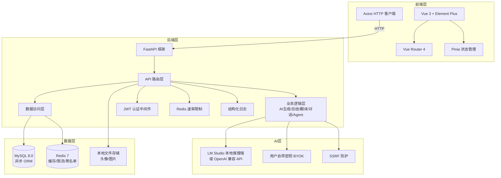
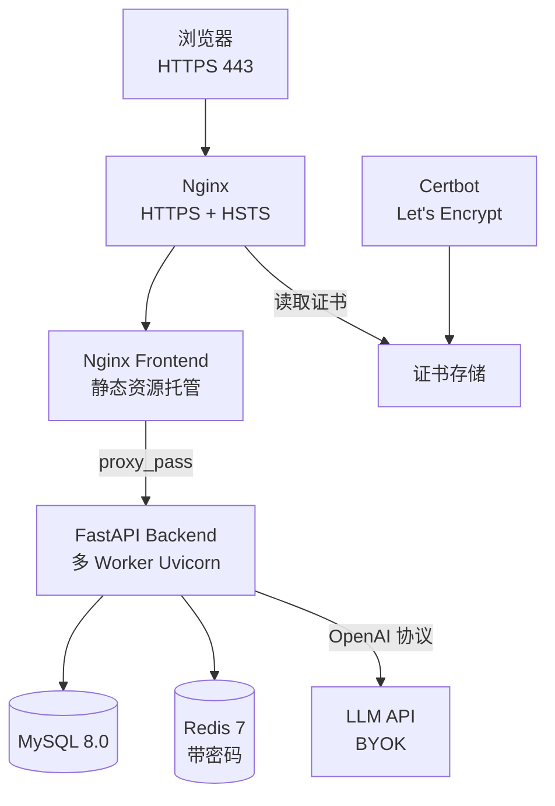
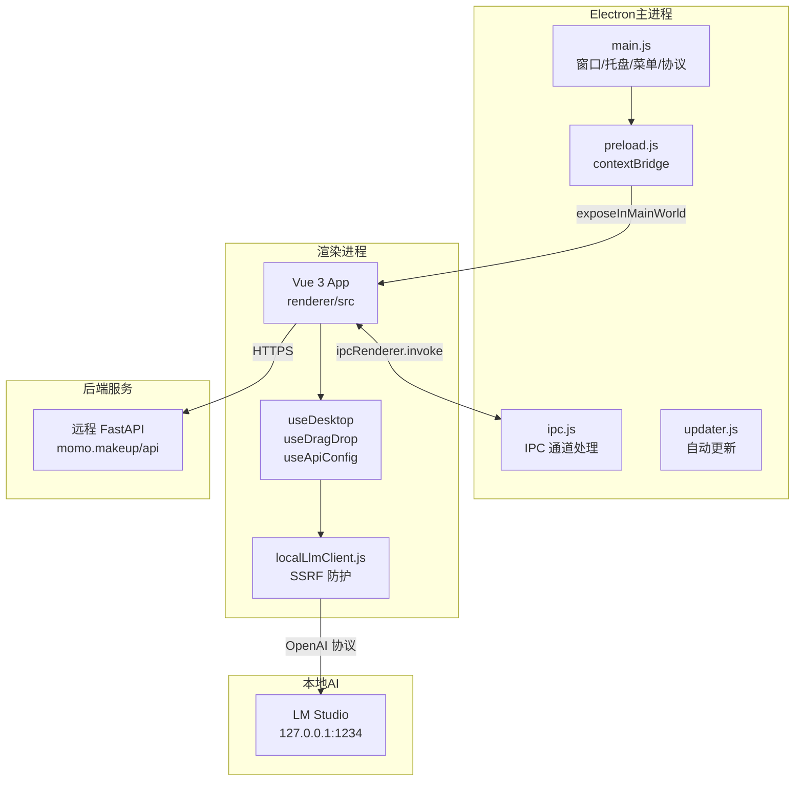
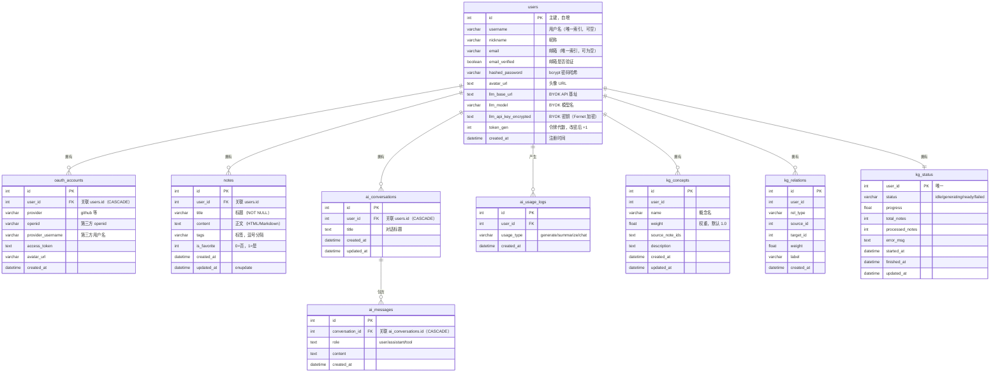
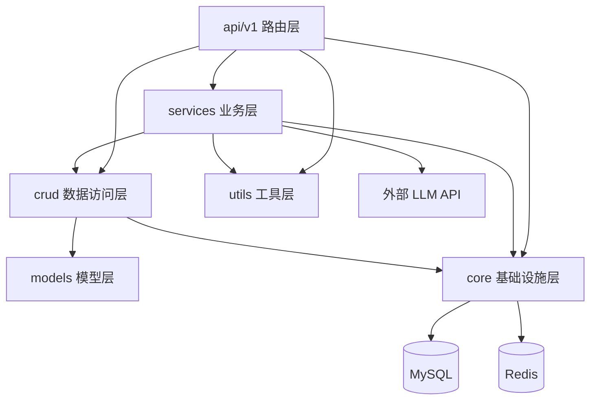
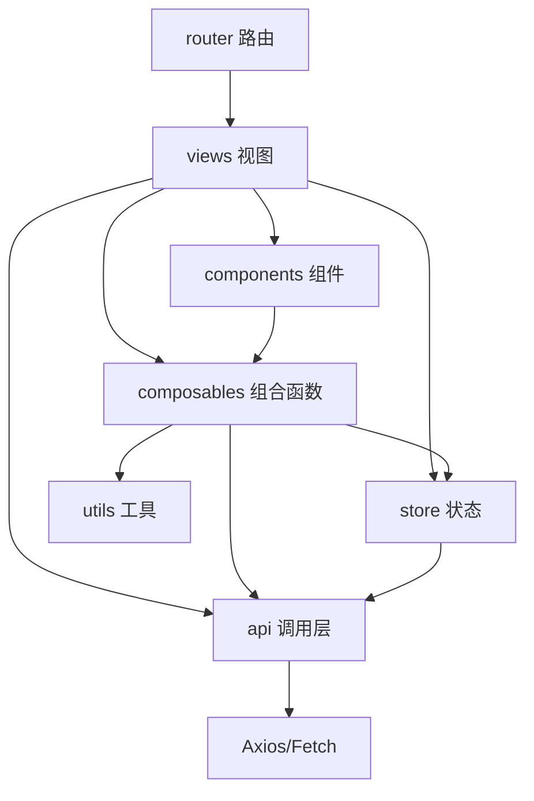

<div align="center">

# NoteMind Code Wiki

**版本**: v1.2.0 · **最后更新**: 2026-07-28

</div>

---

## 目录

- [1. 项目概览](#1-项目概览)
- [2. 整体架构](#2-整体架构)
- [3. 技术栈与依赖](#3-技术栈与依赖)
- [4. 目录结构](#4-目录结构)
- [5. 后端模块详解](#5-后端模块详解)
  - [5.1 入口与启动流程](#51-入口与启动流程)
  - [5.2 core 核心层](#52-core-核心层)
  - [5.3 models 数据模型层](#53-models-数据模型层)
  - [5.4 crud 数据访问层](#54-crud-数据访问层)
  - [5.5 services 业务服务层](#55-services-业务服务层)
  - [5.6 api/v1 路由层](#56-apiv1-路由层)
  - [5.7 utils 工具层](#57-utils-工具层)
  - [5.8 数据库迁移](#58-数据库迁移)
  - [5.9 测试体系](#59-测试体系)
- [6. 前端模块详解](#6-前端模块详解)
  - [6.1 入口与构建配置](#61-入口与构建配置)
  - [6.2 路由系统](#62-路由系统)
  - [6.3 状态管理](#63-状态管理)
  - [6.4 API 调用层](#64-api-调用层)
  - [6.5 工具函数](#65-工具函数)
  - [6.6 组合式函数](#66-组合式函数)
  - [6.7 组件库](#67-组件库)
  - [6.8 视图页面](#68-视图页面)
  - [6.9 部署配置](#69-部署配置)
- [7. 桌面端模块详解](#7-桌面端模块详解)
  - [7.1 Electron 主进程](#71-electron-主进程)
  - [7.2 预加载桥接与 IPC](#72-预加载桥接与-ipc)
  - [7.3 自动更新](#73-自动更新)
  - [7.4 渲染进程](#74-渲染进程)
  - [7.5 桌面专属组件与视图](#75-桌面专属组件与视图)
  - [7.6 本地 LLM 客户端](#76-本地-llm-客户端)
  - [7.7 与 Web 端的差异与共享](#77-与-web-端的差异与共享)
- [8. 数据库设计](#8-数据库设计)
- [9. 模块依赖关系](#9-模块依赖关系)
- [10. 项目运行方式](#10-项目运行方式)
- [11. CI/CD 流水线](#11-cicd-流水线)
- [12. 安全机制总览](#12-安全机制总览)

---

## 1. 项目概览

**NoteMind** 是一款面向个人学习与创作的全栈智能笔记应用，提供 Web 版与 Windows 桌面版两种形态。

| 维度 | 说明 |
|------|------|
| **定位** | 个人学习与创作的智能笔记应用 |
| **核心能力** | 笔记管理 / AI 辅助生成·总结·翻译·多轮对话 / 知识图谱 / 思维导图 / 数据统计 |
| **Web 版** | Vue 3 + FastAPI + MySQL + Redis，AI 走 BYOK（用户自带云端 API Key） |
| **桌面版** | Electron 28 + Vue 3，可直连本机 LM Studio / Ollama，AI 完全本地运行 |
| **部署** | Docker Compose 一键部署，Nginx + Let's Encrypt 自动 HTTPS |
| **License** | MIT |

### Web 版与桌面版对比

| 特性 | Web 版 | 桌面版 |
|------|--------|--------|
| AI 使用方式 | 用户自带云端 API Key（BYOK） | 直连本机 LM Studio / Ollama 或云端 API |
| 数据存储 | 服务端 MySQL + Redis | 共用后端（远程 API） |
| 网络依赖 | 必须联网 | 本地 AI 无需网络 |
| 隐私性 | 数据经服务器转发 | AI 完全本地运行 |
| 路由模式 | `createWebHistory` | `createWebHashHistory`（适配 `app://` 协议） |

---

## 2. 整体架构

### 2.1 开发架构（本地联调）



本地开发时，Vite 将 `/api` 与 `/uploads` 代理到 FastAPI（端口 5174 → 8000）。

### 2.2 生产架构（Docker Compose + Nginx + HTTPS）



### 2.3 端口映射

| 容器 | 内部端口 | 外部暴露 | 说明 |
|------|----------|----------|------|
| `frontend` (Nginx) | 80, 443 | 80, 443 | 静态资源 + API 反向代理 |
| `backend` (FastAPI) | 8000 | ❌ 不对外 | 仅供 Nginx 容器内访问 |
| `mysql` | 3306 | ❌ 不暴露 | 容器内部网络 |
| `redis` | 6379 | ❌ 不暴露 | 容器内部网络，带密码 |
| `certbot` | - | ❌ 不暴露 | 按需运行申请证书 |

### 2.4 桌面端架构



---

## 3. 技术栈与依赖

### 3.1 后端依赖（`backend/requirements.txt`）

| 依赖 | 版本 | 用途 |
|------|------|------|
| fastapi | ≥0.115.0 | Web 框架 |
| uvicorn | ≥0.32.0 | ASGI 服务器 |
| pydantic | ≥2.9.0 | 数据校验 |
| pydantic-settings | ≥2.6.0 | 配置管理 |
| sqlalchemy | ≥2.0.35 | ORM |
| aiomysql | ≥0.2.0 | MySQL 异步驱动 |
| redis | ≥5.2.0 | Redis 客户端 |
| python-jose[cryptography] | ≥3.3.0 | JWT |
| bcrypt | ≥4.2.0 | 密码哈希 |
| openai | ≥1.55.0 | LLM 客户端 |
| cryptography | ≥42.0.0 | Fernet 加密 |
| python-multipart | ≥0.0.12 | 文件上传 |
| python-docx | ≥1.1.0 | Word 解析 |
| beautifulsoup4 | ≥4.12.0 | HTML 解析 |
| html2text | ≥2024.2.26 | HTML→Markdown |
| alembic | ≥1.13.0 | 迁移 |

开发依赖（`requirements-dev.txt`）：pytest / pytest-asyncio / pytest-cov / httpx / requests / ruff

### 3.2 前端依赖（`frontend/package.json`）

**运行时**：
- 核心：`vue@^3.3.11`、`vue-router@^4.2.5`、`pinia@^2.1.7`
- HTTP：`axios@^1.6.2`
- UI：`element-plus@^2.4.3`
- 富文本：`@wangeditor/editor@^5.1.23` + `@wangeditor/editor-for-vue@^5.1.12`
- Markdown / 安全：`marked@^18.0.3`、`isomorphic-dompurify@^2.36.0`
- 可视化：`echarts@^6.0.0`、`mermaid@^11.4.0`、`three@^0.185.0`、`canvg@^4.0.3`、`html-to-image@^1.11.13`
- 动画：`gsap@^3.15.0`
- 文件解析：`mammoth@^1.12.0`（Word → HTML）

**构建时**：`vite@^5.0.10`、`@vitejs/plugin-vue`、`terser`、`unplugin-auto-import`、`unplugin-vue-components`、`vitest@^3.0.5`、`happy-dom`、`eslint@^9.10.0`

### 3.3 桌面端依赖（`desktop/package.json`）

- `electron@^28.2.0`、`electron-builder@^24.9.1`
- `electron-store@^8.1.0`（本地加密配置存储）
- `electron-updater@^6.1.8`（自动更新）
- 图标生成：`electron-icon-builder`、`png-to-ico`、`pngjs`、`sharp`、`svg-to-ico`

---

## 4. 目录结构

```
note-takingAssistant/
├── backend/                    # FastAPI 后端
│   ├── alembic/                # 数据库迁移
│   │   ├── env.py
│   │   └── versions/0001_initial.py
│   ├── app/
│   │   ├── api/v1/             # API 路由层
│   │   │   ├── ai.py  kg.py  note.py  oauth.py  public.py  user.py
│   │   ├── core/               # 核心配置与基础设施
│   │   │   ├── config.py  database.py  security.py  rate_limit.py
│   │   │   ├── redis_client.py  field_crypto.py  logger.py  startup_migrations.py
│   │   ├── crud/               # 数据访问层
│   │   │   ├── user.py  note.py  ai_conversation.py  ai_usage.py
│   │   ├── models/             # SQLAlchemy + Pydantic 模型
│   │   │   ├── user.py  note.py  ai.py  ai_conversation.py  ai_usage.py  kg.py
│   │   ├── services/           # 业务服务层
│   │   │   ├── agent/          # 多 Agent 协作框架
│   │   │   │   ├── agents/     # 6 个专业子 Agent
│   │   │   │   ├── base.py  coordinator.py  intent_classifier.py  note_assistant.py
│   │   │   ├── chat_service.py  agent_service.py  openai_client.py  llm_runtime.py
│   │   │   ├── note_analyzer.py  note_generator.py  note_translator.py
│   │   │   ├── knowledge_graph_service.py  oauth_service.py  email_service.py  prompts.py
│   │   ├── utils/              # 工具函数
│   │   │   ├── common.py  file_parser.py  file_upload.py  llm_errors.py
│   │   │   ├── openai_compatible_url.py  stats_series.py
│   ├── tests/                  # pytest 测试
│   ├── uploads/                # 上传文件存储
│   ├── main.py                 # 入口
│   ├── requirements.txt
│   ├── Dockerfile
│   └── .env.example
├── frontend/                   # Vue 3 Web 前端
│   ├── src/
│   │   ├── api/                # Axios 封装与业务 API
│   │   ├── assets/             # 全局样式
│   │   ├── components/         # 组件（home/icons/welcome + Layout/NoteCard/RichText）
│   │   ├── composables/        # 组合式函数
│   │   ├── config/             # API 基址配置
│   │   ├── constants/          # 常量（用户协议/落地页）
│   │   ├── router/             # 路由
│   │   ├── store/              # Pinia 状态
│   │   ├── utils/              # 工具函数
│   │   ├── views/              # 视图页面（ai/auth/help/kg/mindmap/notes/user + Home）
│   │   ├── App.vue  main.js
│   ├── nginx*.conf             # Nginx 配置（HTTP/HTTPS 双模式）
│   ├── Dockerfile  entrypoint.sh
│   ├── vite.config.js
│   └── package.json
├── desktop/                    # Electron 桌面端
│   ├── electron/               # 主进程
│   │   ├── main.js  preload.js  ipc.js  updater.js
│   ├── renderer/               # 渲染进程（Vue 3，frontend 的超集）
│   │   └── src/                # 含 desktop 专属模块
│   ├── scripts/copy-frontend.js
│   ├── package.json
│   └── README.md
├── docs/                       # 项目文档
│   ├── architecture.md  er-diagram.md  CODE_WIKI.md
├── docker-compose.yml
├── .env.docker
├── CHANGELOG.md
└── README.md
```

---

## 5. 后端模块详解

### 5.1 入口与启动流程

**文件**：[backend/main.py](file:///c:/Users/MOM/Desktop/bishe/note-takingAssistant/note-takingAssistant/backend/main.py)

```python
app = FastAPI(title="NoteMind AI Note Assistant API", version="1.0.0", lifespan=lifespan)
```

#### Lifespan 生命周期

`@asynccontextmanager async def lifespan(app)`：
- **启动时**（受 `SKIP_APP_LIFESPAN=1` 可跳过）：
  1. `init_db()` → `Base.metadata.create_all` 异步建表
  2. 依次执行三个幂等迁移：`ensure_user_llm_columns` / `ensure_user_oauth_columns` / `ensure_ai_conversation_tables`
  3. `await session.commit()`
- **关闭时**：`engine.dispose()` + `redis_client.client.close()`

#### CORS 中间件

- `_get_cors_origins()` 动态合并：`FRONTEND_URL` + `CORS_ORIGINS`（逗号分隔）+ `app://localhost`（桌面端）
- `allow_methods=["*"]`、`allow_headers=["*"]`、`max_age=600`
- 通配符 `*` 时禁用 `allow_credentials`，否则启用

#### 静态文件与路由注册

- `app.mount("/uploads", StaticFiles(directory=uploads_dir))` 挂载上传目录
- 路由统一前缀 `/api/v1`：

| 路由模块 | 前缀 | Tag |
|---------|------|-----|
| `user.router` | `/api/v1/user` | 用户管理 |
| `oauth.router` | `/api/v1/oauth` | OAuth登录 |
| `note.router` | `/api/v1/note` | 笔记管理 |
| `ai.router` | `/api/v1/ai` | AI智能模块 |
| `kg.router` | `/api/v1/kg` | 知识图谱 |
| `public.router` | `/api/v1/public` | 公开接口 |

#### 启动入口

```python
uvicorn.run("main:app", host=settings.API_HOST, port=settings.API_PORT, reload=DEBUG)
```

---

### 5.2 core 核心层

#### 5.2.1 config.py — 配置类

**文件**：[backend/app/core/config.py](file:///c:/Users/MOM/Desktop/bishe/note-takingAssistant/note-takingAssistant/backend/app/core/config.py)

`class Settings(BaseSettings)` 继承 `pydantic_settings.BaseSettings`，单例 `settings = Settings()`。

| 配置组 | 字段 | 默认值 |
|--------|------|--------|
| 服务器 | `API_HOST` / `API_PORT` / `API_BASE_URL` / `FRONTEND_URL` / `CORS_ORIGINS` | 127.0.0.1 / 8000 / - / http://localhost:8081 / "" |
| 数据库 | `DB_HOST/PORT/USER/PASSWORD/NAME` | - |
| Redis | `REDIS_HOST/PORT/DB/PASSWORD` | - |
| JWT | `SECRET_KEY` / `ALGORITHM` / `ACCESS_TOKEN_EXPIRE_MINUTES` | - / HS256 / 120 |
| AI/LLM | `LM_STUDIO_URL` / `LM_STUDIO_MODEL` / `OPENAI_API_KEY` / `ENCRYPTION_KEY` / `LLM_HTTP_READ_TIMEOUT_SECONDS` / `LLM_HTTP_TRUST_ENV` | http://127.0.0.1:1234/v1 / - / - / - / 1200.0 / False |
| GitHub OAuth | `GITHUB_CLIENT_ID/SECRET/REDIRECT_URI` | - |
| SMTP | `SMTP_HOST/PORT/USER/PASSWORD/SMTP_FROM_NAME` | - / 465 / - / - / NoteMind |
| 文件上传 | `MAX_IMPORT_BYTES` / `IMAGE_MAX_BYTES` | 20MB / 5MB |
| 其他 | `DEBUG` | True |

- `@property DATABASE_URL` 返回 `mysql+aiomysql://...`
- `Config` 内部类：`env_file=backend/.env`，`env_file_encoding="utf-8"`，`extra="ignore"`

#### 5.2.2 database.py — 异步引擎与会话工厂

**文件**：[backend/app/core/database.py](file:///c:/Users/MOM/Desktop/bishe/note-takingAssistant/note-takingAssistant/backend/app/core/database.py)

```python
engine = create_async_engine(ASYNC_DATABASE_URL, pool_pre_ping=True, pool_recycle=3600)
AsyncSessionLocal = async_sessionmaker(engine, class_=AsyncSession, expire_on_commit=False)
Base = declarative_base()

async def get_async_db():  # 依赖注入
    async with AsyncSessionLocal() as session:
        yield session
```

#### 5.2.3 security.py — JWT 与密码哈希

**文件**：[backend/app/core/security.py](file:///c:/Users/MOM/Desktop/bishe/note-takingAssistant/note-takingAssistant/backend/app/core/security.py)

| 函数 | 职责 |
|------|------|
| `verify_password(plain, hashed) -> bool` | bcrypt 校验密码 |
| `get_password_hash(password) -> str` | bcrypt 加盐哈希 |
| `create_access_token(data, expires_delta=None, token_gen=0) -> str` | 签发 JWT，jti 格式 `{username}:{token_gen}:{uuid}`，payload 含 `tgen` |
| `get_jti_from_token(token)` | 不验签提取 jti（用于黑名单） |
| `get_token_exp_seconds(token)` | 估算剩余有效秒数 |
| `_check_tgen_valid(email, token_tgen, redis) -> bool` | 校验 token_gen 代数（Redis key `tgen_min:{email}`），Redis 不可用降级放行 |
| `get_current_user(token=Depends(oauth2_scheme)) -> dict` | 核心依赖：黑名单检查 → JWT 解码取 email → tgen 校验 → 返回 `{"email": email}` |

**关键设计 — Token 撤销双重保障**：
1. **jti 黑名单**：logout 时将 jti 写入 Redis（TTL = token 剩余有效期）
2. **token_gen 代数机制**：改密后服务器递增 `token_gen`，让所有旧 token 失效

#### 5.2.4 rate_limit.py — Redis 速率限制

**文件**：[backend/app/core/rate_limit.py](file:///c:/Users/MOM/Desktop/bishe/note-takingAssistant/note-takingAssistant/backend/app/core/rate_limit.py)

**设计原则**：未登录按 IP 节流、已登录按邮箱节流、Redis 不可用降级放行、`RATE_LIMIT_DISABLED=1` 测试环境放行。

**限流策略表 `LIMIT_POLICIES`**：

| 策略名 | max_requests | window_seconds |
|--------|--------------|----------------|
| register | 10 | 3600 |
| login | 5 | 60 |
| email_code | 3 | 300 |
| email_verify | 10 | 300 |
| ai | 60 | 60 |
| notes | 120 | 60 |
| public | 60 | 60 |

**核心 API**：
- `check_and_bump(policy_name, identifier)`：`INCR` + 首次 `EXPIRE` 实现近似滑动窗口
- `rate_limit_anon(policy_name) -> Callable`：未登录依赖工厂（按 IP）
- `rate_limit_user(policy_name) -> Callable`：已登录依赖工厂（按 email 退化 IP）
- `class RateLimitExceeded(HTTPException)`：429 异常

#### 5.2.5 redis_client.py — Redis 多用途缓存

**文件**：[backend/app/core/redis_client.py](file:///c:/Users/MOM/Desktop/bishe/note-takingAssistant/note-takingAssistant/backend/app/core/redis_client.py)

`class RedisClient` 单例（`__new__`），`_init_redis()` 初始化（`decode_responses=True`，5s 超时），ping 失败时 `_client=None`。

**用途分类**：

| 用途 | 函数 | 说明 |
|------|------|------|
| 最近笔记缓存 | `cache_recent_note` / `batch_cache_recent_notes` / `get_recent_notes` / `clear_recent_notes` / `remove_recent_note_by_id` | List 结构，LPUSH + LTRIM 保留 20 条，7 天 TTL |
| Token 黑名单 | `blacklist_token(jti_or_token, ttl)` / `is_token_blacklisted(token) -> bool` | SETEX 写入；**Redis 不可用时返回 True（保守拒绝）** |
| 速率限制原语 | `_rate_limit_bump(key, window_seconds) -> int \| None` | INCR + EXPIRE |

**异步安全包装**：`_run_in_pool(func, *args)` 用 `loop.run_in_executor` 避免阻塞事件循环；提供 `*_async` 版本。

#### 5.2.6 field_crypto.py — Fernet 字段加密

**文件**：[backend/app/core/field_crypto.py](file:///c:/Users/MOM/Desktop/bishe/note-takingAssistant/note-takingAssistant/backend/app/core/field_crypto.py)

用途：加密用户 BYOK 的 LLM API Key，从不记录明文。

**密钥派生**：
- `_derive_fernet_key_from_secret(secret)`：`SHA256(context + secret)` → urlsafe base64
- `_fernet_explicit()`：优先用 `ENCRYPTION_KEY`
- `_fernet_derived()`：降级用 `SECRET_KEY` 派生

| 函数 | 职责 |
|------|------|
| `encrypt_secret(plaintext) -> str` | 优先 explicit，否则 derived |
| `decrypt_secret(ciphertext) -> str` | 先试 explicit，失败再试 derived（兼容迁移） |
| `api_key_last_four(plaintext) -> str` | 返回后 4 位 |
| `mask_api_key_hint(last_four) -> str \| None` | 返回 `****xxxx` |

#### 5.2.7 logger.py — 日志配置

**文件**：[backend/app/core/logger.py](file:///c:/Users/MOM/Desktop/bishe/note-takingAssistant/note-takingAssistant/backend/app/core/logger.py)

- `setup_logger(name="app", log_file=None, level=logging.INFO) -> logging.Logger`
- 格式：`%(asctime)s | %(levelname)-5s | %(name)s | %(message)s`
- 控制台 StreamHandler + 可选 RotatingFileHandler（5MB，3 备份）
- 模块级单例：`app_logger = setup_logger("app")`

#### 5.2.8 startup_migrations.py — 启动迁移（幂等 DDL）

**文件**：[backend/app/core/startup_migrations.py](file:///c:/Users/MOM/Desktop/bishe/note-takingAssistant/note-takingAssistant/backend/app/core/startup_migrations.py)

**设计**：Alembic 已应用（`alembic_version` 表存在）则跳过；仅 MySQL 方言生效。

| 函数 | 作用 |
|------|------|
| `ensure_user_llm_columns(db)` | 为 users 表添加 BYOK 字段（llm_base_url / llm_model / llm_api_key_encrypted / token_gen） |
| `ensure_user_oauth_columns(db)` | 添加 nickname / email_verified 列；扩展 email 到 VARCHAR(255)；创建 oauth_accounts 表；username 改为可空 |
| `ensure_ai_conversation_tables(db)` | 创建 ai_conversations 和 ai_messages 表 |

---

### 5.3 models 数据模型层

**目录**：[backend/app/models/](file:///c:/Users/MOM/Desktop/bishe/note-takingAssistant/note-takingAssistant/backend/app/models)

`__init__.py` 仅导出 KG 和 AI Conversation 的 DB 模型。

#### 5.3.1 user.py — 用户模型

**文件**：[backend/app/models/user.py](file:///c:/Users/MOM/Desktop/bishe/note-takingAssistant/note-takingAssistant/backend/app/models/user.py)

**Pydantic 模型**：
- `UserBase`（nickname, email, avatar_url 均可选）
- `UserCreate(UserBase)`：加 `password: str`
- `UserLogin`：`email` + `password`
- `UserResponse(UserBase)`：含 id / username / email_verified / created_at
- `Token` / `TokenWithUser(Token)`
- `LLMSettingsResponse`：base_url / llm_model / api_key_last4 / has_stored_api_key（alias 兼容 camelCase）
- `LLMSettingsPut`：base_url / llm_model / api_key / retain_api_key
- `ChangePasswordRequest`：currentPassword / newPassword / confirmPassword

**SQLAlchemy 模型**：

`class UserDB(Base)` (`__tablename__="users"`)：
| 字段 | 类型 | 说明 |
|------|------|------|
| id | PK | 自增 |
| username | VARCHAR(50), unique, nullable | 用户名（OAuth 用户可空） |
| nickname | VARCHAR(50) | 昵称 |
| email | VARCHAR(255), unique, nullable | 邮箱（登录主标识） |
| email_verified | Boolean | 邮箱是否验证 |
| hashed_password | VARCHAR(255), NOT NULL | bcrypt 哈希 |
| avatar_url | Text | 头像 URL |
| llm_base_url | Text | BYOK API 基址 |
| llm_model | VARCHAR(512) | BYOK 模型名 |
| llm_api_key_encrypted | Text | BYOK 密钥（Fernet 加密） |
| token_gen | Integer, default 0 | 令牌代数 |
| created_at | datetime | 注册时间 |

`class OAuthAccountDB(Base)` (`__tablename__="oauth_accounts"`)：id / user_id(FK CASCADE) / provider / openid / provider_username / access_token / avatar_url / created_at

#### 5.3.2 note.py — 笔记模型

**文件**：[backend/app/models/note.py](file:///c:/Users/MOM/Desktop/bishe/note-takingAssistant/note-takingAssistant/backend/app/models/note.py)

`class NoteDB(Base)` (`__tablename__="notes"`)：
- id / user_id(FK users.id) / title(VARCHAR200, NOT NULL) / content(Text, NOT NULL) / tags(VARCHAR500) / is_favorite(Integer 0/1) / created_at / updated_at(`onupdate=func.now()`)

Pydantic：`NoteBase` / `NoteCreate` / `NoteUpdate` / `NoteResponse`（`@field_validator('is_favorite')` 将 Integer 转 bool）

#### 5.3.3 ai.py — AI 请求/响应模型

**文件**：[backend/app/models/ai.py](file:///c:/Users/MOM/Desktop/bishe/note-takingAssistant/note-takingAssistant/backend/app/models/ai.py)

- `ReferenceNote`：filename + content
- `GenerateNoteRequest`：topic / keywords / referenceNotes / images / wordCount(600)
- `SummarizeNoteRequest`：content
- `TranslateNoteRequest`：content + targetLang(2-12 字符)
- `ChatMessage`：role + content
- `ChatRequest`：message + history
- `AgentChatRequest`：message + history + conversation_id（可选，传入则持久化）

#### 5.3.4 ai_conversation.py — 对话历史持久化

**文件**：[backend/app/models/ai_conversation.py](file:///c:/Users/MOM/Desktop/bishe/note-takingAssistant/note-takingAssistant/backend/app/models/ai_conversation.py)

`class AIConversationDB(Base)` (`__tablename__="ai_conversations"`)：
- 索引：`idx_ai_conv_user`、`idx_ai_conv_user_updated`
- 字段：id / user_id(FK CASCADE) / title(Text, NOT NULL) / created_at / updated_at

`class AIMessageDB(Base)` (`__tablename__="ai_messages"`)：
- 索引：`idx_ai_msg_conv`、`idx_ai_msg_conv_created`
- 字段：id / conversation_id(FK CASCADE) / role(user/assistant/tool) / content(Text) / created_at

Pydantic：`AIMessageOut` / `AIConversationOut` / `AIConversationDetailOut`（含 messages 列表）/ `AIConversationCreateRequest`

#### 5.3.5 ai_usage.py — AI 使用记录

**文件**：[backend/app/models/ai_usage.py](file:///c:/Users/MOM/Desktop/bishe/note-takingAssistant/note-takingAssistant/backend/app/models/ai_usage.py)

`class AIUsageLog(Base)` (`__tablename__="ai_usage_logs"`)：id / user_id(FK) / usage_type('generate'/'summarize'/'chat') / created_at

#### 5.3.6 kg.py — 知识图谱模型

**文件**：[backend/app/models/kg.py](file:///c:/Users/MOM/Desktop/bishe/note-takingAssistant/note-takingAssistant/backend/app/models/kg.py)

**SQLAlchemy 模型**：

| 模型 | 表名 | 关键字段 |
|------|------|----------|
| `KGConceptDB` | kg_concepts | id / user_id / name(VARCHAR200) / weight(Float, 1.0) / source_note_ids(Text) / description(Text)；唯一索引 (user_id, name) |
| `KGRelationDB` | kg_relations | id / user_id / rel_type(VARCHAR30) / source_id / target_id / weight / label(VARCHAR100) |
| `KGStatusDB` | kg_status | user_id(唯一) / status(idle/generating/ready/failed) / progress / total_notes / processed_notes / error_msg / started_at / finished_at |

**Pydantic**：`KGNode`（含 id/label/type/size/color/note_id/concept_id/weight/preview/tags/is_favorite/created_at/updated_at）/ `KGEdge` / `KGGraphResponse`(nodes + edges + stats) / `KGStatusResponse`

---

### 5.4 crud 数据访问层

**目录**：[backend/app/crud/](file:///c:/Users/MOM/Desktop/bishe/note-takingAssistant/note-takingAssistant/backend/app/crud)

#### 5.4.1 user.py — 用户数据访问

**文件**：[backend/app/crud/user.py](file:///c:/Users/MOM/Desktop/bishe/note-takingAssistant/note-takingAssistant/backend/app/crud/user.py)

| 函数 | 职责 |
|------|------|
| `get_user(db, user_id)` | 按 id 查 |
| `get_user_by_username(db, username)` | 按用户名查 |
| `get_user_by_email(db, email)` | 按 email 查 |
| `create_user(db, email, password, nickname, username)` | 创建用户（自动 hash 密码） |
| `authenticate_user(db, email, password)` | 验证密码返回 user 或 False |
| `get_oauth_account(db, provider, openid)` | 查 OAuth 绑定 |
| `create_oauth_account(...)` | 创建 OAuth 绑定 |
| `get_user_oauth_accounts(db, user_id)` | 列出用户所有 OAuth 绑定 |
| `delete_oauth_account(db, user_id, provider)` | 删除绑定 |

#### 5.4.2 note.py — 笔记数据访问

**文件**：[backend/app/crud/note.py](file:///c:/Users/MOM/Desktop/bishe/note-takingAssistant/note-takingAssistant/backend/app/crud/note.py)

| 函数 | 职责 |
|------|------|
| `get_note(db, note_id, user_id)` | 获取单条（带 user_id 隔离） |
| `get_notes(db, user_id, skip, limit)` | 列表 |
| `search_notes(db, user_id, keyword, skip, limit, is_favorite)` | 标题 `ilike` 模糊搜索 + 收藏筛选 + 分页 |
| `count_notes(db, user_id, keyword, is_favorite) -> int` | 统计总数 |
| `create_note(...)` | 创建（bool→int 转换） |
| `update_note(...)` | 更新 |
| `delete_note(db, note_id, user_id)` | 删除 |
| `get_note_by_title(db, user_id, title)` | 按标题精确查（重复检测） |

#### 5.4.3 ai_conversation.py — 对话历史 CRUD

**文件**：[backend/app/crud/ai_conversation.py](file:///c:/Users/MOM/Desktop/bishe/note-takingAssistant/note-takingAssistant/backend/app/crud/ai_conversation.py)

所有操作均以 user_id 隔离：
- `list_conversations(db, user_id, limit=50)` → 按 updated_at 倒序
- `get_conversation(db, conversation_id, user_id)` → 单条
- `create_conversation(db, user_id, title)` → 新建
- `rename_conversation(db, conversation_id, user_id, title)` → 重命名
- `delete_conversation(db, conversation_id, user_id) -> bool` → 手动清理消息+对话
- `list_messages(db, conversation_id, user_id)` → 校验归属后按时间正序列出

#### 5.4.4 ai_usage.py — AI 使用记录

**文件**：[backend/app/crud/ai_usage.py](file:///c:/Users/MOM/Desktop/bishe/note-takingAssistant/note-takingAssistant/backend/app/crud/ai_usage.py)

- `log_ai_usage(db, user_id, usage_type)` → 记录一次使用
- `get_user_ai_usage_count(db, user_id) -> int` → 统计用户使用次数

---

### 5.5 services 业务服务层

**目录**：[backend/app/services/](file:///c:/Users/MOM/Desktop/bishe/note-takingAssistant/note-takingAssistant/backend/app/services)

`__init__.py` 导出 6 个核心函数：`generate_note_stream` / `analyze_note` / `translate_note_stream` / `chat_with_ai` / `chat_with_ai_stream` / `agent_chat_stream`

#### 5.5.1 agent/ 多 Agent 协作框架

##### base.py — BaseAgent 基类

**文件**：[backend/app/services/agent/base.py](file:///c:/Users/MOM/Desktop/bishe/note-takingAssistant/note-takingAssistant/backend/app/services/agent/base.py)

**常量**：`MAX_TOOL_ROUNDS=5`、`MAX_TOOL_RESULT_CHARS=4000`、`FINAL_ANSWER_CHUNK_SIZE=80`

**辅助**：`sse_event(event_type, data=None) -> str` 构造 `data: {json}\n\n`

**class BaseAgent(ABC)**：
- 子类属性：`name` / `display_name` / `emoji` / `system_prompt` / `tools_definition`(OpenAI Function Calling 格式) / `tool_handlers`(Dict[str, callable])
- `async run(message, history, *, db, db_user) -> AsyncIterator[str]` 主流程：
  1. `_build_messages` 构造 messages
  2. `openai_client_and_model_for_user(db_user)` 获取 BYOK 客户端
  3. 循环最多 `MAX_TOOL_ROUNDS` 轮：
     - 调用 `client.chat.completions.create`（temperature=0.5, max_tokens=2048）
     - 无 tool_calls → `_emit_final_answer` 输出最终回答
     - 有 tool_calls → 推 `thinking` 事件，逐个执行工具，推 `tool_start`/`tool_end`
     - 模型不支持 tools 时降级 `_fallback_plain_stream`
  4. 达上限强制生成最终回答
- `_execute_tool(tool_name, args, *, db, db_user)`：先查 `tool_handlers`，兜底 `agent_service._execute_tool`
- `_build_messages`：合并 system_prompt + history（最近 10 条）+ 当前 user message
- `_looks_like_tools_unsupported(exc)`：关键词检测（tool/function/unsupported/400）
- `_truncate_tool_result(result)`：超长截断
- `_emit_final_answer(text)`：按 80 字符切片推 `delta` + `done` 事件
- `_fallback_plain_stream`：降级为 `stream=True` 的普通流式对话

##### coordinator.py — Coordinator 调度员

**文件**：[backend/app/services/agent/coordinator.py](file:///c:/Users/MOM/Desktop/bishe/note-takingAssistant/note-takingAssistant/backend/app/services/agent/coordinator.py)

- `async coordinator_run(message, history, *, db, db_user, enable_multi_agent=True) -> AsyncIterator[str]`
- 直接使用 `NoteAssistant`（唯一主 Agent），LLM 通过 Function Calling 选择工具；工具调用时由 NoteAssistant 触发 `sub_agent_start`/`sub_agent_end` 事件
- 透传所有事件，同时累计 `delta` 文本到 `final_text`

##### intent_classifier.py — 意图分类

**文件**：[backend/app/services/agent/intent_classifier.py](file:///c:/Users/MOM/Desktop/bishe/note-takingAssistant/note-takingAssistant/backend/app/services/agent/intent_classifier.py)

- `INTENT_AGENT_TOOLS`：6 个工具（use_general_agent / use_search_agent / use_summarize_agent / use_generate_agent / use_translate_agent / use_mindmap_agent）
- `TOOL_TO_AGENT_MAP`：工具名 → Agent 名映射
- `async classify_intent_with_tools(message, history, db_user) -> str`：用 `tool_choice="required"` 让 LLM 选择 Agent，失败降级 "general"

##### note_assistant.py — NoteAssistant 主 Agent

**文件**：[backend/app/services/agent/note_assistant.py](file:///c:/Users/MOM/Desktop/bishe/note-takingAssistant/note-takingAssistant/backend/app/services/agent/note_assistant.py)

**常量**：
- `SUB_AGENTS`：5 个子 Agent 元信息（search/summarize/generate/translate/mindmap）
- `TOOL_TO_SUB_AGENT`：工具→子 Agent 映射
- `NOTE_ASSISTANT_TOOLS`：6 个工具（search_notes, get_note_content, summarize_note, generate_note, translate_note, create_note）
- `NOTE_ASSISTANT_SYSTEM_PROMPT`：职责/可用工具/工作原则/回答风格

**class NoteAssistant(BaseAgent)**：
- `name="note_assistant"` / `display_name="Note助手"` / `emoji="📒"`
- 重写 `run`：推 `agent_start` → 调 `super().run` 解析事件（`tool_start` 时若属于某子 Agent 则推 `sub_agent_start`）→ 推 `agent_end`

##### agents/ 6 个专业子 Agent

**目录**：[backend/app/services/agent/agents/](file:///c:/Users/MOM/Desktop/bishe/note-takingAssistant/note-takingAssistant/backend/app/services/agent/agents)

| 文件 | 类名 | name | display_name | emoji | 工具 |
|------|------|------|--------------|-------|------|
| `general_agent.py` | `GeneralAgent` | general_agent | 通用助手 | 🤖 | 无 |
| `search_agent.py` | `SearchAgent` | search_agent | 搜索专家 | 🔍 | search_notes, get_note_content |
| `summarize_agent.py` | `SummarizeAgent` | summarize_agent | 总结专家 | 📝 | get_note_content, summarize_note |
| `generate_agent.py` | `GenerateAgent` | generate_agent | 生成专家 | ✍️ | generate_note, create_note |
| `translate_agent.py` | `TranslateAgent` | translate_agent | 翻译专家 | 🌐 | get_note_content, translate_note |
| `mindmap_agent.py` | `MindmapAgent` | mindmap_agent | 思维导图专家 | 🧠 | get_note_content |

`__init__.py` 创建单例实例并维护 `AGENTS` 字典 + `AGENT_DISPLAY_NAMES` 映射 + `get_agent(name)` 函数（兜底 general）

#### 5.5.2 chat_service.py — 普通 AI 对话

**文件**：[backend/app/services/chat_service.py](file:///c:/Users/MOM/Desktop/bishe/note-takingAssistant/note-takingAssistant/backend/app/services/chat_service.py)

- `_build_chat_messages(message, history)`：合并 `CHAT_SYSTEM_PROMPT` + history（最近 10 条）+ user message
- `async chat_with_ai(message, history, *, db_user) -> str`：非流式
- `async chat_with_ai_stream(message, history, *, db_user) -> AsyncIterator[str]`：流式（`stream=True`）

#### 5.5.3 agent_service.py — Agent 服务

**文件**：[backend/app/services/agent_service.py](file:///c:/Users/MOM/Desktop/bishe/note-takingAssistant/note-takingAssistant/backend/app/services/agent_service.py)

**工具实现**：
- `_tool_search_notes(db, user_id, args)` → 调 `crud_note.search_notes`
- `_tool_get_note_content(db, user_id, args)` → 调 `crud_note.get_note`
- `_tool_summarize_note(db_user, args)` → 调 `note_analyzer.analyze_note`
- `_tool_generate_note(db_user, args)` → 调 `note_generator.generate_note_stream` 聚合
- `_tool_translate_note(db_user, args)` → 调 `note_translator.translate_note_stream` 聚合
- `_tool_create_note(db, user_id, args)` → 重复检测 + 调 `crud_note.create_note`

**工具调度**：`_execute_tool(tool_name, args, *, db, db_user) -> Dict`

**持久化辅助**：
- `_make_conversation_title(message)`：取首条消息前 50 字符作标题
- `async _persist_messages(*, db, user_id, conversation_id, user_message, assistant_message, first_message) -> Optional[int]`：conversation_id 为空则创建新对话；已存在则刷新 updated_at + 追加消息；失败仅记录日志不阻断

**主流程**：
- `async agent_chat_stream(message, history, *, db, db_user, conversation_id=None, persist=True, use_multi_agent=True) -> AsyncIterator[str]`
- `use_multi_agent=True`：走 `coordinator_run`，拦截 `done` 事件持久化
- `use_multi_agent=False`：旧单 Agent 模式（强制 `tool_choice="required"`）

#### 5.5.4 openai_client.py — 共享 httpx 客户端

**文件**：[backend/app/services/openai_client.py](file:///c:/Users/MOM/Desktop/bishe/note-takingAssistant/note-takingAssistant/backend/app/services/openai_client.py)

- `_llm_http_timeout = httpx.Timeout(connect=60, read=1200, write=120, pool=60)`
- `llm_shared_http_client = httpx.AsyncClient(timeout, trust_env=settings.LLM_HTTP_TRUST_ENV)` 进程级共享
- `make_async_openai_client(base_url, api_key) -> AsyncOpenAI`：构建 BYOK 客户端，**调用 `assert_safe_llm_url` 做 SSRF 拦截**

#### 5.5.5 llm_runtime.py — BYOK 解析

**文件**：[backend/app/services/llm_runtime.py](file:///c:/Users/MOM/Desktop/bishe/note-takingAssistant/note-takingAssistant/backend/app/services/llm_runtime.py)

- `resolve_llm_base_url(db_user) -> str`：用户自定义 URL 必过 SSRF 校验；服务端配置跳过
- `resolve_llm_model(db_user) -> str`：用户 model 优先，否则 `LM_STUDIO_MODEL`
- `openai_client_and_model_for_user(db_user) -> Tuple[AsyncOpenAI, str]`：有加密 key → `decrypt_secret`；否则用服务端默认 API Key

#### 5.5.6 note_analyzer.py — 笔记分析

**文件**：[backend/app/services/note_analyzer.py](file:///c:/Users/MOM/Desktop/bishe/note-takingAssistant/note-takingAssistant/backend/app/services/note_analyzer.py)

- `async analyze_note(content, *, db_user) -> Dict[str, Any]`：
  - 用 `NOTE_ANALYSIS_SYSTEM_PROMPT` + 维度提示（内容完整性/结构清晰度/表达准确性/实用性）
  - temperature=0.3, max_tokens=1000
  - 解析 JSON（兼容 ```json``` 包裹）
  - 返回 `{summary, strengths, weaknesses, suggestions}`，失败返回默认值

#### 5.5.7 note_generator.py — 笔记生成

**文件**：[backend/app/services/note_generator.py](file:///c:/Users/MOM/Desktop/bishe/note-takingAssistant/note-takingAssistant/backend/app/services/note_generator.py)

- `async generate_note_stream(topic, keyword, reference_notes, images, word_count, *, db_user) -> AsyncIterator[str]`
- temperature=0.7, max_tokens=word_count*3, stream=True
- 失败抛 `format_llm_error("AI生成笔记", e)`

#### 5.5.8 note_translator.py — 笔记翻译

**文件**：[backend/app/services/note_translator.py](file:///c:/Users/MOM/Desktop/bishe/note-takingAssistant/note-takingAssistant/backend/app/services/note_translator.py)

**HTML→Markdown 预处理**：
- `MAX_INPUT_CHARS=8000`
- `looks_like_html_note(content)` / `html_to_markdown(html)`（html2text + BeautifulSoup 兜底）
- `prepare_markdown_for_translation(content) -> (md, from_html, truncated)`

- `async translate_note_stream(content, target_lang, *, db_user) -> AsyncIterator[str]`
- temperature=0.2, max_tokens=8192, stream=True
- 末尾若未含水印则补 `WATERMARK_MD = "\n\n---\n\n*由 笔记助手 翻译*"`

#### 5.5.9 knowledge_graph_service.py — 知识图谱

**文件**：[backend/app/services/knowledge_graph_service.py](file:///c:/Users/MOM/Desktop/bishe/note-takingAssistant/note-takingAssistant/backend/app/services/knowledge_graph_service.py)

**常量**：`SIMILARITY_THRESHOLD=0.35` / `MAX_RELATIONS_PER_NOTE=5` / `MAX_CONCEPTS_PER_NOTE=8` / `MIN_CONCEPT_NOTE_FREQ=2` / `TITLE_WEIGHT=3.0` / `MAX_NOTES_FOR_GRAPH=100`

**文本处理**：
- `_clean_html(text)` / `_tokenize(text)`（中英文停用词过滤）
- `_compute_tfidf(notes) -> (tfidf_vectors, idf)`（标题权重 ×3）
- `_cosine_similarity(vec_a, vec_b) -> float`

**核心函数**：
- `async _extract_concepts_with_llm(note, db_user) -> List[Tuple[str, float]]`：LLM 提取 5-8 个概念（"概念:权重"），失败降级关键词
- `async build_knowledge_graph(db, user_id, db_user) -> Tuple[List[KGNode], List[KGEdge], Dict]`：
  1. 取最近 100 篇笔记
  2. 计算 TF-IDF 向量
  3. 笔记间余弦相似度 ≥ 0.35 建边（每篇最多 5 条）
  4. LLM 提取概念 + TF-IDF 增强
  5. 频次 ≥ 2 的概念保留
  6. 生成 note 节点（收藏红 #ff6b6b / 普通蓝 #4facfe）+ concept 节点（紫 #a855f7）
- `async save_kg_to_db(db, user_id, nodes, edges)`：清空旧数据 + 重写
- `async get_kg_from_db(db, user_id)`：从 DB 重建（仅当 status="ready"）
- `async update_kg_status(db, user_id, status, **kwargs)`
- `async get_kg_status(db, user_id) -> Optional[KGStatusDB]`

#### 5.5.10 oauth_service.py — GitHub OAuth

**文件**：[backend/app/services/oauth_service.py](file:///c:/Users/MOM/Desktop/bishe/note-takingAssistant/note-takingAssistant/backend/app/services/oauth_service.py)

- `github_enabled() -> bool`
- `get_github_authorize_url(state="") -> str`（scope: `read:user user:email`）
- `async github_get_access_token(code) -> str | None`
- `async github_get_user_info(access_token) -> dict | None`
- `async github_get_user_emails(access_token) -> list[dict] | None`

#### 5.5.11 email_service.py — SMTP 邮件

**文件**：[backend/app/services/email_service.py](file:///c:/Users/MOM/Desktop/bishe/note-takingAssistant/note-takingAssistant/backend/app/services/email_service.py)

- `send_email(to_email, subject, html_content) -> bool`：465 用 SMTP_SSL，否则 SMTP+STARTTLS
- `send_verification_code_email(to_email, code) -> bool`：发送带渐变背景的 HTML 验证码邮件

#### 5.5.12 prompts.py — AI 系统提示词模板

**文件**：[backend/app/services/prompts.py](file:///c:/Users/MOM/Desktop/bishe/note-takingAssistant/note-takingAssistant/backend/app/services/prompts.py)

| 常量 | 用途 |
|------|------|
| `NOTE_GENERATION_SYSTEM_PROMPT` | 笔记生成专家（Markdown 格式、500-800 字） |
| `NOTE_ANALYSIS_SYSTEM_PROMPT` | 笔记评审专家（严格 JSON 输出） |
| `CHAT_SYSTEM_PROMPT` | NoteMind 聊天助手 |
| `AGENT_SYSTEM_PROMPT` | Agent 智能助手（带 Function Calling） |
| `NOTE_TRANSLATION_SYSTEM_PROMPT` | 英文撰写的翻译专家（保留 Markdown 结构） |

---

### 5.6 api/v1 路由层

**目录**：[backend/app/api/v1/](file:///c:/Users/MOM/Desktop/bishe/note-takingAssistant/note-takingAssistant/backend/app/api/v1)

#### 5.6.1 user.py — 用户管理路由

**文件**：[backend/app/api/v1/user.py](file:///c:/Users/MOM/Desktop/bishe/note-takingAssistant/note-takingAssistant/backend/app/api/v1/user.py)

**输入校验**：`_validate_nickname`（2-32 字符，字母数字中文下划线短横线）/ `_validate_password`（≥8 字符，字母+数字）/ `_validate_email`

| 方法 | 路径 | 函数 | 说明 |
|------|------|------|------|
| POST | `/register` | `register` | 注册（限流 register） |
| POST | `/login` | `login` | 登录（限流 login），签发 token 含 token_gen |
| POST | `/logout` | `logout` | 退出（jti 加入黑名单） |
| GET | `/me` | `get_current_user_info` | 当前用户信息 |
| GET | `/me/llm-settings` | `get_llm_settings` | 获取 BYOK 设置（解密 last4） |
| PUT | `/me/llm-settings` | `put_llm_settings` | 更新 BYOK（SSRF 校验 + 加密） |
| PUT | `/password` | `change_password` | 修改密码（递增 token_gen + 同步 Redis tgen_min） |
| POST | `/avatar` | `upload_avatar` | 上传头像（魔数+扩展名校验） |
| GET | `/stats` | `get_user_stats` | 笔记数/AI 使用/活跃天数 |
| PUT | `/me/nickname` | `update_nickname` | 修改昵称 |
| GET | `/me/bindings` | `get_bindings` | 账号绑定状态 |
| DELETE | `/me/bindings/email` | `unbind_email` | 解绑邮箱（需密码 + 保留其他登录方式） |
| DELETE | `/me/bindings/github` | `unbind_github` | 解绑 GitHub |

#### 5.6.2 note.py — 笔记管理路由

**文件**：[backend/app/api/v1/note.py](file:///c:/Users/MOM/Desktop/bishe/note-takingAssistant/note-takingAssistant/backend/app/api/v1/note.py)

**常量**：`UPLOAD_DIR = backend/uploads/images`；共享限流 `_notes_rate_limit = Depends(rate_limit_user("notes"))`

| 方法 | 路径 | 函数 | 说明 |
|------|------|------|------|
| POST | `/upload-image` | `upload_image` | 上传配图（MD5 + 魔数校验） |
| GET | `/search` | `search_notes` | 搜索（page/page_size/is_favorite） |
| POST | `/` | `create_note` | 创建（标题重复检测 409） |
| GET | `/` | `get_notes` | 列表（skip/limit） |
| GET | `/recent` | `list_recent_notes` | 最近笔记（Redis 缓存 + DB 校验 id 有效性） |
| POST | `/recent/update` | `update_recent_notes_order` | 更新顺序 |
| GET | `/{note_id}` | `get_note` | 详情 |
| PUT | `/{note_id}` | `update_note` | 更新 |
| DELETE | `/{note_id}` | `delete_note` | 删除（清缓存 + 删关联图片） |
| POST | `/import` | `import_note` | 导入（.txt/.md/.docx，MD5 校验，overwrite 控制） |

#### 5.6.3 ai.py — AI 智能模块路由

**文件**：[backend/app/api/v1/ai.py](file:///c:/Users/MOM/Desktop/bishe/note-takingAssistant/note-takingAssistant/backend/app/api/v1/ai.py)

共享限流 `_ai_rate_limit = Depends(rate_limit_user("ai"))`

| 方法 | 路径 | 函数 | 说明 |
|------|------|------|------|
| POST | `/generate-note` | `generate_note_endpoint` | 非流式生成（聚合 chunks） |
| POST | `/generate-note-stream` | `generate_note_stream_endpoint` | 流式生成（text/plain） |
| POST | `/summarize-note` | `summarize_note_endpoint` | 总结分析 |
| POST | `/translate-note-stream` | `translate_note_stream_endpoint` | 流式翻译 |
| POST | `/chat` | `chat_endpoint` | 非流式对话 |
| POST | `/chat-stream` | `chat_stream_endpoint` | 流式对话（text/plain） |
| POST | `/agent-chat-stream` | `agent_chat_stream_endpoint` | Agent SSE 流（text/event-stream，含 conversation_id 持久化） |
| GET | `/conversations` | `list_conversations_endpoint` | 对话列表（limit=100） |
| POST | `/conversations` | `create_conversation_endpoint` | 新建对话 |
| GET | `/conversations/{id}` | `get_conversation_endpoint` | 对话详情（含全部消息） |
| PATCH | `/conversations/{id}` | `rename_conversation_endpoint` | 重命名 |
| DELETE | `/conversations/{id}` | `delete_conversation_endpoint` | 删除（级联消息） |

#### 5.6.4 kg.py — 知识图谱路由

**文件**：[backend/app/api/v1/kg.py](file:///c:/Users/MOM/Desktop/bishe/note-takingAssistant/note-takingAssistant/backend/app/api/v1/kg.py)

限流 `_kg_rate_limit = Depends(rate_limit_user("notes"))`

| 方法 | 路径 | 函数 | 说明 |
|------|------|------|------|
| GET | `/graph` | `get_kg_graph` | 获取图谱（先查 DB 缓存，无则构建+保存） |
| POST | `/refresh` | `refresh_kg` | 后台异步刷新（`asyncio.create_task` + 状态机） |
| GET | `/status` | `get_kg_graph_status` | 生成状态（idle/generating/ready/failed） |

#### 5.6.5 oauth.py — OAuth 与邮箱验证码路由

**文件**：[backend/app/api/v1/oauth.py](file:///c:/Users/MOM/Desktop/bishe/note-takingAssistant/note-takingAssistant/backend/app/api/v1/oauth.py)

**验证码存储**：Redis 优先 + 内存降级；`EMAIL_CODE_TTL=300`，`BIND_CODE_TTL=600`

| 方法 | 路径 | 函数 | 说明 |
|------|------|------|------|
| GET | `/github/config` | `github_config` | GitHub 是否启用 |
| POST | `/github/authorize` | `github_authorize` | 获取授权 URL（已登录走 bind 模式） |
| GET | `/github/callback` | `github_callback` | OAuth 回调（登录/注册/绑定三模式） |
| POST | `/email/send-code` | `send_email_code` | 发送验证码（DEBUG 模式打印日志） |
| POST | `/email/verify` | `verify_email_code` | 验证码登录/注册 |
| POST | `/email/bind-code` | `send_bind_code` | 已登录用户绑定/换绑发送验证码 |
| POST | `/email/bind` | `bind_email` | 验证绑定/换绑 |

#### 5.6.6 public.py — 公开接口

**文件**：[backend/app/api/v1/public.py](file:///c:/Users/MOM/Desktop/bishe/note-takingAssistant/note-takingAssistant/backend/app/api/v1/public.py)

- `STATS_DAYS=30`
- `GET /welcome-stats`：注册用户总量、笔记总量、AI 调用总次数、近 30 日每日新增注册（用 `build_daily_series` 填充空缺日期）

---

### 5.7 utils 工具层

**目录**：[backend/app/utils/](file:///c:/Users/MOM/Desktop/bishe/note-takingAssistant/note-takingAssistant/backend/app/utils)

#### 5.7.1 common.py

**文件**：[backend/app/utils/common.py](file:///c:/Users/MOM/Desktop/bishe/note-takingAssistant/note-takingAssistant/backend/app/utils/common.py)

- `success_response(data, message)` / `error_response(message, code)`：统一响应格式 `{code, message, data, timestamp}`

#### 5.7.2 file_parser.py

**文件**：[backend/app/utils/file_parser.py](file:///c:/Users/MOM/Desktop/bishe/note-takingAssistant/note-takingAssistant/backend/app/utils/file_parser.py)

| 函数 | 职责 |
|------|------|
| `parse_text_file(file_path)` | UTF-8 读取 .txt |
| `parse_markdown_file(file_path)` | 读取 .md |
| `parse_word_file(file_path)` | python-docx 提取段落 |
| `parse_file(file_path, filename)` | 按扩展名自动路由 |
| `extract_title_from_filename(filename)` | 去扩展名作为标题 |

#### 5.7.3 file_upload.py — 图片上传安全

**文件**：[backend/app/utils/file_upload.py](file:///c:/Users/MOM/Desktop/bishe/note-takingAssistant/note-takingAssistant/backend/app/utils/file_upload.py)

- `validate_image_bytes(file_bytes, filename, max_bytes=5MB) -> (ok, ext, err)`：扩展名白名单 + 大小 + 魔数 + MIME 兜底四重校验
- `safe_image_filename(original_filename, ext) -> str`：`secrets.token_hex(16)` + 安全扩展名（防路径遍历）

支持的图片类型：png / jpg / jpeg / gif / webp

#### 5.7.4 llm_errors.py

**文件**：[backend/app/utils/llm_errors.py](file:///c:/Users/MOM/Desktop/bishe/note-takingAssistant/note-takingAssistant/backend/app/utils/llm_errors.py)

- `format_llm_error(action, exc) -> str`：将 OpenAI/httpx 异常转为中文提示
  - 连接错误 → LM Studio 启动提示
  - 鉴权错误 → API Key 配置提示
  - 模型不存在 → 模型名检查提示
  - 其他 → 原始错误

#### 5.7.5 openai_compatible_url.py — URL 规范化与 SSRF 防御

**文件**：[backend/app/utils/openai_compatible_url.py](file:///c:/Users/MOM/Desktop/bishe/note-takingAssistant/note-takingAssistant/backend/app/utils/openai_compatible_url.py)

**白名单**：
- `_ALLOWED_SCHEMES = ("http", "https")`
- `_ALLOWED_PORTS`：80/443/1234/2000/3000/8000/8081-8085/8888/11434/30000/30001
- `_METADATA_HOSTS`：云元数据服务（169.254.169.254 等）
- `_INTERNAL_HOSTNAMES`：Docker 内部服务名（mysql/redis/localhost 等）

| 函数 | 职责 |
|------|------|
| `_is_private_or_link_local_ip(ip_str)` | 私有/环回/链路本地/未指定/保留/多播 |
| `_host_resolves_to_internal(host)` | DNS 解析，任一记录指向内网即危险 |
| `assert_safe_llm_url(url) -> str \| None` | 四重校验（协议/主机名/IP/端口/DNS）。**DEBUG 模式放行内网**便于本地开发 |
| `normalize_openai_compatible_base_url(url)` | 去尾斜杠 + 去错误后缀（`/models`、`/chat/completions`）+ 自动补 `/v1` |

#### 5.7.6 stats_series.py

**文件**：[backend/app/utils/stats_series.py](file:///c:/Users/MOM/Desktop/bishe/note-takingAssistant/note-takingAssistant/backend/app/utils/stats_series.py)

- `build_daily_series(start_date, days, daily_map, defaults=None) -> list[dict]`：填充连续日期序列
- `rows_to_map(rows, key_fn, value_fn) -> dict`：行转 map

---

### 5.8 数据库迁移

**目录**：[backend/alembic/](file:///c:/Users/MOM/Desktop/bishe/note-takingAssistant/note-takingAssistant/backend/alembic)

#### env.py

**文件**：[backend/alembic/env.py](file:///c:/Users/MOM/Desktop/bishe/note-takingAssistant/note-takingAssistant/backend/alembic/env.py)

- 导入所有模型（UserDB / OAuthAccountDB / NoteDB / AIConversationDB / AIMessageDB / KGConceptDB / KGRelationDB / KGStatusDB / AIUsageLog）
- `target_metadata = Base.metadata`
- `run_migrations_online()`：`asyncio.run(run_async_migrations())`（`compare_type=True`）

#### versions/0001_initial.py

- `revision = '0001_initial'`，`down_revision = None`
- `upgrade()` 和 `downgrade()` 均为 `pass`（空迁移，实际 schema 由 `startup_migrations.py` 在运行时幂等维护）

---

### 5.9 测试体系

**目录**：[backend/tests/](file:///c:/Users/MOM/Desktop/bishe/note-takingAssistant/note-takingAssistant/backend/tests)

**配置**（`pytest.ini`）：`pythonpath=.`、`testpaths=tests`、`asyncio_mode=auto`、`asyncio_default_fixture_loop_scope=function`

**conftest.py**：
- 全局环境变量预设（`RATE_LIMIT_DISABLED=1`、随机 `ENCRYPTION_KEY`、测试 `SECRET_KEY`）
- `event_loop` fixture：每测试独立事件循环
- `async_db_session` fixture：function 级异步会话，结束回滚
- `test_user_id` fixture：创建随机 email 测试用户

| 测试文件 | 覆盖内容 |
|---------|----------|
| `test_health.py` | `GET /` 健康检查 |
| `test_api_routes.py` | 完整 API 路由（注册/登录/me/笔记 CRUD/未授权访问） |
| `test_note_crud.py` | 笔记 CRUD（创建/获取/搜索/收藏筛选/分页/计数/更新/删除） |
| `test_field_crypto.py` | Fernet 加解密往返、derived key 降级 |
| `test_security_password.py` | 密码哈希往返验证 |
| `test_llm_errors.py` | LLM 错误提示转换 |
| `test_openai_compatible_url.py` | URL 规范化 |
| `test_stats_series.py` | 日期序列填充空缺 |

---

## 6. 前端模块详解

### 6.1 入口与构建配置

#### package.json

**文件**：[frontend/package.json](file:///c:/Users/MOM/Desktop/bishe/note-takingAssistant/note-takingAssistant/frontend/package.json)

- **name**: `ai-note`，**displayName**: `NoteMind`，**version**: `1.1.0`，**type**: `module`
- **scripts**：`dev`(vite) / `build`(vite build) / `preview` / `test`(vitest run) / `lint`

#### vite.config.js

**文件**：[frontend/vite.config.js](file:///c:/Users/MOM/Desktop/bishe/note-takingAssistant/note-takingAssistant/frontend/vite.config.js)

- **base**: `'./'`（相对路径）
- **plugins**：`vue()` + `Components`（`ElementPlusResolver({ importStyle: 'css' })` 自动按需导入）
- **resolve.alias**：`@` → `src`
- **server**：port `5174`，proxy `/api` 与 `/uploads` → `VITE_API_BASE_URL || 'http://localhost:8000'`
- **build**：`chunkSizeWarningLimit: 800`，`minify: 'terser'`，`drop_console`/`drop_debugger`；manualChunks 分包（vendor-mermaid / vendor-echarts / vendor-element-plus / vendor-markdown / vendor-mammoth / vendor-canvg / vendor-axios / vue-vendor）

#### src/main.js

**文件**：[frontend/src/main.js](file:///c:/Users/MOM/Desktop/bishe/note-takingAssistant/note-takingAssistant/frontend/src/main.js)

- 创建 Vue 应用，注册 Pinia 与 vue-router
- 按需预导入 Element Plus Message / MessageBox 的 CSS
- 引入全局样式 `@/assets/style.css`
- 兼容性补丁：`window.dragEvent`
- 设置 `app.config.errorHandler`

#### src/App.vue

**文件**：[frontend/src/App.vue](file:///c:/Users/MOM/Desktop/bishe/note-takingAssistant/note-takingAssistant/frontend/src/App.vue)

- 根据 `route.meta.requiresAuth` 决定使用 `<Layout>` 主布局或全屏落地页
- `<keep-alive :include="KEEP_ALIVE_PAGES">` 缓存命名组件：Home / AiGenerate / AiSummarize / NoteEdit / NoteList / HistoryNotes / NoteTranslate / UserManual / Mindmap / UserCenter
- 落地页用 `page-fade` / `page-slide` 过渡
- `prefetchMainRoutes()`：requestIdleCallback 预加载常用页面 chunk
- 手绘纸张主题（`--color-paper`、点阵网格背景）

---

### 6.2 路由系统

**文件**：[frontend/src/router/index.js](file:///c:/Users/MOM/Desktop/bishe/note-takingAssistant/note-takingAssistant/frontend/src/router/index.js)

- **模式**：`createWebHistory()`
- **全部懒加载** `() => import(...)`

| path | name | 组件 | meta |
|---|---|---|---|
| `/` | Welcome | `views/auth/Welcome.vue` | `transition: 'slide'`, `guestLanding: true` |
| `/home` | Home | `views/Home.vue` | `requiresAuth: true` |
| `/login` | Login | `views/auth/Login.vue` | `transition: 'slide'` |
| `/register` | Register | `views/auth/Register.vue` | `transition: 'slide'` |
| `/notes` | NoteList | `views/notes/NoteList.vue` | `requiresAuth: true` |
| `/notes/edit/:id?` | NoteEdit | `views/notes/NoteEdit.vue` | `requiresAuth: true` |
| `/notes/history` | HistoryNotes | `views/notes/HistoryNotes.vue` | `requiresAuth: true` |
| `/ai/generate` | AiGenerate | `views/ai/AiGenerate.vue` | `requiresAuth: true` |
| `/ai/summarize` | AiSummarize | `views/ai/AiSummarize.vue` | `requiresAuth: true` |
| `/ai/translate` | NoteTranslate | `views/ai/NoteTranslate.vue` | `requiresAuth: true` |
| `/mindmap` | Mindmap | `views/mindmap/Mindmap.vue` | `requiresAuth: true` |
| `/kg` | KnowledgeGraph | `views/kg/KnowledgeGraph.vue` | `requiresAuth: true` |
| `/knowledge-graph` | — | 重定向到 `/kg` | — |
| `/manual` | UserManual | `views/help/UserManual.vue` | `requiresAuth: false` |
| `/user` | UserCenter | `views/user/UserCenter.vue` | `requiresAuth: true` |
| `/oauth-callback` | OAuthCallback | `views/auth/OAuthCallback.vue` | `transition: 'fade'` |

**全局守卫 `router.beforeEach`**：
- `/` 已登录则跳 `/home`
- 已登录访问 `/login`、`/register` 跳 `/home`
- `requiresAuth` 但未登录跳 `/`
- 异常时安全降级到 `/`

---

### 6.3 状态管理

#### store/index.js — useUserStore / useNoteStore

**文件**：[frontend/src/store/index.js](file:///c:/Users/MOM/Desktop/bishe/note-takingAssistant/note-takingAssistant/frontend/src/store/index.js)

**`useUserStore`（user）**：
- **state**：`token` / `user`（从 localStorage 恢复）/ `authSessionEpoch`（登录/登出世代计数，用于 keep-alive 页面感知账号切换）
- **getters**：`isLoggedIn`（`!!token && !!user`）
- **actions**：
  - `login(tokenValue, userData)`：清旧缓存、递增 epoch、写 localStorage
  - `logout()`：先调 `userApi.logout()` 撤销令牌（失败静默），再清本地状态、清 legacy 缓存、递增 epoch
- **辅助**：`clearLegacyHomeCaches()` 清除 `home_chat_history` / `home_current_note` / `mindmap_mermaid_source` / `mindmap_pending_mermaid_source`

**`useNoteStore`（note）**：
- state：`notes`；actions：`setNotes` / `addNote`(unshift) / `updateNote` / `deleteNote`

#### store/ai.js

**文件**：[frontend/src/store/ai.js](file:///c:/Users/MOM/Desktop/bishe/note-takingAssistant/note-takingAssistant/frontend/src/store/ai.js)

- state：`chatHistories`(`{home:[], generate:[], summarize:[]}`) / `thinkingStates`
- actions：`addMessage(page, message)`（自动持久化）/ `setThinking` / `clearHistory` / `saveToLocalStorage` / `loadFromLocalStorage`（key: `ai_chat_histories`）
- 注：实际首页使用 `useHomePage` 中的本地状态而非此 store

---

### 6.4 API 调用层

#### api/index.js — Axios 实例

**文件**：[frontend/src/api/index.js](file:///c:/Users/MOM/Desktop/bishe/note-takingAssistant/note-takingAssistant/frontend/src/api/index.js)

- `api = axios.create({ baseURL: '/api', timeout: 180000ms（可由 VITE_DEFAULT_REQUEST_TIMEOUT_MS 覆盖） })`
- **请求拦截器**：自动注入 `Authorization: Bearer <token>`
- **响应拦截器**：成功返回 `response.data`；401 时（非 logout 请求）自动登出、`ElMessage.warning('登录已过期')`、跳转 `/`

#### api/ai.js — AI 接口

**文件**：[frontend/src/api/ai.js](file:///c:/Users/MOM/Desktop/bishe/note-takingAssistant/note-takingAssistant/frontend/src/api/ai.js)

- 超时：`AI_REQUEST_TIMEOUT_MS = VITE_AI_REQUEST_TIMEOUT_MS || 600_000`（10 分钟）
- `authHeaders()`：返回带 Bearer Token 的请求头

**流式接口（基于 fetch）**：

| 函数 | 端点 | 说明 |
|------|------|------|
| `translateNoteStream({content, targetLang, onChunk, signal})` | `/api/v1/ai/translate-note-stream` | 流式翻译 |
| `generateNoteStream({topic, keywords, wordCount, images, referenceNotes, onChunk, signal})` | `/api/v1/ai/generate-note-stream` | 流式生成 |
| `chatStream({message, history, onChunk, signal})` | `/api/v1/ai/chat-stream` | 流式对话 |
| `agentChatStream({message, history, conversationId, onEvent, signal})` | `/api/v1/ai/agent-chat-stream` | SSE 事件流（事件：thinking/tool_start/tool_end/delta/done/error/agent_start/agent_end/sub_agent_start/sub_agent_end） |

**对话历史持久化**：`listConversations` / `createConversation` / `getConversation` / `renameConversation` / `deleteConversation`

**默认导出 `aiApi`**：`generateNote` / `summarizeNote` / `chat`（普通 POST）

#### api/kg.js / note.js / public.js / user.js

| 模块 | 主要函数 |
|------|----------|
| [api/kg.js](file:///c:/Users/MOM/Desktop/bishe/note-takingAssistant/note-takingAssistant/frontend/src/api/kg.js) | `getGraph` / `refreshGraph` / `getStatus` |
| [api/note.js](file:///c:/Users/MOM/Desktop/bishe/note-takingAssistant/note-takingAssistant/frontend/src/api/note.js) | `getNotes` / `getNote` / `createNote` / `updateNote` / `deleteNote` / `searchNotes` / `importNote`(timeout 120s) / `getRecentNotes` / `updateRecentNotesOrder` |
| [api/public.js](file:///c:/Users/MOM/Desktop/bishe/note-takingAssistant/note-takingAssistant/frontend/src/api/public.js) | `getWelcomeStats` |
| [api/user.js](file:///c:/Users/MOM/Desktop/bishe/note-takingAssistant/note-takingAssistant/frontend/src/api/user.js) | `login` / `register` / `logout` / `changePassword` / `getUserInfo` / `uploadAvatar` / `getUserStats` / `getLLMSettings` / `putLLMSettings` / `getBindings` / `updateNickname` / `unbindEmail` / `unbindGithub`；`oauthApi.githubConfig` / `githubAuthorize` / `sendEmailCode` / `verifyEmailCode` / `sendBindCode` / `bindEmail` |

#### config/api.js

**文件**：[frontend/src/config/api.js](file:///c:/Users/MOM/Desktop/bishe/note-takingAssistant/note-takingAssistant/frontend/src/config/api.js)

- `API_BASE_URL = import.meta.env.VITE_API_BASE_URL || ''`
- `UPLOAD_IMAGE_URL = ${API_BASE_URL}/api/v1/note/upload-image`
- `IMAGE_BASE_URL = API_BASE_URL`
- `MAX_IMPORT_SIZE = 20 * 1024 * 1024`（20MB）

---

### 6.5 工具函数

#### utils/common.js

**文件**：[frontend/src/utils/common.js](file:///c:/Users/MOM/Desktop/bishe/note-takingAssistant/note-takingAssistant/frontend/src/utils/common.js)

- **常量**：`MAX_NOTE_CONTEXT_CHARS=28000` / `MINDMAP_LOCAL_STORAGE_KEY` / `MINDMAP_PENDING_SESSION_KEY` / `AI_MINDMAP_QUICK_PROMPT`（强制模型输出 ```mermaid 代码块）
- **日期与文本**：`formatDate` / `hasMeaningfulNoteText` / `shouldAttachNoteContext` / `clipNoteForAiContext` / `composeUserMessageWithNoteContext`
- **Mermaid 处理**：
  - `prepareMermaidSourceForRender(src)`：对 mindmap 块中含冒号/括号/方括号的高风险行自动改为 `mmdfixN["原文"]`
  - `extractFirstMermaidSource(markdown)` / `extractMindmapDiagramSource(markdown)`
- **跨页导航桥**：`setMindmapNavBridgeSource` / `takeMindmapNavBridgeSource`（同页内存桥）
- **通用**：`debounce` / `throttle` / `generateId` / `stripHtml`
- **URL 规范化**：`normalizeOpenAiCompatibleBaseUrl(url)`（去 `/models`、`/chat/completions`，补 `/v1`）

#### utils/htmlSanitize.js

**文件**：[frontend/src/utils/htmlSanitize.js](file:///c:/Users/MOM/Desktop/bishe/note-takingAssistant/note-takingAssistant/frontend/src/utils/htmlSanitize.js)

基于 `DOMPurify` + `marked`：
- `isLikelyHtmlContent(text)`：与后端 `looks_like_html_note` 一致
- `sanitizeHtml(dirty)`：白名单消毒
- `renderMarkdownToSafeHtml(markdown)`：Markdown → HTML → 消毒
- `sanitizeInlineAlignmentStyle(styleStr)`：保留 Word 安全排版声明，过滤 `url()` / `expression()` / `javascript:` / `@import`
- 安装 `DOMPurify` 的 `uponSanitizeAttribute` hook 处理 style/align/valign

#### utils/streamSseEvents.js

**文件**：[frontend/src/utils/streamSseEvents.js](file:///c:/Users/MOM/Desktop/bishe/note-takingAssistant/note-takingAssistant/frontend/src/utils/streamSseEvents.js)

- `streamSseEventsPost({url, body, headers, onEvent, signal})`：POST JSON + 按 SSE 协议（`\n\n` 切分事件，提取 `data:` 行 JSON 解析）消费 `text/event-stream`

#### utils/streamPlainTextPost.js

**文件**：[frontend/src/utils/streamPlainTextPost.js](file:///c:/Users/MOM/Desktop/bishe/note-takingAssistant/note-takingAssistant/frontend/src/utils/streamPlainTextPost.js)

- `streamPlainTextPost({url, body, headers, onChunk, signal})`：POST JSON + 按 UTF-8 流式累积文本（适用于后端 `StreamingResponse(text/plain)`）；`onChunk(accumulated)` 每次回调当前全文

#### utils/welcomeChartTheme.js

**文件**：[frontend/src/utils/welcomeChartTheme.js](file:///c:/Users/MOM/Desktop/bishe/note-takingAssistant/note-takingAssistant/frontend/src/utils/welcomeChartTheme.js)

- `WELCOME_CHART`：手绘风调色板（pencil/blue/yellow/accent/muted/paper + Patrick Hand 字体）
- ECharts 配置工厂：`baseGrid` / `axisCategory` / `axisValue` / `tooltipAxis` / `legendBottom`

---

### 6.6 组合式函数

#### composables/useAIAssistant.js

**文件**：[frontend/src/composables/useAIAssistant.js](file:///c:/Users/MOM/Desktop/bishe/note-takingAssistant/note-takingAssistant/frontend/src/composables/useAIAssistant.js)

通用 AI 对话与笔记上传（旧版，非首页使用）：
- state：`aiMessage` / `chatHistory` / `isAiThinking` / `uploadedNoteContent` / `uploadedNoteName` / `showNoteSelector`
- 方法：`sendMessage`(用 `aiApi.chat`) / `sendQuickMessage` / `renderMessage` / `uploadNoteToAI`(支持 .txt/.md/.docx，用 mammoth 解析) / `handleInput`(检测 `/note` 命令)

#### composables/useLazyReveal.js

**文件**：[frontend/src/composables/useLazyReveal.js](file:///c:/Users/MOM/Desktop/bishe/note-takingAssistant/note-takingAssistant/frontend/src/composables/useLazyReveal.js)

基于 `IntersectionObserver` 的懒揭示：`useLazyReveal({root, rootMargin, threshold})` 返回 `{root, visible}`；元素进入视口后 `visible=true` 并 disconnect

#### composables/useNoteManager.js

**文件**：[frontend/src/composables/useNoteManager.js](file:///c:/Users/MOM/Desktop/bishe/note-takingAssistant/note-takingAssistant/frontend/src/composables/useNoteManager.js)

笔记管理通用 composable（旧版）：
- state：`recentNotes` / `currentNote` / `allNotes`
- computed：`renderedContent`（Markdown → 安全 HTML）/ `filteredNotes`
- 方法：`loadRecentNotes` / `loadAllNotes` / `viewNote` / `createNewNote` / `editNote` / `importNote`(含 20MB 限制、409 重复时弹窗确认覆盖) / `updateRecentNotesWithCurrent`

#### composables/home/useHomePage.js — 首页核心

**文件**：[frontend/src/composables/home/useHomePage.js](file:///c:/Users/MOM/Desktop/bishe/note-takingAssistant/note-takingAssistant/frontend/src/composables/home/useHomePage.js)

导出 `HOME_PAGE_KEY = Symbol('homePage')`，是首页所有状态与逻辑的核心 composable。

- **常量**：`HOME_CHAT_MAX_MESSAGES=40`、`HOME_CHAT_STREAM_MS`（流式超时，默认 10 分钟）
- **state**：`recentNotes` / `currentNote` / `aiMessage` / `chatHistory` / `isAiThinking` / `isAiOutputInProgress` / `uploadedNoteContent/Name` / `showNoteSelector` / `allNotes` / `viewMode`(all/chat/note)；对话持久化：`currentConversationId` / `conversationList` / `showConversationDrawer`
- **computed**：`filteredNotes` / `renderedContent`（HTML/Markdown 自动判别）
- **生命周期**：`onMounted`/`onActivated` 调用 `ensureHomeSessionForCurrentUser()`，监听 `userStore.user.id/email/authSessionEpoch` 切换账号时重置
- **笔记操作**：`loadRecentNotes` / `loadAllNotes` / `createNewNote` / `importNote` / `viewNote` / `editNote` / `addToMyNotes` / `goToHistory` / `selectNote`
- **AI 助手**：`sendMessage`（核心：调用 `aiApi.agentChatStream`，处理 thinking/tool_start/tool_end/delta/done/error/agent_start/end/sub_agent_start/end 事件；工具 `create_note` 成功时弹可点击提示跳转笔记列表）/ `stopAiChatOutput`(AbortController) / `sendQuickMessage` / `sendMindmapQuickPrompt` / `openMindmapPreviewFromMessage` / `renderMessage` / `uploadNoteToAI`
- **滚动管理**：`onChatScroll` / `scrollChatToLatest` / `scrollToBottom`（rAF + debounce）
- **缓存**：按用户隔离的 `homeStorageKey(suffix)`，`saveCurrentNoteToCache` / `loadCurrentNoteFromCache`（24 小时过期）/ `saveChatHistory` / `loadChatHistory`（带 `ownerId/email/username` 归属校验）
- **对话历史管理**：`loadConversationList` / `switchConversation` / `createNewConversation` / `deleteConversationById` / `renameConversationById` / `toggleConversationDrawer`

#### composables/home/useHomeInject.js

**文件**：[frontend/src/composables/home/useHomeInject.js](file:///c:/Users/MOM/Desktop/bishe/note-takingAssistant/note-takingAssistant/frontend/src/composables/home/useHomeInject.js)

- `useHomeInject()`：通过 `inject(HOME_PAGE_KEY)` 获取首页上下文，未在 Home 下使用时抛错
- 供 `HomeNotesSidebar` / `HomeNotePreview` / `HomeAiChatPanel` 子组件复用首页状态

---

### 6.7 组件库

#### components/Layout.vue

**文件**：[frontend/src/components/Layout.vue](file:///c:/Users/MOM/Desktop/bishe/note-takingAssistant/note-takingAssistant/frontend/src/components/Layout.vue)

已登录页面的整体框架：`<el-container>` + Header + Main
- **Header**：Logo + NoteMind 标题 + 横向 `el-menu`（首页 / 我的笔记 / AI 生成 / AI 总结 / 翻译 / 导图 / 知识图谱 / 手册）+ 用户下拉菜单（个人中心、退出登录）或登录/注册按钮
- **导航**：`activeMenu` 跟随当前路径；`navigate(path)` 同路径不重复 push
- **样式**：手绘风格，顶部胶带装饰，菜单项 hover 旋转 -1°、active 旋转 0.5°

#### components/NoteCard.vue

**文件**：[frontend/src/components/NoteCard.vue](file:///c:/Users/MOM/Desktop/bishe/note-takingAssistant/note-takingAssistant/frontend/src/components/NoteCard.vue)

笔记卡片：props `note`；emits `click`/`edit`/`delete`；显示图钉装饰、标题、日期、最多 3 个 tag（超出 `+N`）、编辑/删除按钮；手绘 wobbly 卡片样式

#### components/RichText.vue

**文件**：[frontend/src/components/RichText.vue](file:///c:/Users/MOM/Desktop/bishe/note-takingAssistant/note-takingAssistant/frontend/src/components/RichText.vue)

基于 `@wangeditor/editor-for-vue` 的富文本编辑器封装：
- props `modelValue`（v-model）；emits `update:modelValue`
- 图片上传：`UPLOAD_IMAGE_URL` + 自定义 `customUpload`（带 Bearer Token 的 FormData POST）
- `defineExpose`：`getContent()` / `setContent(content)`
- `onBeforeUnmount` 销毁编辑器实例

#### components/home/ — 首页三大子面板

| 组件 | 文件 | 职责 |
|------|------|------|
| `HomeNotesSidebar` | [HomeNotesSidebar.vue](file:///c:/Users/MOM/Desktop/bishe/note-takingAssistant/note-takingAssistant/frontend/src/components/home/HomeNotesSidebar.vue) | 左侧 240px 笔记管理侧栏：视图切换（全部/仅聊天/仅笔记）、新建、导入、最近笔记列表 |
| `HomeNotePreview` | [HomeNotePreview.vue](file:///c:/Users/MOM/Desktop/bishe/note-takingAssistant/note-takingAssistant/frontend/src/components/home/HomeNotePreview.vue) | 中间笔记预览区：显示标题、`renderedContent`（v-html）；空态 IconDocument 占位；「加入我的笔记」「编辑」 |
| `HomeAiChatPanel` | [HomeAiChatPanel.vue](file:///c:/Users/MOM/Desktop/bishe/note-takingAssistant/note-takingAssistant/frontend/src/components/home/HomeAiChatPanel.vue) | 右侧 560px AI 助手面板：历史对话抽屉、消息区（展示 agents/subAgents/thinking(可折叠)/toolCalls/delta）、输入区（上传笔记、`/note` 触发选择器、快捷按钮） |

#### components/icons/ — SVG 图标库

**文件**：[frontend/src/components/icons/index.js](file:///c:/Users/MOM/Desktop/bishe/note-takingAssistant/note-takingAssistant/frontend/src/components/icons/index.js)

通过 `index.js` 统一导出 17 个图标组件（单文件 SVG Vue 组件）：AppLogo / IconHome / IconDocument / IconMagic / IconTrend / IconUser / IconEdit / IconUpload / IconSearch / IconPlus / IconClock / IconLogout / IconAI / IconMindmap / IconTranslate / IconNotebook / IconGitHub。另有 `BaseIcon.vue`（基础包装）

#### components/welcome/WelcomeFeatureRow.vue

**文件**：[frontend/src/components/welcome/WelcomeFeatureRow.vue](file:///c:/Users/MOM/Desktop/bishe/note-takingAssistant/note-takingAssistant/frontend/src/components/welcome/WelcomeFeatureRow.vue)

欢迎页功能卡片：props `feature`/`revealClass`，emits `navigate`；集成 `useLazyReveal` 进入视口揭示动画（左/右滑入）；3D tilt 跟随鼠标、shine 高光、magnetic button 磁吸效果；内置 4 个 SVG 图标渲染函数

---

### 6.8 视图页面

#### views/Home.vue

**文件**：[frontend/src/views/Home.vue](file:///c:/Users/MOM/Desktop/bishe/note-takingAssistant/note-takingAssistant/frontend/src/views/Home.vue)

- `defineOptions({ name: 'Home' })`
- 三栏布局：`HomeNotesSidebar` + `HomeNotePreview` + `HomeAiChatPanel`
- 调用 `useHomePage()` 创建上下文，通过 `provide(HOME_PAGE_KEY, homePage)` 注入子组件

#### views/ai/ — AI 功能视图

| 视图 | 文件 | 功能 |
|------|------|------|
| AiGenerate | [AiGenerate.vue](file:///c:/Users/MOM/Desktop/bishe/note-takingAssistant/note-takingAssistant/frontend/src/views/ai/AiGenerate.vue) | AI 笔记生成：左侧输入（主题、关键词、字数滑块、输出格式），右侧流式生成结果，调 `aiApi.generateNoteStream` |
| AiSummarize | [AiSummarize.vue](file:///c:/Users/MOM/Desktop/bishe/note-takingAssistant/note-takingAssistant/frontend/src/views/ai/AiSummarize.vue) | AI 总结：选择笔记或粘贴文本，生成总结、字数统计、优化建议，调 `aiApi.summarizeNote` |
| NoteTranslate | [NoteTranslate.vue](file:///c:/Users/MOM/Desktop/bishe/note-takingAssistant/note-takingAssistant/frontend/src/views/ai/NoteTranslate.vue) | 翻译：原文区（上传/选笔记/编辑）+ 译文区，调 `aiApi.translateNoteStream` |

#### views/auth/ — 认证视图

| 视图 | 文件 | 功能 |
|------|------|------|
| Welcome | [Welcome.vue](file:///c:/Users/MOM/Desktop/bishe/note-takingAssistant/note-takingAssistant/frontend/src/views/auth/Welcome.vue) | 落地页：导航栏（滚动样式切换）、Hero Banner（视差/粒子/鼠标光晕/打字机）、技术栈 chips、四大核心功能、使用步骤、统计数据（计数器动画）、GitHub 链接 |
| Login | [Login.vue](file:///c:/Users/MOM/Desktop/bishe/note-takingAssistant/note-takingAssistant/frontend/src/views/auth/Login.vue) | 双 Tab 登录：邮箱密码 / 邮箱验证码（倒计时重发，未注册自动创建）；GitHub OAuth |
| Register | [Register.vue](file:///c:/Users/MOM/Desktop/bishe/note-takingAssistant/note-takingAssistant/frontend/src/views/auth/Register.vue) | 注册：邮箱、昵称（可选）、密码（≥8 位且字母+数字）、确认密码 |
| OAuthCallback | [OAuthCallback.vue](file:///c:/Users/MOM/Desktop/bishe/note-takingAssistant/note-takingAssistant/frontend/src/views/auth/OAuthCallback.vue) | OAuth 第三方绑定回调（弹窗模式）：`window.opener.postMessage({type:'oauth-bind-result', success:true})` 后关窗 |

#### views/notes/ — 笔记视图

| 视图 | 文件 | 功能 |
|------|------|------|
| NoteList | [NoteList.vue](file:///c:/Users/MOM/Desktop/bishe/note-takingAssistant/note-takingAssistant/frontend/src/views/notes/NoteList.vue) | 我的笔记列表：搜索框、创建按钮、`NoteCard` 网格、分页、空态 |
| NoteEdit | [NoteEdit.vue](file:///c:/Users/MOM/Desktop/bishe/note-takingAssistant/note-takingAssistant/frontend/src/views/notes/NoteEdit.vue) | 笔记编辑：标题、标签、内容；编辑器模式切换（rich 富文本 / markdown textarea+预览） |
| HistoryNotes | [HistoryNotes.vue](file:///c:/Users/MOM/Desktop/bishe/note-takingAssistant/note-takingAssistant/frontend/src/views/notes/HistoryNotes.vue) | 历史笔记：返回、搜索、新建、笔记网格 |

#### views/user/ — 个人中心

| 视图 | 文件 | 功能 |
|------|------|------|
| UserCenter | [UserCenter.vue](file:///c:/Users/MOM/Desktop/bishe/note-takingAssistant/note-takingAssistant/frontend/src/views/user/UserCenter.vue) | 个人中心容器：重新加载按钮 + 多个子面板组合 |
| UserProfileCard | [UserProfileCard.vue](file:///c:/Users/MOM/Desktop/bishe/note-takingAssistant/note-takingAssistant/frontend/src/views/user/UserProfileCard.vue) | 头像上传、昵称展示 |
| UserStatsCard | [UserStatsCard.vue](file:///c:/Users/MOM/Desktop/bishe/note-takingAssistant/note-takingAssistant/frontend/src/views/user/UserStatsCard.vue) | 统计卡片（笔记数、AI 用量、活跃天数） |
| UserLlmSettings | [UserLlmSettings.vue](file:///c:/Users/MOM/Desktop/bishe/note-takingAssistant/note-takingAssistant/frontend/src/views/user/UserLlmSettings.vue) | 可折叠 LLM 配置面板（API 基址、模型、API Key），`onBaseUrlBlur` 自动规范化 |
| UserPasswordForm | [UserPasswordForm.vue](file:///c:/Users/MOM/Desktop/bishe/note-takingAssistant/note-takingAssistant/frontend/src/views/user/UserPasswordForm.vue) | 修改密码表单 |
| UserBindingsPanel | [UserBindingsPanel.vue](file:///c:/Users/MOM/Desktop/bishe/note-takingAssistant/note-takingAssistant/frontend/src/views/user/UserBindingsPanel.vue) | 账号绑定面板（GitHub / 邮箱） |
| UserAboutCard / UserLegalDialogs | [UserAboutCard.vue](file:///c:/Users/MOM/Desktop/bishe/note-takingAssistant/note-takingAssistant/frontend/src/views/user/UserAboutCard.vue) | 关于卡片 + 用户协议/隐私政策弹窗 |

#### 其他视图

| 视图 | 文件 | 功能 |
|------|------|------|
| KnowledgeGraph | [KnowledgeGraph.vue](file:///c:/Users/MOM/Desktop/bishe/note-takingAssistant/note-takingAssistant/frontend/src/views/kg/KnowledgeGraph.vue) | 知识图谱：搜索、2D/3D 切换、Canvas 渲染、详情面板；3D 用 three |
| Mindmap | [Mindmap.vue](file:///c:/Users/MOM/Desktop/bishe/note-takingAssistant/note-takingAssistant/frontend/src/views/mindmap/Mindmap.vue) | 思维导图（Mermaid）：源代码 textarea + 工具栏 + 预览（滚轮缩放、拖拽平移、保存 PNG）；用 mermaid 渲染、canvg/html-to-image 导出 |
| UserManual | [UserManual.vue](file:///c:/Users/MOM/Desktop/bishe/note-takingAssistant/note-takingAssistant/frontend/src/views/help/UserManual.vue) | 用户手册：左侧可折叠目录树 + 右侧文档内容 |

---

### 6.9 部署配置

#### Dockerfile

**文件**：[frontend/Dockerfile](file:///c:/Users/MOM/Desktop/bishe/note-takingAssistant/note-takingAssistant/frontend/Dockerfile)

- 基础镜像：`nginx:alpine`
- 复制本机已 `npm run build` 生成的 `dist` 到 `/usr/share/nginx/html`
- 复制 `nginx.http.conf` 与 `nginx.https.conf` 到 `/etc/nginx/conf.d/`
- `EXPOSE 80 443`，`ENTRYPOINT ["/entrypoint.sh"]`

#### entrypoint.sh — 双模式切换

**文件**：[frontend/entrypoint.sh](file:///c:/Users/MOM/Desktop/bishe/note-takingAssistant/note-takingAssistant/frontend/entrypoint.sh)

- 检查 Let's Encrypt 证书是否存在
- 证书存在 → 复制 `nginx.https.conf` 为 `default.conf`（HTTPS 模式）
- 证书不存在 → 复制 `nginx.http.conf` 为 `default.conf`（HTTP 模式）
- `exec nginx -g 'daemon off;'`

#### Nginx 配置

| 文件 | 说明 |
|------|------|
| [nginx.conf](file:///c:/Users/MOM/Desktop/bishe/note-takingAssistant/note-takingAssistant/frontend/nginx.conf) | 80 端口：certbot 验证 + 前端静态 + API 代理；443 块被注释（`@HTTPS_BLOCK_START@`/`@HTTPS_BLOCK_END@`）；`proxy_buffering off`、`proxy_read_timeout 1200s` |
| [nginx.http.conf](file:///c:/Users/MOM/Desktop/bishe/note-takingAssistant/note-takingAssistant/frontend/nginx.http.conf) | 纯 HTTP 模式：单 server 块监听 80 |
| [nginx.https.conf](file:///c:/Users/MOM/Desktop/bishe/note-takingAssistant/note-takingAssistant/frontend/nginx.https.conf) | HTTPS 模式：80 跳转 443；TLSv1.2/1.3 + HSTS + 安全头 + gzip |

#### .env.example

**文件**：[frontend/.env.example](file:///c:/Users/MOM/Desktop/bishe/note-takingAssistant/note-takingAssistant/frontend/.env.example)

- `VITE_API_BASE_URL=http://127.0.0.1:8000`（开发时 API 基址，留空则由 Vite 代理 `/api`）
- 可选 `VITE_DEFAULT_REQUEST_TIMEOUT_MS` / `VITE_APP_DISPLAY_NAME` / `VITE_AI_REQUEST_TIMEOUT_MS`（默认 600000ms）

---

## 7. 桌面端模块详解

### 7.1 Electron 主进程

#### electron/main.js

**文件**：[desktop/electron/main.js](file:///c:/Users/MOM/Desktop/bishe/note-takingAssistant/note-takingAssistant/desktop/electron/main.js)

| 函数 | 职责 |
|------|------|
| `getEncryptionKey()` | SHA-256 派生 32 字符密钥（盐 `'notemind-desktop-store-v1'`），供 electron-store 加密 |
| `getFrontendDir()` | 优先找 `desktop/dist/index.html`；找不到回退 `process.resourcesPath/frontend-dist`（打包后） |
| `registerAppProtocol()` | 注册 `app://` 自定义协议（standard/secure/supportFetchAPI/corsEnabled/stream），通过 `net.fetch('file://...')` 加载本地前端资源，支持 SPA fallback |
| `getFrontendPath()` | 返回 `{type:'url', path:'app://localhost/index.html'}` |
| `getIconPath()` | 按平台选择图标（win32→ico、darwin→icns、linux→png） |
| `createWindow()` | 创建主 BrowserWindow |
| `createTray()` | 系统托盘 + 上下文菜单（显示/退出） |
| `createMenu()` | 应用菜单（文件/编辑/视图/导航/帮助），通过 `mainWindow.webContents.send(...)` 派发菜单事件 |

**窗口配置**：尺寸 1280×800（最小 960×640）、`frame: false`（自定义 TitleBar）、`backgroundColor: '#faf8f5'`、webPreferences：`contextIsolation: true` / `nodeIntegration: false` / `sandbox: true` / `webSecurity: false` / preload

**安全与 CORS 处理**：
- 注册 `app://` 为 privileged scheme
- `onHeadersReceived`：注入 CSP（`default-src 'self' app:`，`connect-src *`），对 http(s) 响应重写 CORS 头
- `onBeforeSendHeaders`：删除 `/api/` 请求的 `Origin` 头，规避 CORS 预检
- `onBeforeRequest`：拦截 `OPTIONS /api/` 直接返回 204 + 完整 CORS 头
- `onCompleted`：日志记录所有 `/api/` 请求

**生命周期与窗口行为**：
- **单实例锁**：`app.requestSingleInstanceLock()`，第二实例唤起已有窗口
- `isDev = !app.isPackaged`；开发模式自动 `openDevTools()`
- 生产模式：拦截 F12 / Ctrl+Shift+I / Ctrl+J / Ctrl+Shift+C；右键菜单仅保留剪切/复制/粘贴/全选
- **关闭行为**（从 store 读取 `close_behavior`）：`quit`（直接退出）/ `minimize`（隐藏到托盘）/ `ask`（弹对话框询问）
- `setWindowOpenHandler`：外部链接（http/https/mailto）走 `shell.openExternal`，自身窗口 deny
- `app.whenReady()` 后：`registerAppProtocol` → `createWindow` → `createMenu` → `createTray` → `registerIpc(...)` → `setupAutoUpdater(...)`

#### package.json — electron-builder 配置

**文件**：[desktop/package.json](file:///c:/Users/MOM/Desktop/bishe/note-takingAssistant/note-takingAssistant/desktop/package.json)

- **包名/版本**：`notemind-desktop` v1.1.0；主入口 `electron/main.js`
- **scripts**：`dev` / `build:renderer` / `copy:frontend` / `build` / `build:win`(NSIS x64) / `build:mac`(dmg x64+arm64) / `build:all`
- **electron-builder**：
  - `appId: com.notemind.app`，`productName: NoteMind`，`directories.output: release`
  - `extraResources`：将 `dist`（前端构建产物）作为 `frontend-dist` 打入安装包资源
  - **Windows**：target=`nsis`，arch=`x64`，`oneClick: false`（允许自定义安装目录、桌面/开始菜单快捷方式）
  - **macOS**：target=`dmg`，arch=`x64,arm64`，category=`public.app-category.productivity`

---

### 7.2 预加载桥接与 IPC

#### electron/preload.js

**文件**：[desktop/electron/preload.js](file:///c:/Users/MOM/Desktop/bishe/note-takingAssistant/note-takingAssistant/desktop/electron/preload.js)

通过 `contextBridge.exposeInMainWorld('electronAPI', {...})` 暴露受控 API：

| 命名空间 | API | 通道 |
|----------|-----|------|
| 全局 | `platform`(getter) / `isDesktop: true` | — |
| `app` | `getVersion` / `getPath(name)` / `openExternal(url)` | `app:get-version` / `app:get-path` / `app:open-external` |
| `window` | `minimize` / `maximize` / `unmaximize` / `toggleMaximize` / `close` / `isMaximized` / `setTitle` | `window:*` |
| `dialog` | `showOpenDialog` / `showSaveDialog` / `showMessageBox` | `dialog:show-open` / `dialog:show-save` / `dialog:show-message` |
| `fs` | `readFile` / `writeFile` / `readDir` / `stat` / `exists` | `fs:read-file` / `fs:write-file` / `fs:read-dir` / `fs:stat` / `fs:exists` |
| `store` | `get` / `set` / `delete` / `clear`(被屏蔽) | `store:get` / `store:set` / `store:delete` |
| `shell` | `openPath` / `showItemInFolder` | `shell:open-path` / `shell:show-item-in-folder` |
| `clipboard` | `writeText` / `readText` | `clipboard:write-text` / `clipboard:read-text` |
| `notification` | `show(title, body)` | `notification:show` |
| `autoLaunch` | `isEnabled` / `setEnabled` | `auto-launch:is-enabled` / `auto-launch:set-enabled` |
| `oauth` | `startGithub(authorizeUrl)` | `oauth:start-github` |
| `on` / `once` | 订阅主进程消息 | 仅白名单通道 |

**关键安全约束**：
- **store 白名单**：`get`/`set`/`delete` 仅允许 3 个 key：`local_llm_settings` / `desktop_api_base_url` / `close_behavior`
- **`store.clear()`** 被显式屏蔽
- **菜单事件白名单**（`VALID_CHANNELS`）：`menu:new-note` / `menu:import-note` / `menu:export-note` / `menu:navigate` / `menu:search`

#### electron/ipc.js

**文件**：[desktop/electron/ipc.js](file:///c:/Users/MOM/Desktop/bishe/note-takingAssistant/note-takingAssistant/desktop/electron/ipc.js)

导出：`registerIpc(ipcMain, getMainWindow, store, dialog, shell, app)`

**路径安全（核心防线）**：
- `VALID_ROOTS = ['home','desktop','documents','downloads','temp','appData','userData']`
- `buildPathWhitelist(app)`：收集上述所有 `app.getPath()` 路径
- `isPathAllowed(targetPath, allowedRoots)`：目标路径必须以某个白名单根 + `path.sep` 开头或完全相等
- 体积限制：`MAX_READ_SIZE = 10MB`、`MAX_WRITE_SIZE = 50MB`

**已注册通道清单**：

| 通道 | 处理逻辑要点 |
|------|--------------|
| `app:get-version` / `app:get-path` / `app:open-external` | app 信息与外部链接（仅 http/https/mailto） |
| `window:*` | 调用对应 BrowserWindow 方法 |
| `dialog:show-open/save/message` | 透传 options，绑定父窗口 |
| `fs:read-file` | 路径白名单 + 大小限制 + 返回 `{success, data}` |
| `fs:write-file` | 路径白名单 + 大小限制 + 自动 mkdir（recursive） |
| `fs:read-dir` / `fs:stat` / `fs:exists` | 路径白名单 |
| `store:get/set/delete/clear` | 直接调用 electron-store |
| `shell:open-path` / `shell:show-item-in-folder` | 系统 shell |
| `clipboard:write-text/read-text` | 剪贴板 |
| `notification:show` | 检查 `Notification.isSupported()` 后创建 |
| `auto-launch:is-enabled/set-enabled` | `app.getLoginItemSettings` / `app.setLoginItemSettings` |
| `oauth:start-github` | 新建模态 BrowserWindow（800×600，sandbox），监听 `will-navigate`/`did-redirect-navigation`，捕获 URL 含 `token=` 或 `error=` 后关闭 |

返回值统一为 `{success: boolean, data?/error?}` 结构。

---

### 7.3 自动更新

#### electron/updater.js

**文件**：[desktop/electron/updater.js](file:///c:/Users/MOM/Desktop/bishe/note-takingAssistant/note-takingAssistant/desktop/electron/updater.js)

导出：`{ setupAutoUpdater }`；函数签名 `setupAutoUpdater(getMainWindow)`

- try/catch 包裹，缺失 `electron-updater` 时仅 warn
- 配置：`autoUpdater.autoDownload = false`（需用户确认）、`autoInstallOnAppQuit = true`
- **事件处理**：
  - `update-available`：弹窗提示版本号，按钮「立即更新 / 稍后提醒」，确认后 `downloadUpdate()`
  - `update-downloaded`：弹窗「立即重启 / 稍后重启」，确认后 `quitAndInstall()`
  - `error`：仅 console.error
- 启动延迟：`setTimeout(() => autoUpdater.checkForUpdates(), 5000)`

---

### 7.4 渲染进程

#### renderer/src/main.js

**文件**：[desktop/renderer/src/main.js](file:///c:/Users/MOM/Desktop/bishe/note-takingAssistant/note-takingAssistant/desktop/renderer/src/main.js)

- 初始化 Pinia 与 Vue Router
- 按需加载 Element Plus 的 Message / MessageBox / Input 样式
- 注册全局错误处理器
- 兼容性 polyfill `window.dragEvent`

#### renderer/src/api/index.js — 桌面版差异核心

**文件**：[desktop/renderer/src/api/index.js](file:///c:/Users/MOM/Desktop/bishe/note-takingAssistant/note-takingAssistant/desktop/renderer/src/api/index.js)

桌面版关键差异点（vs frontend）：
- `resolveBaseUrl()`：检测 `window.electronAPI?.isDesktop`，桌面端用 `DESKTOP_DEFAULT_API_BASE`，Web 端用 `/api`
- `getSyncBaseUrl()`：同步获取
- `updateBaseUrl(url)`：动态更新 `api.defaults.baseURL`（供 useApiConfig 写回）
- 拦截器：请求拦截器内 `await baseUrlPromise` 等 baseURL 解析完成；401 响应触发自动登出并 `router.replace('/')`

#### renderer/src/config/desktop.js

**文件**：[desktop/renderer/src/config/desktop.js](file:///c:/Users/MOM/Desktop/bishe/note-takingAssistant/note-takingAssistant/desktop/renderer/src/config/desktop.js)

```javascript
export const DESKTOP_STORAGE_KEY = 'desktop_api_base_url'
export const DESKTOP_DEFAULT_API_BASE = 'https://momo.makeup/api'
```

#### renderer/src/composables/useApiConfig.js

**文件**：[desktop/renderer/src/composables/useApiConfig.js](file:///c:/Users/MOM/Desktop/bishe/note-takingAssistant/note-takingAssistant/desktop/renderer/src/composables/useApiConfig.js)

桌面端 API 地址管理 composable：
- `initApiBase()`：若 `window.electronAPI.store` 存在则读取 `DESKTOP_STORAGE_KEY`（默认 `DESKTOP_DEFAULT_API_BASE`），否则回退到 `import.meta.env.VITE_API_BASE_URL`
- `setApiBase(url)`：去掉尾部斜杠后写入 ref 并持久化到 electron-store
- `isDesktop()`：检查 `window.electronAPI?.isDesktop === true`

#### renderer/src/composables/useDesktop.js

**文件**：[desktop/renderer/src/composables/useDesktop.js](file:///c:/Users/MOM/Desktop/bishe/note-takingAssistant/note-takingAssistant/desktop/renderer/src/composables/useDesktop.js)

桌面能力的统一封装层，所有函数内部先判断 `isDesktop.value`，Web 端返回安全默认值。

**核心导出**：
- `isDesktop`（ref）
- `platform`：桌面返回 `window.electronAPI.platform`，否则 `'web'`
- 文件/对话框：`showOpenDialog` / `showSaveDialog` / `showOpenDirectory` / `readFile` / `writeFile`
- 存储：`storeGet` / `storeSet`
- 系统：`showNotification` / `getAutoLaunch` / `setAutoLaunch` / `openExternal`
- 窗口控制：`windowMinimize` / `windowMaximize` / `windowToggleMaximize` / `windowClose` / `windowIsMaximized`
- 菜单：`onMenuEvent(channel, callback)` 订阅主进程菜单事件，返回取消订阅函数

#### renderer/src/composables/useDragDrop.js

**文件**：[desktop/renderer/src/composables/useDragDrop.js](file:///c:/Users/MOM/Desktop/bishe/note-takingAssistant/note-takingAssistant/desktop/renderer/src/composables/useDragDrop.js)

- **常量**：`SUPPORTED_EXTENSIONS = ['.txt','.md','.docx','.pdf','.jpg','.jpeg','.png']`、`MAX_FILE_SIZE = 10MB`
- **响应式状态**：`isDragging` / `dragFiles` / `dragError`
- `isSupportedFile(fileName)` / `handleDragEnter/Over/Leave/Drop(e, onImport)` / `registerDragDrop(target, onImport)`

#### renderer/src/composables/useNotification.js

**文件**：[desktop/renderer/src/composables/useNotification.js](file:///c:/Users/MOM/Desktop/bishe/note-takingAssistant/note-takingAssistant/desktop/renderer/src/composables/useNotification.js)

封装系统通知，内部依赖 `useDesktop().showNotification`，Web 端 fallback 到 console。业务封装：`notifyAIComplete` / `notifySummaryComplete` / `notifyTranslationComplete` / `notifyImportSuccess` / `notifyExportSuccess` / `notifyUpdateAvailable`

#### renderer/src/App.vue — 三种布局分发

桌面版 App.vue 实现**三种布局分发**：
1. `standaloneLayout`（如 NoteEditDesktop）：仅 `TitleBar` + 路由视图
2. `requiresAuth`：`DesktopLayout` 包裹（含侧边栏 + 拖拽遮罩）+ `keep-alive` 缓存命名组件
3. Guest 页面（登录/注册）：`TitleBar` + 路由视图

并实现菜单事件绑定：`menu:navigate` / `menu:new-note` / `menu:search` / `menu:import-note` / `menu:export-note`（通过 `window.dispatchEvent(new CustomEvent(...))` 转发给具体页面监听）。还实现了 `prefetchMainRoutes()` 空闲时预加载常用路由 chunk。

---

### 7.5 桌面专属组件与视图

#### components/desktop/TitleBar.vue

**文件**：[desktop/renderer/src/components/desktop/TitleBar.vue](file:///c:/Users/MOM/Desktop/bishe/note-takingAssistant/note-takingAssistant/desktop/renderer/src/components/desktop/TitleBar.vue)

自定义无边框窗口标题栏（高度 36px）：
- **左**：AppLogo + "NoteMind"
- **中**：当前页面标题（基于 `routeTitleMap` 路由映射，动态路由 `/notes/edit*` 特判）
- **右**：最小化 / 最大化-还原（图标切换） / 关闭（hover 红色）按钮
- 关键函数：`updateTitle()`（同时调用 `window.electronAPI.window.setTitle` 同步系统标题）/ `checkMaximized()` / `handleMinimize` / `handleToggleMaximize` / `handleClose`
- CSS：`-webkit-app-region: drag` 标记整个标题栏为拖拽区；按钮区域 `no-drag`；双击切换最大化

#### components/desktop/DesktopSidebar.vue

**文件**：[desktop/renderer/src/components/desktop/DesktopSidebar.vue](file:///c:/Users/MOM/Desktop/bishe/note-takingAssistant/note-takingAssistant/desktop/renderer/src/components/desktop/DesktopSidebar.vue)

常驻侧边栏（默认宽 64px，hover 展开到 200px）：
- `navItems` 数组：8 个导航项（首页/我的笔记/AI助手/AI生成/AI摘要/翻译/思维导图/知识图谱）
- 底部：个人中心、退出登录
- `isActive(path)`：`/notes` 用 startsWith 判断，其余精确匹配
- 动画：`transition: width 0.25s cubic-bezier(0.4,0,0.2,1)`

#### components/desktop/DragDropOverlay.vue

**文件**：[desktop/renderer/src/components/desktop/DragDropOverlay.vue](file:///c:/Users/MOM/Desktop/bishe/note-takingAssistant/note-takingAssistant/desktop/renderer/src/components/desktop/DragDropOverlay.vue)

拖拽导入时的全屏遮罩（仅当 `isDragging` 为 true 显示）：
- Props：`isDragging` / `dragFiles` / `dragError`
- 显示 IconUpload + 标题 + 支持格式说明 + 文件列表预览（含 `formatFileSize`）+ 错误提示
- CSS：固定定位 `top: 36px`（避开标题栏）、`z-index: 9998`、`backdrop-filter: blur(4px)`、虚线边框脉冲动画

#### components/desktop/AiAssistantPanel.vue

**文件**：[desktop/renderer/src/components/desktop/AiAssistantPanel.vue](file:///c:/Users/MOM/Desktop/bishe/note-takingAssistant/note-takingAssistant/desktop/renderer/src/components/desktop/AiAssistantPanel.vue)

笔记编辑页右侧 AI 助手面板：
- **Props**：`noteContext`（{title, content}）
- **Emits**：`close`
- **defineExpose**：`setNoteContext(note)` / `clearChat()`
- **快捷操作**：`quickAction('summarize'|'translate'|'generate')` 填充预设消息后 `sendMessage()`
- `sendMessage()`：附加笔记上下文，调用 `aiApi.chat({message, history})`，回复渲染为安全 HTML

#### layouts/DesktopLayout.vue

**文件**：[desktop/renderer/src/layouts/DesktopLayout.vue](file:///c:/Users/MOM/Desktop/bishe/note-takingAssistant/note-takingAssistant/desktop/renderer/src/layouts/DesktopLayout.vue)

桌面端主布局（登录后页面使用）：
- 顶部 `TitleBar`
- 主容器：左侧 `DesktopSidebar` + 右侧 `<slot />` 内容区
- 末尾 `DragDropOverlay`
- `handleDragImport(results)`：单个文本文件→`sessionStorage.setItem('dragImportContent'/'dragImportFileName')` 后跳 `/notes/new`；多文件→跳 `/notes`；图片→提示需在编辑页导入
- 背景：`var(--color-paper)` + 圆点纹理

#### views/desktop/HomeDesktop.vue

**文件**：[desktop/renderer/src/views/desktop/HomeDesktop.vue](file:///c:/Users/MOM/Desktop/bishe/note-takingAssistant/note-takingAssistant/desktop/renderer/src/views/desktop/HomeDesktop.vue)

桌面端首页（被 keep-alive 缓存）：
- **布局**：中栏（flex:1）+ 右栏（320px 固定）
- **欢迎区**：按小时返回问候语；displayName 优先取 `nickname`/`username`/邮箱前缀
- **快捷操作 grid**：7 张卡片（新建笔记、AI助手、AI生成、AI摘要、翻译、思维导图、知识图谱）
- **最近笔记**：调 `noteApi.searchNotes({page:1, pageSize:6})`
- **右栏统计**：`stats.value = {totalNotes, weeklyNew, aiCalls}`；`aiCalls` 从 `localStorage.home_chat_history_u{id}` 解析
- **图表**：echarts 柱状图，按最近 7 天统计每日新建数；橙色渐变

#### views/desktop/NoteEditDesktop.vue

**文件**：[desktop/renderer/src/views/desktop/NoteEditDesktop.vue](file:///c:/Users/MOM/Desktop/bishe/note-takingAssistant/note-takingAssistant/desktop/renderer/src/views/desktop/NoteEditDesktop.vue)

桌面端笔记编辑页（standaloneLayout，不被 DesktopLayout 包裹）：

**三栏布局**：
- 左栏（280px，可折叠到 48px）：笔记列表 + 搜索框 + 新建按钮
- 中栏（flex:1）：预览/编辑切换
- 右栏（360px，可隐藏）：`AiAssistantPanel`

**关键函数**：`loadNotes` / `loadNote(id)` / `enterEditMode` / `saveNote` / `createNewNote`（检测 `sessionStorage.dragImportContent` 自动填充）/ `selectNote` / `toggleAiPanel`

---

### 7.6 本地 LLM 客户端

#### utils/localLlmClient.js

**文件**：[desktop/renderer/src/utils/localLlmClient.js](file:///c:/Users/MOM/Desktop/bishe/note-takingAssistant/note-takingAssistant/desktop/renderer/src/utils/localLlmClient.js)

OpenAI 兼容协议的本地模型客户端（连接 LM Studio / Ollama 等）。

**SSRF 防护**：
- `ALLOWED_SCHEMES = ['http','https']`
- `ALLOWED_PORTS = new Set([80, 443, 1234, 2000, 3000, 8000, 8081-8085, 8888, 11434, 30000, 30001])`（11434 为 Ollama 默认端口）
- `isPrivateIpv4(ip)` / `isPrivateIpv6(ip)` / `isPrivateIp(ip)`
- `validateLocalModelUrl(url)`：协议 + 私有 IP + 端口白名单三重校验，返回 `{valid, message}`
- `isLocalUrl(url)`：封装 validate 返回 valid

**API 调用**：
- `streamChatCompletion({baseUrl, apiKey, model, messages, onChunk, signal, timeout=600000})`：
  - 用 `AbortController` + `AbortSignal.any` 组合超时与外部 signal
  - POST `${baseUrl}/chat/completions`，`stream: true`
  - 用 `res.body.getReader()` + `TextDecoder` 流式解析 SSE，按 `data: ` 前缀分行，遇到 `[DONE]` 跳过，`choices[0].delta.content` 累加调用 `onChunk(acc)`
- `chatCompletion(...)`：非流式版本

#### scripts/copy-frontend.js

**文件**：[desktop/scripts/copy-frontend.js](file:///c:/Users/MOM/Desktop/bishe/note-takingAssistant/note-takingAssistant/desktop/scripts/copy-frontend.js)

构建辅助脚本，在 `npm run copy:frontend` 阶段调用：
- `RENDERER_DIST_PATH`：环境变量或回退到 `../renderer/dist`
- 校验源目录含 `index.html`
- 清空 `desktop/dist`（`fs.rmSync` recursive + 重建）
- `copyDirSync(src, dest)`：递归复制

将 renderer 构建产物搬到 `desktop/dist`，再由 electron-builder 通过 `extraResources` 打入安装包 `frontend-dist` 目录，运行时由 `main.js` 的 `getFrontendDir()` 定位。

---

### 7.7 与 Web 端的差异与共享

#### 项目结构对比

`desktop/renderer` 与 `frontend` 是**两个独立的 Vue 工程**，但 `desktop/renderer/src` 是 `frontend/src` 的**超集**：

| 类别 | frontend/src | desktop/renderer/src | 说明 |
|------|--------------|----------------------|------|
| `components/desktop/` | ❌ | ✅（4 个） | TitleBar / DesktopSidebar / DragDropOverlay / AiAssistantPanel |
| `layouts/DesktopLayout.vue` | ❌ | ✅ | 桌面专属布局 |
| `views/desktop/` | ❌ | ✅（2 个） | HomeDesktop / NoteEditDesktop |
| `composables/useDesktop/useDragDrop/useApiConfig/useNotification` | ❌ | ✅ | 桌面专属组合函数 |
| `config/desktop.js` | ❌ | ✅ | 桌面默认 API base 配置 |
| `utils/localLlmClient.js` | ❌ | ✅ | 本地 LLM 客户端（SSRF 防护） |
| `views/ai/AiAssistant.vue` | ❌ | ✅ | 桌面端独立 AI 助手视图 |

#### router/index.js 差异

| 差异点 | frontend | desktop |
|--------|----------|---------|
| history 模式 | `createWebHistory()` | `createWebHashHistory()`（Electron file:// 协议下必需） |
| 根路径 `/` | 重定向到 Welcome 落地页 | 重定向到 `/login`（无 Welcome 落地） |
| `/home` | `@/views/Home.vue` | `@/views/desktop/HomeDesktop.vue` |
| `/notes/edit/:id?` | `@/views/notes/NoteEdit.vue` | `@/views/desktop/NoteEditDesktop.vue`（meta 加 `standaloneLayout: true`） |
| `/notes/new` | ❌ | ✅（独立路由，复用 NoteEditDesktop） |
| `/ai/assistant` | ❌ | ✅ |
| 401 跳转 | `next('/')` | `next('/login')` |

#### api/index.js 差异

frontend 版固定 `baseURL: '/api'`（依赖 Vite/Nginx 代理），桌面版动态解析：
- 检测 `window.electronAPI?.isDesktop`
- 桌面端默认 `DESKTOP_DEFAULT_API_BASE = 'https://momo.makeup/api'`
- 多出 `resolveBaseUrl()` / `getSyncBaseUrl()` / `updateBaseUrl()` / `getApiBaseUrl()`
- 请求拦截器内 `await baseUrlPromise` 等首次解析完成

#### vite.config.js 差异

- 桌面版 `base: './'`（相对路径，适配 `app://` 协议）；frontend 用默认 `/`
- 桌面版 dev server 端口 5174
- 桌面版 `manualChunks` 更细致（mermaid / echarts / element-plus / marked / mammoth / canvg / axios / vue-vendor 分别拆包）

#### 共享代码情况

**完全共享（代码相同）**：
- `components/icons/`、`components/home/`、`components/welcome/`、`components/Layout.vue`、`components/NoteCard.vue`、`components/RichText.vue`
- `api/ai.js`、`api/note.js`、`api/user.js`、`api/kg.js`、`api/public.js`
- `store/index.js`、`store/ai.js`
- `composables/useAIAssistant.js`、`composables/useNoteManager.js`、`composables/useLazyReveal.js`、`composables/home/*`
- `utils/common.js`、`utils/htmlSanitize.js`、`utils/streamPlainTextPost.js`、`utils/welcomeChartTheme.js`
- `constants/userCenterLegal.js`、`constants/welcomeLanding.js`
- `assets/style.css`、`assets/styles/home.css`
- 多数视图：`views/ai/AiGenerate.vue`、`AiSummarize.vue`、`NoteTranslate.vue`；`views/auth/*`；`views/help/UserManual.vue`；`views/kg/KnowledgeGraph.vue`；`views/mindmap/Mindmap.vue`；`views/notes/NoteList.vue`、`HistoryNotes.vue`；`views/user/*`

---

## 8. 数据库设计

### 8.1 ER 图



### 8.2 表说明

| 表名 | 说明 |
|------|------|
| `users` | 用户账户信息，含 BYOK 配置与 token_gen |
| `oauth_accounts` | 第三方 OAuth 绑定（GitHub 等） |
| `notes` | 笔记正文，按用户隔离 |
| `ai_conversations` | AI 对话历史 |
| `ai_messages` | 对话消息（user/assistant/tool） |
| `ai_usage_logs` | AI 功能调用记录（统计分析用） |
| `kg_concepts` | 知识图谱概念节点 |
| `kg_relations` | 知识图谱关系边 |
| `kg_status` | 知识图谱生成状态 |

### 8.3 索引

| 表 | 索引字段 | 类型 |
|----|----------|------|
| `users` | `username` | UNIQUE |
| `users` | `email` | UNIQUE |
| `oauth_accounts` | `(provider, openid)` | 查询用 |
| `notes` | `user_id` | 普通索引 |
| `ai_conversations` | `(user_id)` / `(user_id, updated_at)` | 索引 |
| `ai_messages` | `(conversation_id)` / `(conversation_id, created_at)` | 索引 |
| `kg_concepts` | `(user_id, name)` | UNIQUE |

---

## 9. 模块依赖关系

### 9.1 后端分层依赖



### 9.2 前端依赖图



### 9.3 桌面端依赖图

```mermaid
graph TB
    Main[electron/main.js]
    IPC[electron/ipc.js]
    Preload[electron/preload.js]
    Updater[electron/updater.js]
    Renderer[renderer Vue App]
    DesktopComposables[useDesktop/useDragDrop/useApiConfig]
    LocalLLM[localLlmClient.js]
    RemoteBackend[远程 FastAPI]
    LMStudio[本机 LM Studio]

    Main --> IPC
    Main --> Preload
    Main --> Updater
    Preload -.exposeInMainWorld.-> Renderer
    Renderer <-.ipcRenderer.invoke.-> IPC
    Renderer --> DesktopComposables
    DesktopComposables --> LocalLLM
    LocalLLM -->|OpenAI 协议| LMStudio
    Renderer -->|HTTPS| RemoteBackend
```

### 9.4 关键依赖链（AI Agent 调用）

```
前端 HomeAiChatPanel.sendMessage()
  └─ aiApi.agentChatStream() [fetch SSE]
       └─ POST /api/v1/ai/agent-chat-stream
            └─ agent_service.agent_chat_stream()
                 ├─ use_multi_agent=True → coordinator.coordinator_run()
                 │    └─ NoteAssistant.run() [BaseAgent.run]
                 │         ├─ openai_client_and_model_for_user(db_user) [BYOK 解析 + SSRF]
                 │         ├─ client.chat.completions.create(tools=...) [Function Calling]
                 │         ├─ _execute_tool(tool_name, args)
                 │         │    ├─ _tool_search_notes → crud_note.search_notes
                 │         │    ├─ _tool_get_note_content → crud_note.get_note
                 │         │    ├─ _tool_summarize_note → note_analyzer.analyze_note
                 │         │    ├─ _tool_generate_note → note_generator.generate_note_stream
                 │         │    ├─ _tool_translate_note → note_translator.translate_note_stream
                 │         │    └─ _tool_create_note → crud_note.create_note
                 │         └─ _emit_final_answer [按 80 字符切片推 delta]
                 └─ _persist_messages() [拦截 done 事件持久化对话]
```

---

## 10. 项目运行方式

### 10.1 本地开发

**环境要求**：Node.js ≥ 18、Python ≥ 3.10、MySQL ≥ 8.0

#### 后端

```bash
cd backend
cp .env.example .env          # 填写数据库配置与 LLM 配置
pip install -r requirements.txt
uvicorn main:app --reload      # 默认 127.0.0.1:8000
```

#### Web 前端

```bash
cd frontend
npm install
npm run dev                    # 默认 http://localhost:5174
```

访问 http://localhost:5174，Vite 自动将 `/api` 与 `/uploads` 代理到 `http://localhost:8000`。

#### 桌面端开发

```bash
cd desktop
npm install
cd renderer && npm install && cd ..
npm run dev                    # build:renderer → copy:frontend → electron .
```

桌面端开发流程：先启后端 (8000) → 启前端 dev (5174) → 启 Electron。

### 10.2 生产部署（Docker Compose）

```bash
cp .env.docker .env            # 填写真实配置
docker compose up -d           # 启动所有服务
```

**`.env.docker` 关键变量**：

| 变量 | 说明 |
|------|------|
| `DB_PASSWORD` | MySQL root 密码 |
| `DB_NAME` | 数据库名（默认 note_db） |
| `REDIS_PASSWORD` | Redis 密码 |
| `SECRET_KEY` | JWT 签名密钥（务必修改） |
| `LM_STUDIO_URL` | 默认 LLM 地址 |
| `LM_STUDIO_MODEL` | 默认模型 ID |
| `OPENAI_API_KEY` | 默认 API Key |
| `GITHUB_CLIENT_ID/SECRET/REDIRECT_URI` | GitHub OAuth |
| `SMTP_HOST/PORT/USER/PASSWORD` | 邮件服务 |

**首次申请 HTTPS 证书**（certbot 容器启动后手动执行一次）：

```bash
docker exec note-certbot certbot certonly --webroot -w /var/www/certbot \
  -d your-domain.com --email your-email@example.com --agree-tos --no-eff-email
```

证书到期前由 certbot 容器内置 cron 自动续期。

### 10.3 API 文档

后端启动后访问 `http://localhost:8000/docs` 查看 Swagger UI。

### 10.4 测试

```bash
# 后端
cd backend
pytest                          # 含 MySQL + Redis service

# 前端
cd frontend
npm test                        # vitest run
```

### 10.5 桌面端打包

```bash
cd desktop
npm run build:win               # Windows x64 NSIS 安装包 → release/
npm run build:mac               # macOS dmg（x64+arm64）
npm run build:all               # 同时打 win + mac
```

---

## 11. CI/CD 流水线

**目录**：[.github/workflows/](file:///c:/Users/MOM/Desktop/bishe/note-takingAssistant/note-takingAssistant/.github/workflows)

### 11.1 持续集成（CI）

每次推送到 `main`/`master` 分支或提交 PR 时自动触发。

#### 11.1.1 主流水线 — [ci.yml](file:///c:/Users/MOM/Desktop/bishe/note-takingAssistant/note-takingAssistant/.github/workflows/ci.yml)

两个并行 Job：

| Job | 运行环境 | 步骤 | 说明 |
|-----|----------|------|------|
| **frontend** | `ubuntu-latest` · Node 22 | `npm ci` → ESLint（informational）→ `npm run test`（Vitest）→ `npm run build`（Vite）→ `npm audit --audit-level=high`（informational） | Lint/audit 设 `continue-on-error: true`，不阻断流水线，便于渐进式修复历史代码 |
| **backend** | `ubuntu-latest` · Python 3.11 | `pip install` → Ruff lint（informational）→ Ruff format check（informational）→ `pytest -q --cov=app --cov-report=term-missing -x` → `pip-audit`（informational）→ `pip check` | 启动 MySQL 8.0 + Redis 7 service 容器供 pytest 集成测试，`-x` 表示首个失败立即终止 |

#### 11.1.2 桌面端流水线 — [desktop-ci.yml](file:///c:/Users/MOM/Desktop/bishe/note-takingAssistant/note-takingAssistant/.github/workflows/desktop-ci.yml)

- **触发条件**：仅当 `desktop/**` 路径有变更时触发
- **运行环境**：`windows-latest` · Node 20
- **步骤**：`npm ci`（desktop）→ `npm ci`（renderer）→ `npm run build:renderer`（Vite 构建）→ `npm run copy:frontend`（搬产物到 `desktop/dist`）

仅做构建验证，不执行单元测试与打包（打包在 release 流程）。

### 11.2 持续交付（CD）

**文件**：[release.yml](file:///c:/Users/MOM/Desktop/bishe/note-takingAssistant/note-takingAssistant/.github/workflows/release.yml)

**触发方式**：推送 `v*.*.*` 格式的 tag

```bash
git tag v1.2.0
git push origin v1.2.0
```

**权限**：`contents: write`（创建 Release）+ `packages: write`（推送 GHCR 镜像）

**Job 流程**：

```
build-backend  ──┐
                 ├──> create-release
build-frontend ──┘
```

#### 11.2.1 build-backend

1. Checkout 代码
2. 提取 tag 版本号（`v1.2.0` → image_tag `1.2.0`）
3. 登录 GHCR（`GITHUB_TOKEN`）
4. 镜像名：`ghcr.io/<owner_lower>/note-taking-assistant/backend`
5. `docker/build-push-action@v6` 构建并推送，同时打 `:1.2.0` 与 `:latest` 两个 tag
6. 注入 OCI 标准 labels（title/version/source）

#### 11.2.2 build-frontend

1. 设置 Node 22
2. **关键**：构建时设置环境变量 `VITE_API_BASE_URL=''`（空字符串）—— 生产前端走相对路径，由 Nginx 反代到后端，避免 HTTPS 页面回退到 `http://localhost:8000` 导致 Mixed Content 拦截
3. `npm ci` + `npm run build`
4. 提取 tag 版本号
5. 登录 GHCR
6. 镜像名：`ghcr.io/<owner_lower>/note-taking-assistant/frontend`
7. `docker/build-push-action@v6` 构建并推送，同样打 `:1.2.0` 与 `:latest` 两个 tag

#### 11.2.3 create-release

依赖 `build-backend` + `build-frontend` 都成功后执行：

1. `checkout` 时 `fetch-depth: 0`（拉完整历史用于读 CHANGELOG）
2. 从 [CHANGELOG.md](file:///c:/Users/MOM/Desktop/bishe/note-takingAssistant/note-takingAssistant/CHANGELOG.md) 用 awk 截取当前版本段落（`## [vX.Y.Z]` 到下一个 `## [` 之间）
3. 调用 `softprops/action-gh-release@v2` 创建 GitHub Release，body 含：
   - Docker 镜像拉取命令（backend + frontend 的 `:version` 与 `:latest`）
   - 从 CHANGELOG 提取的更新日志
   - 部署方式示例（`docker pull` → 替换 `image:` 字段 → `docker compose up -d`）

### 11.3 部署到生产

发布后，在生产服务器上：

```bash
# 1. 拉取最新镜像
docker pull ghcr.io/<owner>/note-taking-assistant/backend:1.2.0
docker pull ghcr.io/<owner>/note-taking-assistant/frontend:1.2.0

# 2. 在 docker-compose.yml 中将 build: 替换为 image:
#    backend:
#      image: ghcr.io/<owner>/note-taking-assistant/backend:1.2.0
#    frontend:
#      image: ghcr.io/<owner>/note-taking-assistant/frontend:1.2.0

# 3. 重启
docker compose up -d
```

---

## 12. 安全机制总览

项目采用**多层纵深防御**策略，覆盖认证、传输、存储、API 调用、文件上传、限流等关键面。

### 12.1 认证与令牌安全

| 机制 | 实现位置 | 说明 |
|------|----------|------|
| **密码哈希** | [core/security.py](file:///c:/Users/MOM/Desktop/bishe/note-takingAssistant/note-takingAssistant/backend/app/core/security.py) | bcrypt 加盐哈希；前后端均校验至少 8 位且含字母+数字 |
| **JWT 签发** | `create_access_token` | HS256 签名，默认 2h 过期；payload 含 `sub`(email) / `exp` / `jti` / `tgen` |
| **jti 黑名单** | [core/redis_client.py](file:///c:/Users/MOM/Desktop/bishe/note-takingAssistant/note-takingAssistant/backend/app/core/redis_client.py) `blacklist_token` / `is_token_blacklisted` | logout 时把 jti 写入 Redis `token_blacklist:{jti}`，TTL = 剩余有效期；**Redis 不可用时保守拒绝**（返回 True），避免撤销被绕过 |
| **token_gen 代数撤销** | `_check_tgen_valid` | 改密后服务端递增 `users.token_gen`，并把 `tgen_min:{email}` 写入 Redis；旧 token 携带的 `tgen` 小于该值即视为无效，可一次性撤销该用户所有旧 token |
| **核心依赖** | `get_current_user(token=Depends(oauth2_scheme))` | 流程：黑名单检查 → JWT 解码取 email → tgen 校验 → 返回 `{"email": email}`；任一步失败返回 401 |

### 12.2 速率限制（防暴力破解与滥用）

**文件**：[core/rate_limit.py](file:///c:/Users/MOM/Desktop/bishe/note-takingAssistant/note-takingAssistant/backend/app/core/rate_limit.py)

基于 Redis 的近似滑动窗口计数（INCR + 首次 EXPIRE）。

| 策略名 | 限额 / 窗口 | 适用接口 | 维度 |
|--------|-------------|----------|------|
| `register` | 10 / 3600s | 注册 | 客户端 IP |
| `login` | 5 / 60s | 登录 | 客户端 IP |
| `email_code` | 3 / 300s | 邮箱验证码发送 | 客户端 IP |
| `email_verify` | 10 / 300s | 邮箱验证码校验 | 客户端 IP |
| `ai` | 60 / 60s | 所有 AI 接口 | 用户 email |
| `notes` | 120 / 60s | 笔记 CRUD | 用户 email |
| `public` | 60 / 60s | 公开接口 | 用户 email |

**关键设计**：
- Redis 不可用时**降级放行**（保证基本可用性，因已有 jti 黑名单兜底）
- 测试环境 `RATE_LIMIT_DISABLED=1` 直接放行，避免 CI 单 IP 触发限流
- 超限返回 `HTTP 429 Too Many Requests`

### 12.3 SSRF 防护（LLM URL 校验）

**文件**：[utils/openai_compatible_url.py](file:///c:/Users/MOM/Desktop/bishe/note-takingAssistant/note-takingAssistant/backend/app/utils/openai_compatible_url.py)

`assert_safe_llm_url(url)` 在调用 LLM 前对用户提供的 BYOK `base_url` 做四重校验：

| 校验项 | 规则 | 拒绝示例 |
|--------|------|----------|
| **协议白名单** | 仅允许 `http` / `https` | `file://` / `gopher://` / `dict://` |
| **主机名黑名单** | 拒绝云元数据地址（`169.254.169.254` / `metadata.google.internal` 等）与 Docker 内部服务名（`mysql` / `redis` / `localhost` / `host.docker.internal` 等） | `http://mysql:3306` |
| **私有 IP 拒绝** | `ipaddress` 判断 `is_loopback` / `is_private` / `is_link_local` / `is_unspecified` / `is_reserved` / `is_multicast` | `http://127.0.0.1:1234` / `http://10.0.0.1` |
| **端口白名单** | 仅允许 `[80, 443, 1234, 2000, 3000, 8000, 8081-8085, 8888, 11434, 30000, 30001]`（11434 = Ollama 默认） | `http://example.com:22` / `:3306` / `:6379` |
| **DNS 反查** | `socket.getaddrinfo` 解析 hostname，若任一 A/AAAA 记录指向内网 IP 则拒绝 | 域名解析到 `10.0.0.1` |

**DEBUG 模式豁免**：开发环境（`DEBUG=True`）允许 LM Studio 本地地址（`127.0.0.1:1234`），便于本地联调；生产环境严格拒绝。

**桌面端对应实现**：[desktop/renderer/src/utils/localLlmClient.js](file:///c:/Users/MOM/Desktop/bishe/note-takingAssistant/note-takingAssistant/desktop/renderer/src/utils/localLlmClient.js) 的 `validateLocalModelUrl` 提供同等的协议/IP/端口三重校验。

### 12.4 BYOK 密钥加密

**文件**：[core/field_crypto.py](file:///c:/Users/MOM/Desktop/bishe/note-takingAssistant/note-takingAssistant/backend/app/core/field_crypto.py)

用户 LLM API Key 采用 **Fernet 对称加密**存储：

| 函数 | 职责 |
|------|------|
| `encrypt_secret(plaintext) -> str` | 加密；优先用 `ENCRYPTION_KEY`，未配置则用 `SECRET_KEY` + SHA-256 派生密钥（pepper = `note-takingAssistant/user-llm-api-key/fernet-v1\0`） |
| `decrypt_secret(ciphertext) -> str` | 解密；先试 `ENCRYPTION_KEY`，失败再试 `SECRET_KEY` 派生（兼容历史数据） |
| `api_key_last_four(plaintext) -> str` | 取末 4 位 |
| `mask_api_key_hint(last_four)` | 返回 `****xxxx` 掩码 |

**安全要点**：
- 数据库存储 `llm_api_key_encrypted`（密文），**从不**记录明文日志
- 前端展示仅返回 `****{last_four}` 掩码
- 桌面端使用 Windows DPAPI（electron-store 自动加密）保护本地配置

### 12.5 文件上传安全

**文件**：[utils/file_upload.py](file:///c:/Users/MOM/Desktop/bishe/note-takingAssistant/note-takingAssistant/backend/app/utils/file_upload.py)

| 防护层 | 实现 |
|--------|------|
| **扩展名白名单** | 仅允许 `.png` / `.jpg` / `.jpeg` / `.gif` / `.webp` |
| **魔数校验** | 读取前 16 字节，与扩展名对应签名比对；WEBP 二次校验 `file_bytes[8:12] == b"WEBP"`，防止伪装图片 |
| **大小限制** | 默认 5MB（`IMAGE_MAX_BYTES`），笔记导入 20MB（`MAX_IMPORT_BYTES`） |
| **文件名安全化** | `safe_image_filename` 用 `secrets.token_hex(16)` 生成随机 hex 文件名，防止路径遍历与文件覆盖攻击 |
| **路径清洗** | `os.path.basename` 去除任何路径前缀 |

### 12.6 CORS 配置

**文件**：[backend/main.py](file:///c:/Users/MOM/Desktop/bishe/note-takingAssistant/note-takingAssistant/backend/main.py) `_get_cors_origins()`

- 动态合并：`FRONTEND_URL` + `CORS_ORIGINS`（逗号分隔）+ `app://localhost`（桌面端）
- `allow_methods=["*"]` / `allow_headers=["*"]` / `max_age=600`
- **关键约束**：当 origins 含通配符 `*` 时禁用 `allow_credentials`，否则启用

### 12.7 OAuth 安全（GitHub 登录）

| 防护点 | 实现 |
|--------|------|
| **state 参数** | 防 CSRF；绑定场景使用 `bind_{user_id}_{nonce}` 前缀，登录场景使用随机 nonce |
| **redirect_uri 严格匹配** | 必须与 GitHub OAuth App 中配置完全一致（本地开发用未编码的 `http://localhost:8000/api/v1/oauth/github/callback`） |
| **popup + postMessage** | 桌面端 OAuth 通过弹窗 + `window.postMessage` 把 token/error 回传父窗口，避免跨域跳转丢失上下文 |
| **账户绑定隔离** | `oauth_accounts` 表 `(provider, openid)` 唯一，防止同一第三方账号绑定多个本地账号 |

### 12.8 桌面端 IPC 安全

**文件**：[electron/ipc.js](file:///c:/Users/MOM/Desktop/bishe/note-takingAssistant/note-takingAssistant/desktop/electron/ipc.js) + [electron/preload.js](file:///c:/Users/MOM/Desktop/bishe/note-takingAssistant/note-takingAssistant/desktop/electron/preload.js)

| 防护点 | 实现 |
|--------|------|
| **contextIsolation: true** | 渲染进程与 Node 环境隔离，仅通过 `contextBridge.exposeInMainWorld` 暴露白名单 API |
| **nodeIntegration: false** | 渲染进程不能直接 require Node 模块 |
| **sandbox: true** | 渲染进程沙箱化 |
| **store key 白名单** | `get/set/delete` 仅允许 3 个 key：`local_llm_settings` / `desktop_api_base_url` / `close_behavior`；`store.clear()` 被屏蔽 |
| **菜单事件白名单** | `VALID_CHANNELS` 限定可订阅的菜单消息类型 |
| **路径白名单** | `VALID_ROOTS = [home, desktop, documents, downloads, temp, appData, userData]`；所有 `fs:*` 操作必须落在这些根目录下（`isPathAllowed` 严格前缀匹配） |
| **文件大小限制** | `MAX_READ_SIZE = 10MB` / `MAX_WRITE_SIZE = 50MB` |
| **外部链接拦截** | `setWindowOpenHandler`：http/https/mailto 走 `shell.openExternal`，自身窗口 deny |
| **生产模式禁用 DevTools** | 拦截 F12 / Ctrl+Shift+I / Ctrl+J / Ctrl+Shift+C；右键菜单仅保留剪切/复制/粘贴/全选 |
| **CSP 注入** | `onHeadersReceived` 注入 `default-src 'self' app:`，`connect-src *` |
| **CORS 绕过处理** | `onBeforeSendHeaders` 删除 `/api/` 请求的 Origin 头规避预检；`onBeforeRequest` 拦截 `OPTIONS /api/` 直接返回 204 + CORS 头 |

### 12.9 生产环境网络隔离

**文件**：[docker-compose.yml](file:///c:/Users/MOM/Desktop/bishe/note-takingAssistant/note-takingAssistant/docker-compose.yml)

| 容器 | 对外暴露 | 说明 |
|------|----------|------|
| `frontend` (Nginx) | 80, 443 | 唯一对外入口，终止 TLS |
| `backend` (FastAPI) | ❌ | 仅容器内网络，由 Nginx `proxy_pass` 反代 |
| `mysql` | ❌ | 仅容器内网络 |
| `redis` | ❌ | 仅容器内网络，`--requirepass` 强制密码 |

### 12.10 Nginx 安全配置

**文件**：[frontend/nginx.https.conf](file:///c:/Users/MOM/Desktop/bishe/note-takingAssistant/note-takingAssistant/frontend/nginx.https.conf)

- HTTP 80 全量 301 跳转 HTTPS
- TLSv1.2 / TLSv1.3，禁用旧协议
- HSTS：`Strict-Transport-Security max-age=31536000; includeSubDomains; preload`
- 安全响应头：`X-Content-Type-Options: nosniff` / `X-Frame-Options: SAMEORIGIN` / `X-XSS-Protection: 1; mode=block` / `Referrer-Policy`
- gzip 压缩静态资源
- `proxy_buffering off` + `proxy_read_timeout 1200s`（适配 AI 流式输出长连接）

### 12.11 前端 XSS 防护

| 措施 | 实现 |
|------|------|
| **HTML 消毒** | [utils/htmlSanitize.js](file:///c:/Users/MOM/Desktop/bishe/note-takingAssistant/note-takingAssistant/frontend/src/utils/htmlSanitize.js) 使用 `isomorphic-dompurify`，AI 返回的 HTML 与 Markdown 渲染前必过 `sanitize()` |
| **Markdown 渲染** | `marked` + DOMPurify 组合，禁止执行内联脚本与事件处理器 |
| **富文本编辑器** | WangEditor 默认白名单过滤 |

### 12.12 密钥与配置管理

| 配置项 | 来源 | 安全要求 |
|--------|------|----------|
| `SECRET_KEY` | `.env` / `.env.docker` | **必须修改默认值**，用于 JWT 签名与 Fernet 派生 |
| `ENCRYPTION_KEY` | `.env`（可选） | 显式指定 Fernet 密钥；未配置时从 `SECRET_KEY` 派生 |
| `DB_PASSWORD` / `REDIS_PASSWORD` | `.env` | 通过环境变量注入，不硬编码；Docker 容器内通信 |
| GitHub OAuth `client_secret` | `.env` | 仅服务端持有，前端无感知 |
| SMTP 密码 | `.env` | 仅用于服务端发信 |
| `GITHUB_TOKEN` | CI secrets | 仅 release workflow 用，推送 GHCR 镜像 |

**`.env.docker` 不提交到仓库**（在 `.gitignore` 中），DEPLOY.md 也按约定不上传以避免泄露部署细节。

---

<div align="center">

**NoteMind Code Wiki · v1.2.0 · 2026-07-28**

</div>