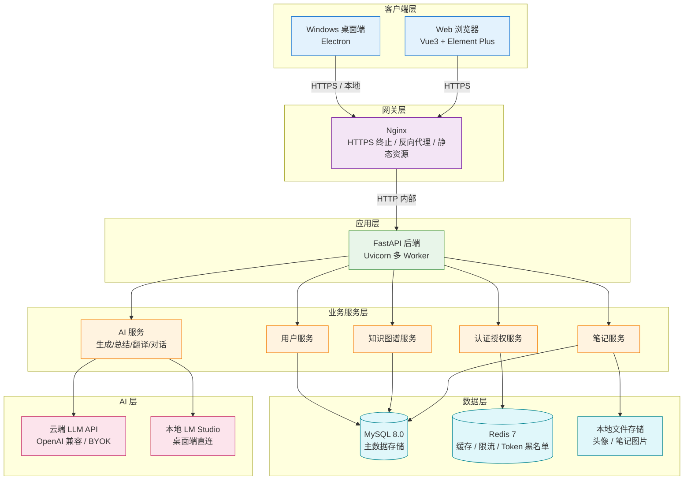
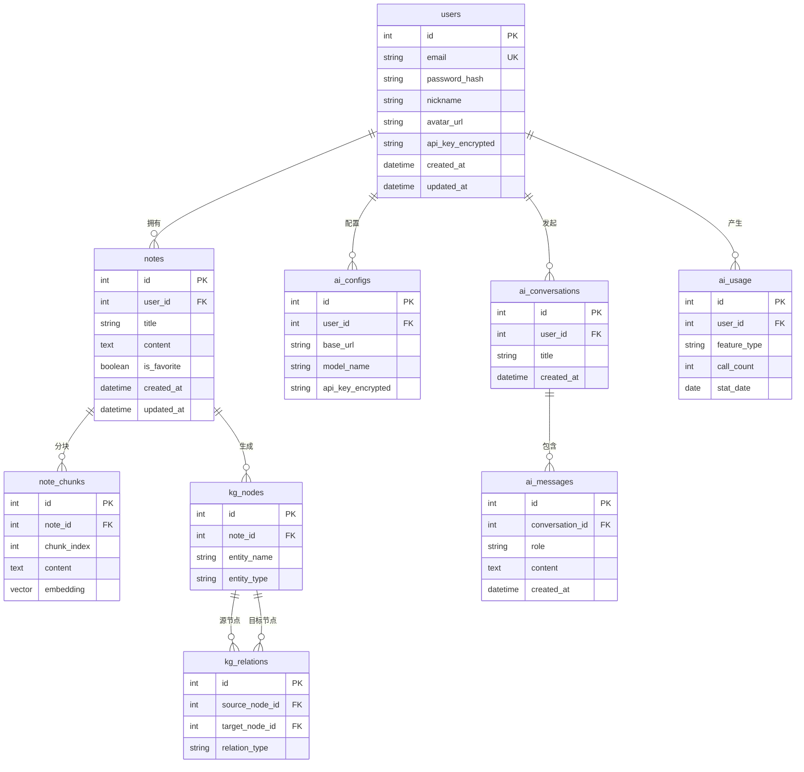

<div align="center">

# NoteMind 项目 Wiki

**版本**：v1.2.0 · **最后更新**：2026-09-04

> 一份让你从零到一彻底了解 NoteMind 项目的完整指南

</div>

---

## 目录

- [一、项目概览](#一项目概览)
- [二、功能特性详解](#二功能特性详解)
- [三、技术架构](#三技术架构)
- [四、项目目录结构](#四项目目录结构)
- [五、快速开始（本地开发）](#五快速开始本地开发)
- [六、后端模块详解](#六后端模块详解)
- [七、前端模块详解](#七前端模块详解)
- [八、桌面端（Electron）](#八桌面端electron)
- [九、数据库设计](#九数据库设计)
- [十、部署指南](#十部署指南)
- [十一、CI/CD 流水线](#十一cicd-流水线)
- [十二、安全机制总览](#十二安全机制总览)
- [十三、开发规范与质量保障](#十三开发规范与质量保障)
- [十四、常见问题与排障](#十四常见问题与排障)
- [十五、项目现状与后续规划](#十五项目现状与后续规划)

---

## 一、项目概览

### 1.1 项目是什么

**NoteMind** 是一款面向个人学习与创作的**全栈智能笔记应用**，也是作者的毕业设计项目。它不仅仅是一个笔记工具，而是将笔记管理与 AI 能力深度结合的智能知识管理平台。

项目提供两种使用形态：

| 形态 | 说明 | 适用场景 |
|------|------|----------|
| **Web 版** | 浏览器访问，数据存服务端 | 多设备同步、团队协作 |
| **桌面版** | Windows 原生客户端（Electron），数据存本地 SQLite | 隐私敏感、本地 AI 推理 |

### 1.2 解决什么问题

传统笔记工具（如 Notion、印象笔记）存在以下痛点：

1. **AI 能力薄弱**：大多只做简单的文本润色，缺乏深度的知识关联
2. **数据隐私顾虑**：笔记内容上传到第三方服务器，敏感信息不安全
3. **本地模型支持差**：无法对接 LM Studio 等本地推理引擎
4. **知识可视化不足**：笔记之间的关联难以直观呈现

NoteMind 的解决方案：

- **BYOK（自带密钥）**：Web 版用户自行配置云端 API Key，平台不代收费用
- **本地 AI 支持**：桌面版可直连本机 LM Studio，AI 完全离线运行
- **知识图谱 + 思维导图**：双重视觉化方式呈现笔记间的关联
- **多层安全防护**：JWT 认证、速率限制、SSRF 防护、密钥加密存储

### 1.3 核心数据

- **版本**：v1.2.0
- **开源协议**：MIT
- **本地开发库数据**：362 篇笔记、290 个用户
- **后端测试**：126 用例通过，覆盖率 48%
- **前端测试**：45 用例通过
- **代码质量**：Lint 零问题（后端 ruff / 前端 eslint），npm audit 零漏洞

---

## 二、功能特性详解

### 2.1 笔记管理

这是项目的基础功能，提供完整的笔记生命周期管理：

| 能力 | 说明 |
|------|------|
| **富文本编辑** | 基于 WangEditor 5，支持图片、代码块、表格、引用等 |
| **Markdown 支持** | 可切换 Markdown 编辑模式，基于 marked 解析 |
| **代码高亮** | 集成 PrismJS，支持多种编程语言语法高亮（已通过 patch-package 固化修复） |
| **笔记搜索** | 全文关键词搜索 |
| **收藏功能** | 重要笔记可收藏，快速访问 |
| **历史版本** | 笔记修改历史记录，可查看和恢复 |
| **文件导入** | 支持 Word（.docx）等文件导入解析 |
| **图片上传** | 笔记内图片上传，本地存储 |

### 2.2 AI 辅助（核心亮点）

AI 是 NoteMind 区别于普通笔记工具的核心能力，基于 OpenAI 兼容协议，支持所有兼容 OpenAI API 格式的大模型服务：

| AI 功能 | 说明 | 技术实现 |
|---------|------|----------|
| **AI 生成笔记** | 输入主题，AI 自动生成完整笔记内容 | 流式输出（SSE） |
| **AI 总结** | 对已有笔记进行摘要总结，提取核心要点 | 流式输出 |
| **AI 翻译** | 笔记内容多语言翻译 | 流式输出 |
| **多轮对话** | AI 助手聊天，支持上下文记忆 | 流式输出 + 对话历史存储 |
| **笔记分析** | 自动提取笔记关键词、生成知识图谱节点 | 异步处理 |

**AI 配置方式**：

- **Web 版**：用户在「个人中心」配置自己的云端 API Key（BYOK）
- **桌面版**：可直连本机 LM Studio（默认 `http://localhost:1234/v1`），也可配置云端 API

### 2.3 知识图谱

自动分析笔记内容，提取实体和概念，构建笔记之间的关联网络：

- **可视化展示**：基于 ECharts 力导向图，节点可拖拽、缩放
- **自动构建**：AI 分析笔记内容，自动提取关键词和关联
- **交互探索**：点击节点查看相关笔记，支持筛选和搜索
- **后端服务**：`knowledge_graph_service.py` 负责图谱的构建和查询

### 2.4 思维导图

将笔记的层级结构以思维导图形式可视化：

- **基于 Mermaid**：使用 Mermaid 的 mindmap 语法渲染
- **结构提取**：从笔记标题层级自动生成思维导图
- **导出功能**：支持导出为图片（基于 html-to-image / canvg）

### 2.5 数据统计

为用户提供个人笔记数据的可视化分析：

| 统计维度 | 说明 |
|----------|------|
| **笔记数量趋势** | 按日/周/月统计创建数量 |
| **字数统计** | 总字数、平均每篇字数 |
| **AI 使用量** | AI 生成/总结/翻译的调用次数 |
| **平台趋势图** | 全站用户的笔记创作趋势（公开数据） |

图表基于 ECharts 6.0 渲染。

### 2.6 用户与认证

支持多种登录方式，满足不同用户习惯：

| 登录方式 | 说明 |
|----------|------|
| **邮箱密码** | 传统注册登录，密码 bcrypt 加密存储 |
| **邮箱验证码** | 一次性验证码登录，无需记密码 |
| **GitHub OAuth** | 第三方授权登录，快速注册 |

**用户中心功能**：
- 个人信息修改（昵称、头像）
- API Key 配置（加密存储，展示时仅显示后四位）
- 密码修改
- 账号安全设置

### 2.7 安全体系

项目内置多层安全防护，详见[第十二章](#十二安全机制总览)。

---

## 三、技术架构

### 3.1 整体架构图



### 3.2 技术栈全景

#### 前端技术栈

| 类别 | 技术 | 版本 | 用途 |
|------|------|------|------|
| 框架 | Vue 3 | ^3.3.11 | 核心框架（Composition API） |
| 构建工具 | Vite | ^6.4.3 | 开发服务器与构建 |
| UI 组件库 | Element Plus | ^2.4.3 | 界面组件 |
| 路由 | Vue Router | ^4.2.5 | 前端路由 |
| 状态管理 | Pinia | ^2.1.7 | 全局状态管理 |
| HTTP 客户端 | Axios | ^1.6.2 | API 请求 |
| 富文本编辑器 | WangEditor | ^5.1.23 | 笔记编辑 |
| 图表库 | ECharts | ^6.0.0 | 数据统计 / 知识图谱 |
| 流程图 | Mermaid | ^11.4.0 | 思维导图渲染 |
| Markdown 解析 | marked | ^18.0.3 | Markdown 渲染 |
| 3D 渲染 | Three.js | ^0.185.0 | 部分视觉效果 |
| 动画 | GSAP | ^3.15.0 | 页面动画 |
| HTML 净化 | isomorphic-dompurify | ^2.36.0 | XSS 防护 |
| 测试 | Vitest | ^3.0.5 | 单元测试 |
| Lint | ESLint | ^9.10.0 | 代码规范检查 |

#### 后端技术栈

| 类别 | 技术 | 版本 | 用途 |
|------|------|------|------|
| Web 框架 | FastAPI | >=0.115.0 | 核心框架（异步） |
| ASGI 服务器 | Uvicorn | >=0.32.0 | 运行服务器 |
| 数据校验 | Pydantic | >=2.9.0 | 请求/响应模型 |
| ORM | SQLAlchemy | >=2.0.35 | 数据库操作（异步） |
| MySQL 驱动 | aiomysql | >=0.2.0 | 异步 MySQL 连接 |
| 缓存 | Redis | >=5.2.0 | 缓存 / 限流 / 黑名单 |
| 认证 | python-jose | >=3.3.0 | JWT 令牌 |
| 密码加密 | bcrypt | >=4.2.0 | 密码哈希 |
| AI 客户端 | OpenAI SDK | >=1.55.0 | LLM API 调用 |
| 加密 | cryptography | >=42.0.0 | API Key 加密存储（Fernet） |
| 文件解析 | python-docx | >=1.1.0 | Word 文件导入 |
| HTML 解析 | BeautifulSoup4 | >=4.12.0 | 内容清洗 |
| 数据库迁移 | Alembic | >=1.13.0 | 版本化迁移 |
| 测试 | pytest | - | 单元测试 |
| Lint | Ruff | - | 代码规范检查 |

#### 基础设施

| 组件 | 技术 | 用途 |
|------|------|------|
| 数据库 | MySQL 8.0 | 主数据存储 |
| 缓存 | Redis 7 | 缓存、速率限制、Token 黑名单 |
| 容器化 | Docker + Docker Compose | 服务编排 |
| Web 服务器 | Nginx | 反向代理、HTTPS、静态资源 |
| HTTPS 证书 | Certbot + Let's Encrypt | 免费 SSL 证书自动续期 |
| CI/CD | GitHub Actions | 自动化测试、构建、发布 |
| 镜像仓库 | GHCR（GitHub Container Registry） | Docker 镜像存储 |

---

## 四、项目目录结构

```
note-takingAssistant/               # 项目根目录（Git 仓库根）
├── backend/                        # 【后端】FastAPI 服务
│   ├── app/
│   │   ├── main.py                 # 应用入口，创建 FastAPI 实例
│   │   ├── api/
│   │   │   └── v1/                 # API v1 路由层
│   │   │       ├── ai.py           # AI 相关接口（生成/总结/翻译/对话）
│   │   │       ├── kg.py           # 知识图谱接口
│   │   │       ├── note.py         # 笔记 CRUD 接口
│   │   │       ├── oauth.py        # OAuth 登录接口（GitHub）
│   │   │       ├── public.py       # 公开接口（无需认证）
│   │   │       └── user.py         # 用户相关接口（注册/登录/个人中心）
│   │   ├── core/                   # 核心基础设施层
│   │   │   ├── config.py           # 配置管理（环境变量读取）
│   │   │   ├── database.py         # 数据库连接（异步 SQLAlchemy）
│   │   │   ├── security.py         # 安全工具（JWT、密码哈希）
│   │   │   ├── redis_client.py     # Redis 连接管理
│   │   │   ├── rate_limit.py       # 速率限制中间件
│   │   │   ├── field_crypto.py     # 字段加密（API Key Fernet 加密）
│   │   │   ├── logger.py           # 结构化日志
│   │   │   └── startup_migrations.py  # 启动时自动建表/迁移
│   │   ├── models/                 # 数据模型层（SQLAlchemy ORM）
│   │   │   ├── user.py             # 用户模型
│   │   │   ├── note.py             # 笔记模型
│   │   │   ├── note_chunk.py       # 笔记分块（用于 RAG）
│   │   │   ├── ai.py               # AI 配置模型
│   │   │   ├── ai_conversation.py  # AI 对话记录模型
│   │   │   ├── ai_usage.py         # AI 使用量统计模型
│   │   │   └── kg.py               # 知识图谱模型
│   │   ├── crud/                   # 数据访问层（CRUD 封装）
│   │   │   ├── user.py
│   │   │   ├── note.py
│   │   │   ├── note_chunk.py
│   │   │   ├── ai_conversation.py
│   │   │   └── ai_usage.py
│   │   ├── services/               # 业务服务层（核心逻辑）
│   │   │   ├── agent/              # Agent 相关（智能体编排）
│   │   │   ├── chat_service.py     # 多轮对话服务
│   │   │   ├── note_generator.py   # AI 生成笔记服务
│   │   │   ├── note_analyzer.py    # 笔记分析服务（关键词提取）
│   │   │   ├── note_translator.py  # 翻译服务
│   │   │   ├── note_rag.py         # RAG 检索增强生成
│   │   │   ├── knowledge_graph_service.py  # 知识图谱服务
│   │   │   ├── llm_runtime.py      # LLM 运行时（统一调用入口）
│   │   │   ├── openai_client.py    # OpenAI 兼容客户端封装
│   │   │   ├── oauth_service.py    # OAuth 认证服务
│   │   │   ├── email_service.py    # 邮件发送服务（验证码）
│   │   │   └── prompts.py          # AI Prompt 模板管理
│   │   └── utils/                  # 工具函数层
│   │       ├── file_upload.py      # 文件上传处理
│   │       ├── file_parser.py      # 文件解析（Word 等）
│   │       ├── common.py           # 通用工具
│   │       ├── llm_errors.py       # LLM 错误处理
│   │       ├── openai_compatible_url.py  # OpenAI 兼容 URL 校验（SSRF 防护）
│   │       └── stats_series.py     # 统计数据序列处理
│   ├── tests/                      # 后端测试（pytest）
│   │   ├── test_file_upload.py     # 文件上传测试（12 用例）
│   │   ├── test_knowledge_graph.py # 知识图谱测试（16 用例）
│   │   ├── test_ai_api.py          # AI API 测试（3 用例）
│   │   └── ...                     # 其他测试文件
│   ├── .venv/                       # Python 虚拟环境
│   ├── requirements.txt             # Python 依赖
│   └── Dockerfile                   # 后端 Docker 镜像
│
├── frontend/                       # 【前端】Vue 3 应用
│   ├── src/
│   │   ├── main.js                 # 应用入口
│   │   ├── App.vue                 # 根组件
│   │   ├── api/                    # API 调用层（Axios 封装）
│   │   │   ├── index.js            # Axios 实例配置（拦截器、Token）
│   │   │   ├── ai.js               # AI 相关 API
│   │   │   ├── note.js             # 笔记相关 API
│   │   │   ├── kg.js               # 知识图谱 API
│   │   │   ├── user.js             # 用户相关 API
│   │   │   └── public.js           # 公开 API
│   │   ├── assets/                 # 静态资源
│   │   │   └── styles/             # 全局样式
│   │   │       └── home.css        # 首页样式（含移动端响应式）
│   │   ├── components/             # 通用组件
│   │   │   ├── Layout.vue          # 布局组件（侧边栏 + 主内容）
│   │   │   ├── RichText.vue        # 富文本编辑器封装
│   │   │   ├── MarkdownContent.vue # Markdown 渲染组件
│   │   │   ├── NoteCard.vue        # 笔记卡片组件
│   │   │   ├── home/               # 首页相关组件
│   │   │   ├── icons/              # 图标组件
│   │   │   └── welcome/            # 欢迎页组件
│   │   ├── composables/            # 组合式函数（逻辑复用）
│   │   │   ├── useAIAssistant.js   # AI 助手逻辑
│   │   │   ├── useNoteManager.js   # 笔记管理逻辑
│   │   │   ├── useLazyReveal.js    # 懒加载动画
│   │   │   └── home/               # 首页相关组合式函数
│   │   ├── config/                 # 配置
│   │   │   └── api.js              # API 基础地址配置
│   │   ├── constants/              # 常量
│   │   │   ├── userCenterLegal.js  # 用户中心法律文本
│   │   │   └── welcomeLanding.js   # 欢迎页文案
│   │   ├── router/                 # 路由配置
│   │   │   └── index.js            # 路由表 + 导航守卫
│   │   ├── store/                  # Pinia 状态管理
│   │   │   ├── index.js            # Store 入口
│   │   │   └── ai.js               # AI 相关状态
│   │   ├── utils/                  # 工具函数
│   │   │   ├── common.js           # 通用工具
│   │   │   ├── htmlSanitize.js     # HTML 净化（XSS 防护）
│   │   │   ├── streamPlainTextPost.js  # 流式文本请求
│   │   │   ├── streamSseEvents.js  # SSE 事件流处理
│   │   │   └── welcomeChartTheme.js    # 图表主题
│   │   └── views/                  # 页面视图
│   │       ├── Home.vue            # 首页（登录后主界面，三栏布局）
│   │       ├── auth/               # 认证相关页面
│   │       │   ├── Welcome.vue     # 欢迎页（未登录首页）
│   │       │   ├── Login.vue       # 登录页
│   │       │   ├── Register.vue    # 注册页
│   │       │   └── OAuthCallback.vue  # OAuth 回调页
│   │       ├── notes/              # 笔记相关页面
│   │       │   ├── NoteList.vue    # 笔记列表
│   │       │   ├── NoteEdit.vue    # 笔记编辑
│   │       │   └── HistoryNotes.vue # 历史笔记
│   │       ├── ai/                 # AI 相关页面
│   │       │   ├── AiGenerate.vue  # AI 生成笔记
│   │       │   ├── AiSummarize.vue # AI 总结
│   │       │   └── NoteTranslate.vue # AI 翻译
│   │       ├── kg/                 # 知识图谱页面
│   │       │   └── KnowledgeGraph.vue
│   │       ├── mindmap/            # 思维导图页面
│   │       │   └── Mindmap.vue
│   │       ├── user/               # 用户中心页面
│   │       │   └── UserCenter.vue
│   │       └── help/               # 帮助页面
│   │           └── UserManual.vue  # 用户操作手册
│   ├── patches/                    # patch-package 补丁
│   │   └── @wangeditor+code-highlight+1.0.3.patch  # 代码高亮修复
│   ├── public/                     # 公共静态资源
│   ├── tests/                      # 前端测试（Vitest）
│   ├── vite.config.js              # Vite 配置（含测试环境 jsdom）
│   ├── package.json                # 前端依赖
│   └── Dockerfile                  # 前端 Docker 镜像（Nginx）
│
├── desktop/                        # 【桌面端】Electron 应用
│   ├── main.js                     # Electron 主进程
│   ├── preload.js                  # 预加载脚本（IPC 桥接）
│   ├── README.md                   # 桌面端说明
│   └── ...                         # 其他桌面端资源
│
├── docs/                           # 项目文档
│   ├── PROJECT_WIKI.md             # 【本文档】项目完整 Wiki
│   ├── CODE_WIKI.md                # 代码层面 Wiki（更细的代码说明）
│   ├── architecture.md             # 系统架构图（Mermaid）
│   ├── er-diagram.md               # 数据库 ER 图
│   ├── PRODUCTION_OPS.md           # 生产运维方案（监控/告警/备份/巡检）
│   ├── DEPLOY.md                   # 部署详细指南
│   ├── ai-assistant-improvement.md # AI 助手改进方案
│   ├── file-upload-security-improvement.md  # 文件上传安全改进
│   ├── code-health-audit-2026-06-29.md  # 代码健康审计报告
│   └── logo.svg                    # 项目 Logo
│
├── scripts/                        # 辅助脚本
├── .github/                        # GitHub 配置
│   └── workflows/                  # CI/CD 工作流
│       ├── ci.yml                  # 持续集成（测试 + Lint）
│       └── release.yml             # 发布流程（Docker 镜像 + GitHub Release）
├── .idea/                          # JetBrains IDE 配置
├── docker-compose.yml              # Docker Compose 编排（5 服务）
├── .env                            # 本地环境变量
├── .env.docker                     # Docker 环境变量模板
├── .gitignore
├── README.md                       # 项目简介（面向 GitHub 访客）
├── DEPLOY.md                       # 部署文档
├── CHANGELOG.md                    # 变更日志
└── reasonix.toml                   # Reasonix AI IDE 配置
```

---

## 五、快速开始（本地开发）

### 5.1 环境要求

| 组件 | 最低版本 | 说明 |
|------|----------|------|
| Node.js | >= 18 | 前端构建与开发 |
| Python | >= 3.10 | 后端运行（推荐 3.12） |
| MySQL | >= 8.0 | 数据库 |
| Redis | >= 7 | 缓存（Docker 运行即可） |
| Git | 任意 | 版本控制 |

### 5.2 本地开发环境配置（已配置好的环境）

> 以下是当前开发机的实际配置，可直接使用。

#### 第一步：启动 MySQL

本地 MySQL 已安装并运行：
- 地址：`localhost:3306`
- 用户名：`root`
- 密码：`123456`
- 开发库：`ai_note_db`（含 362 篇笔记、290 用户的真实测试数据）
- 测试库：`note_db_test`

如果 MySQL 未启动，Windows 下通过服务管理器启动 `MySQL80` 服务。

#### 第二步：启动 Redis

Redis 以 Docker 容器运行：

```bash
# 查看容器状态
docker ps -a --filter name=note-redis

# 如果容器已存在但未运行
docker start note-redis

# 如果需要重新创建（注意：宿主机 6379 被其他项目占用，这里映射 6380）
docker run -d --name note-redis --restart unless-stopped -p 6380:6379 redis:7-alpine
```

验证 Redis 连通性：

```bash
redis-cli -p 6380 PING
# 应返回 PONG
```

> **重要**：宿主机 6379 端口被另一个项目 `mtt-redis` 占用，**不要动它**。本项目 Redis 使用 6380。

#### 第三步：启动后端

```bash
cd backend

# 激活虚拟环境
.\.venv\Scripts\Activate.ps1

# 设置环境变量（PowerShell）
$env:DB_PASSWORD="123456"
$env:DB_NAME="ai_note_db"
$env:REDIS_PORT="6380"

# 启动后端（热重载）
uvicorn main:app --reload --port 8000
```

后端启动后：
- API 地址：`http://localhost:8000`
- Swagger 文档：`http://localhost:8000/docs`

#### 第四步：启动前端

```bash
cd frontend

# 安装依赖（首次或依赖变更时）
npm install

# 启动开发服务器
npm run dev
```

前端启动后：
- 访问地址：`http://localhost:5174`
- Vite 会自动将 `/api` 请求代理到 `http://localhost:8000`

#### 第五步：登录测试

使用测试账号登录：

| 项目 | 值 |
|------|-----|
| 邮箱 | `verify_645353@example.com` |
| 密码 | `Test123456` |

测试笔记：ID 453「PHP 测试笔记」（用于验证代码高亮功能）

### 5.3 从零搭建环境（新机器）

如果在一台全新的机器上搭建，按以下步骤：

1. **安装 MySQL 8.0**，创建数据库 `ai_note_db`
2. **安装 Docker**，运行 Redis 容器
3. **后端初始化**：
   ```bash
   cd backend
   python -m venv .venv
   .\.venv\Scripts\Activate.ps1
   pip install -r requirements.txt
   # 复制 .env.example 为 .env，填写配置
   uvicorn main:app --reload --port 8000
   # 首次启动会自动建表（startup_migrations.py）
   ```
4. **前端初始化**：
   ```bash
   cd frontend
   npm install
   npm run dev
   ```

---

## 六、后端模块详解

### 6.1 入口与启动流程

**入口文件**：`backend/app/main.py`

启动时执行的操作：

1. **创建 FastAPI 实例**：配置标题、版本、CORS 中间件
2. **注册路由**：挂载 `/api/v1` 下的所有路由模块
3. **启动事件（lifespan）**：
   - 初始化数据库连接池
   - 执行启动迁移（`startup_migrations.py`）：自动创建不存在的表
   - 初始化 Redis 连接
4. **注册中间件**：
   - CORS 中间件（允许前端域名跨域）
   - 速率限制中间件（基于 Redis）
   - 结构化日志中间件

### 6.2 core 核心层

| 模块 | 职责 | 关键实现 |
|------|------|----------|
| **config.py** | 统一配置管理 | 基于 pydantic-settings，从环境变量读取所有配置 |
| **database.py** | 数据库连接 | SQLAlchemy 2.0 异步引擎 + 会话工厂（async_sessionmaker） |
| **security.py** | 安全工具 | JWT 编解码（python-jose）、密码哈希（bcrypt）、Token 黑名单检查 |
| **redis_client.py** | Redis 连接 | 异步 Redis 客户端（redis-py asyncio） |
| **rate_limit.py** | 速率限制 | 基于 Redis 的滑动窗口限流，按 IP + 端点限制请求频率 |
| **field_crypto.py** | 字段加密 | Fernet 对称加密，用于用户 API Key 的加密存储 |
| **logger.py** | 结构化日志 | 统一日志格式，含请求 ID、用户 ID、耗时等 |
| **startup_migrations.py** | 启动迁移 | 应用启动时自动检查并创建缺失的数据库表 |

### 6.3 models 数据模型层

使用 SQLAlchemy 2.0 声明式模型，所有表使用 `utf8mb4` 字符集。

| 模型 | 表名 | 说明 |
|------|------|------|
| **User** | `users` | 用户信息（邮箱、密码哈希、昵称、头像、API Key 加密值） |
| **Note** | `notes` | 笔记主表（标题、内容、用户 ID、是否收藏、创建/更新时间） |
| **NoteChunk** | `note_chunks` | 笔记分块（用于 RAG 检索，按段落切分） |
| **AIConfig** | `ai_configs` | 用户 AI 配置（API Key、模型名称、基础 URL） |
| **AIConversation** | `ai_conversations` | AI 对话会话（会话 ID、用户 ID、标题） |
| **AIMessage** | `ai_messages` | AI 对话消息（会话 ID、角色、内容、时间戳） |
| **AIUsage** | `ai_usage` | AI 使用量统计（用户 ID、功能类型、调用次数、日期） |
| **KGNode** | `kg_nodes` | 知识图谱节点（笔记 ID、实体名称、类型） |
| **KGRelation** | `kg_relations` | 知识图谱关系（源节点、目标节点、关系类型） |

### 6.4 crud 数据访问层

CRUD 层封装了所有数据库操作，遵循以下规范：

- 所有方法接收 `db: AsyncSession` 作为第一个参数
- 查询方法返回模型实例或 `None`
- 创建/更新方法后自动 `commit` + `refresh`
- 按业务实体分文件：`user.py`、`note.py`、`ai_conversation.py` 等

### 6.5 services 业务服务层

这是后端最核心的一层，承载所有业务逻辑：

| 服务 | 职责 | 关键技术 |
|------|------|----------|
| **llm_runtime.py** | LLM 调用统一入口 | 封装 OpenAI SDK，支持流式/非流式，统一错误处理 |
| **openai_client.py** | OpenAI 兼容客户端 | 支持自定义 base_url，SSRF 防护，超时控制 |
| **note_generator.py** | AI 生成笔记 | 根据主题生成完整笔记，流式输出 |
| **note_analyzer.py** | 笔记分析 | 提取关键词、摘要，为知识图谱提供数据 |
| **note_translator.py** | 笔记翻译 | 多语言翻译，保留格式 |
| **chat_service.py** | 多轮对话 | 对话历史管理、上下文拼接、流式回复 |
| **note_rag.py** | RAG 检索增强 | 笔记分块检索，为 AI 回答提供上下文 |
| **knowledge_graph_service.py** | 知识图谱 | 图谱构建、查询、可视化数据输出 |
| **oauth_service.py** | OAuth 认证 | GitHub OAuth 流程，用户创建/登录 |
| **email_service.py** | 邮件发送 | 验证码邮件，基于 SMTP |
| **prompts.py** | Prompt 管理 | 所有 AI Prompt 模板集中管理 |

**AI 调用链路**：

```
API 路由 → services.llm_runtime → services.openai_client → 外部 LLM API
                    ↓
              统一错误处理
              流式响应封装
              超时控制
              SSRF 防护
```

### 6.6 api/v1 路由层

路由层负责 HTTP 请求的接收和响应，遵循 RESTful 规范：

| 路由文件 | 前缀 | 主要接口 |
|----------|------|----------|
| **user.py** | `/api/v1/user` | 注册、登录、登出、获取/更新用户信息、修改密码 |
| **note.py** | `/api/v1/notes` | 笔记 CRUD、搜索、收藏、历史版本、文件导入 |
| **ai.py** | `/api/v1/ai` | 生成笔记、总结、翻译、对话（流式）、使用量统计 |
| **kg.py** | `/api/v1/kg` | 知识图谱查询、构建、节点管理 |
| **oauth.py** | `/api/v1/oauth` | GitHub OAuth 登录 URL、回调处理 |
| **public.py** | `/api/v1/public` | 公开统计数据、平台趋势（无需认证） |

**路由层规范**：
- 使用 Pydantic 模型定义请求体和响应体
- 认证接口使用 `Depends(get_current_user)` 注入当前用户
- 流式接口使用 `StreamingResponse` + SSE 格式
- 统一异常处理，返回结构化错误响应

### 6.7 utils 工具层

| 工具 | 职责 |
|------|------|
| **file_upload.py** | 文件上传处理（图片、头像），含类型校验、大小限制、安全重命名 |
| **file_parser.py** | 文件解析（Word .docx → 纯文本/HTML） |
| **openai_compatible_url.py** | OpenAI 兼容 URL 校验，防止 SSRF 攻击（禁止内网地址） |
| **llm_errors.py** | LLM 相关异常定义和错误映射 |
| **stats_series.py** | 统计数据序列处理（按日/周/月聚合） |
| **common.py** | 通用工具函数 |

---

## 七、前端模块详解

### 7.1 入口与构建配置

**入口文件**：`frontend/src/main.js`

启动时执行：
1. 创建 Vue 应用实例
2. 注册 Pinia 状态管理
3. 注册 Vue Router
4. 注册 Element Plus（按需自动导入）
5. 挂载到 `#app`

**构建配置**：`frontend/vite.config.js`

- 开发服务器端口：`5174`
- API 代理：`/api` → `http://localhost:8000`
- 自动导入：`unplugin-auto-import` + `unplugin-vue-components`（Element Plus 按需加载）
- 测试环境：`jsdom`（原 happy-dom 因兼容性问题替换）
- 构建优化：terser 压缩，代码分割

### 7.2 路由系统

**配置文件**：`frontend/src/router/index.js`

使用 `createWebHistory` 模式（HTML5 History API）。

**路由表**：

| 路径 | 页面 | 认证要求 | 说明 |
|------|------|----------|------|
| `/` | Welcome.vue | 否 | 欢迎页（未登录首页），已登录自动跳转 /home |
| `/home` | Home.vue | 是 | 主界面（三栏布局：侧边栏 + 笔记列表 + 编辑区） |
| `/login` | Login.vue | 否 | 登录页 |
| `/register` | Register.vue | 否 | 注册页 |
| `/notes` | NoteList.vue | 是 | 笔记列表 |
| `/notes/edit/:id?` | NoteEdit.vue | 是 | 笔记编辑（id 可选，无 id 为新建） |
| `/notes/history` | HistoryNotes.vue | 是 | 历史笔记 |
| `/ai/generate` | AiGenerate.vue | 是 | AI 生成笔记 |
| `/ai/summarize` | AiSummarize.vue | 是 | AI 总结 |
| `/ai/translate` | NoteTranslate.vue | 是 | AI 翻译 |
| `/mindmap` | Mindmap.vue | 是 | 思维导图 |
| `/kg` | KnowledgeGraph.vue | 是 | 知识图谱 |
| `/user` | UserCenter.vue | 是 | 用户中心 |
| `/manual` | UserManual.vue | 否 | 用户操作手册 |
| `/oauth-callback` | OAuthCallback.vue | 否 | GitHub OAuth 回调 |

**导航守卫**：
- 未登录访问需要认证的页面 → 跳转 `/`
- 已登录访问登录/注册页 → 跳转 `/home`
- 访问 `/` 时已登录 → 跳转 `/home`

### 7.3 状态管理（Pinia）

**Store 入口**：`frontend/src/store/index.js`

| Store | 职责 | 关键状态 |
|-------|------|----------|
| **user** | 用户认证状态 | token、userInfo、isLoggedIn |
| **ai** | AI 相关状态 | 当前对话、AI 配置、加载状态 |

**持久化**：Token 存储在 `localStorage`，页面刷新后从 localStorage 恢复登录状态。

### 7.4 API 调用层

**Axios 实例配置**：`frontend/src/api/index.js`

- 基础 URL：`/api/v1`（通过 Vite 代理转发）
- 请求拦截器：自动添加 `Authorization: Bearer <token>`
- 响应拦截器：
  - 401 未授权 → 清除登录状态，跳转登录页
  - 错误统一处理，Element Plus Message 提示

**API 模块**：按业务分文件，每个文件导出一组 API 函数。

### 7.5 核心组件

| 组件 | 路径 | 职责 |
|------|------|------|
| **Layout.vue** | `components/Layout.vue` | 全局布局（侧边栏导航 + 主内容区） |
| **RichText.vue** | `components/RichText.vue` | 富文本编辑器封装（WangEditor 5 + 代码高亮） |
| **MarkdownContent.vue** | `components/MarkdownContent.vue` | Markdown 渲染组件（marked + DOMPurify 净化） |
| **NoteCard.vue** | `components/NoteCard.vue` | 笔记卡片（列表展示用） |

### 7.6 组合式函数（Composables）

| 函数 | 职责 |
|------|------|
| **useAIAssistant.js** | AI 助手逻辑封装（流式请求、对话管理） |
| **useNoteManager.js** | 笔记管理逻辑（CRUD、搜索、收藏） |
| **useLazyReveal.js** | 滚动懒加载动画（基于 IntersectionObserver） |

### 7.7 工具函数

| 工具 | 职责 |
|------|------|
| **htmlSanitize.js** | HTML 净化（基于 isomorphic-dompurify，防止 XSS） |
| **streamSseEvents.js** | SSE 事件流解析（处理 AI 流式响应） |
| **streamPlainTextPost.js** | 流式纯文本 POST 请求 |
| **common.js** | 通用工具（日期格式化、防抖节流等） |

### 7.8 响应式设计

当前状态（2026-09-04）：

- **/home 页面**：已添加 `@media (max-width: 768px)` 断点，三栏布局在小屏变为纵向堆叠
- **其他页面**：NoteList / AiGenerate / HistoryNotes / UserCenter 等已有各自的响应式断点
- **移动端验证限制**：自动化工具无法模拟移动端视口，需手动缩小浏览器窗口验证

---

## 八、桌面端（Electron）

### 8.1 概述

桌面端基于 Electron 构建，提供 Windows 原生客户端体验。与 Web 版共享前端代码，但有以下关键差异：

| 特性 | Web 版 | 桌面版 |
|------|--------|--------|
| **数据存储** | 服务端 MySQL | 本地 SQLite |
| **AI 调用** | 用户自带云端 API Key | 可直连本机 LM Studio（默认 localhost:1234） |
| **网络依赖** | 必须联网 | 本地 AI 功能无需网络 |
| **隐私性** | 数据经服务器转发 | AI 完全本地运行，数据不出本机 |

### 8.2 架构

```
┌─────────────────────────────────────┐
│         Electron 主进程              │
│  - 窗口管理                          │
│  - 本地 SQLite 数据库                │
│  - 文件系统访问                      │
│  - 自动更新                          │
└──────────────┬──────────────────────┘
               │ IPC (contextBridge)
┌──────────────▼──────────────────────┐
│         渲染进程（Vue 3）            │
│  - 与 Web 版共享前端代码             │
│  - 通过 preload 桥接调用原生能力     │
└─────────────────────────────────────┘
```

### 8.3 关键模块

| 模块 | 文件 | 职责 |
|------|------|------|
| **主进程** | `desktop/main.js` | 窗口创建、应用生命周期、本地服务启动 |
| **预加载脚本** | `desktop/preload.js` | contextBridge 暴露安全 API 给渲染进程 |
| **本地 LLM 客户端** | - | 直连 LM Studio Local Server |

> 桌面端的详细说明见 `desktop/README.md`。

---

## 九、数据库设计

### 9.1 ER 图概览



> 完整 ER 图见 `docs/er-diagram.md`。

### 9.2 核心表说明

#### users（用户表）

| 字段 | 类型 | 说明 |
|------|------|------|
| id | INT PK | 用户 ID |
| email | VARCHAR UNIQUE | 邮箱（登录账号） |
| password_hash | VARCHAR | bcrypt 密码哈希 |
| nickname | VARCHAR | 昵称 |
| avatar_url | VARCHAR | 头像 URL |
| api_key_encrypted | TEXT | Fernet 加密后的 API Key |
| created_at | DATETIME | 创建时间 |
| updated_at | DATETIME | 更新时间 |

#### notes（笔记表）

| 字段 | 类型 | 说明 |
|------|------|------|
| id | INT PK | 笔记 ID |
| user_id | INT FK | 所属用户 |
| title | VARCHAR | 笔记标题 |
| content | LONGTEXT | 笔记内容（HTML 格式） |
| is_favorite | BOOLEAN | 是否收藏 |
| created_at | DATETIME | 创建时间 |
| updated_at | DATETIME | 更新时间 |

### 9.3 数据库迁移

项目使用两种迁移机制：

1. **启动自动建表**（`startup_migrations.py`）：应用启动时检查所有模型对应的表是否存在，不存在则自动创建。适用于开发环境和简单部署。
2. **Alembic 版本化迁移**：`requirements.txt` 中已包含 Alembic，可用于复杂的 schema 变更管理（生产环境推荐）。

---

## 十、部署指南

### 10.1 Docker Compose 一键部署

项目提供完整的 Docker Compose 配置，包含 5 个服务：

| 服务 | 镜像 | 端口暴露 | 说明 |
|------|------|----------|------|
| **mysql** | mysql:8.0 | 不对外 | 数据库，数据持久化到 volume |
| **redis** | redis:7-alpine | 不对外 | 缓存，带密码 |
| **backend** | 本地构建（./backend） | 不对外 | FastAPI 后端，多 Worker |
| **frontend** | 本地构建（./frontend） | 80, 443 | Nginx 静态资源 + API 反向代理 + HTTPS |
| **certbot** | certbot/certbot:latest | 不对外 | Let's Encrypt 证书自动续期 |

#### 部署步骤

```bash
# 1. 克隆项目
git clone <repo-url>
cd note-takingAssistant

# 2. 配置环境变量
cp .env.docker .env
# 编辑 .env，填写以下关键配置：
#   DB_PASSWORD=你的数据库密码
#   REDIS_PASSWORD=你的Redis密码
#   SECRET_KEY=你的JWT密钥（务必修改！）
#   API_BASE_URL=https://你的域名
#   FRONTEND_URL=https://你的域名

# 3. 构建并启动所有服务
docker compose up -d --build

# 4. 首次申请 HTTPS 证书（certbot 容器内执行）
docker compose run --rm certbot certonly --webroot \
  --webroot-path /var/www/certbot \
  -d 你的域名 \
  --email 你的邮箱 \
  --agree-tos

# 5. 重启 frontend 使证书生效
docker compose restart frontend
```

#### 常用运维命令

```bash
# 查看服务状态
docker compose ps

# 查看日志
docker compose logs -f backend
docker compose logs -f frontend

# 停止所有服务
docker compose down

# 重启某个服务
docker compose restart backend

# 进入数据库
docker compose exec mysql mysql -u root -p
```

### 10.2 生产环境配置要点

1. **安全配置**：
   - `SECRET_KEY` 必须使用强随机字符串
   - `DB_PASSWORD` 和 `REDIS_PASSWORD` 必须设置强密码
   - `DEBUG=false`

2. **域名与 HTTPS**：
   - 域名 DNS A 记录指向服务器 IP
   - 防火墙开放 80 和 443 端口
   - Certbot 自动续期（每 12 小时检查一次）

3. **数据备份**：
   - MySQL 数据持久化到 Docker volume `mysql_data`
   - 建议定期执行 `mysqldump` 备份到异地存储
   - 详见 `docs/PRODUCTION_OPS.md`

### 10.3 GHCR 镜像部署（推荐生产）

CI/CD 会自动将 Docker 镜像推送到 GitHub Container Registry（GHCR）。生产环境可直接使用预构建镜像，无需在服务器上构建：

```yaml
# docker-compose.yml 中替换 build 为 image
backend:
  image: ghcr.io/<owner>/note-taking-assistant/backend:v1.2.0
frontend:
  image: ghcr.io/<owner>/note-taking-assistant/frontend:v1.2.0
```

---

## 十一、CI/CD 流水线

### 11.1 持续集成（CI）

**触发条件**：推送到 `master` 分支或提交 Pull Request

**工作流文件**：`.github/workflows/ci.yml`

#### 前端 CI 流程

```
npm ci（安装依赖）
  → ESLint 检查（强制门禁，失败即中断）
  → Vitest 单元测试（45 用例）
  → Vite 构建（验证可构建性）
  → npm audit（依赖安全扫描，0 漏洞）
```

#### 后端 CI 流程

```
pip install（安装依赖）
  → Ruff lint 检查（强制门禁）
  → Ruff format 检查（代码格式）
  → pytest（含 MySQL + Redis service 容器，126 用例）
  → 覆盖率检查（门槛 40%，当前 48%）
  → pip-audit（依赖安全扫描）
```

#### 桌面端 CI 流程

```
Electron 构建验证（确保桌面端可正常打包）
```

> **注意**：Lint 检查已从 informational 模式改为**强制门禁**（`c8fdd8a` 提交），任何 lint 错误都会导致 CI 失败。

### 11.2 持续交付（CD）

**触发条件**：推送 `v*.*.*` 格式的 tag

**工作流文件**：`.github/workflows/release.yml`

#### 发布流程

```
推送 tag v1.2.0
  → 构建后端 Docker 镜像
  → 构建前端 Docker 镜像
  → 推送镜像到 GHCR（打 v1.2.0 和 latest 标签）
  → 从 CHANGELOG.md 提取本版本说明
  → 创建 GitHub Release（附镜像拉取命令）
```

#### 发布命令

```bash
# 1. 更新 CHANGELOG.md 和版本号
# 2. 打 tag
git tag v1.2.0
# 3. 推送 tag（触发 release workflow）
git push origin v1.2.0
```

---

## 十二、安全机制总览

NoteMind 在设计时充分考虑了安全性，内置多层防护机制：

### 12.1 认证与授权

| 机制 | 说明 |
|------|------|
| **JWT 认证** | 基于 python-jose 的 HS256 签名，Access Token 有效期 2 小时 |
| **Token 黑名单** | 登出时将 Token 加入 Redis 黑名单，防止已登出 Token 被滥用 |
| **Token 代数** | 用户修改密码后 Token 代数递增，旧 Token 全部失效 |
| **密码哈希** | bcrypt 算法存储密码，不可逆 |
| **路由守卫** | 前端路由级认证检查，未登录自动跳转 |

### 12.2 速率限制

- 基于 Redis 的滑动窗口限流
- 按 IP + 端点维度限制请求频率
- 防止暴力破解、爬虫滥用
- 测试环境自动禁用（避免 CI 单 IP 触发 429）

### 12.3 SSRF 防护

AI 功能允许用户自定义 API Base URL，存在 SSRF（服务端请求伪造）风险。防护措施：

- `openai_compatible_url.py` 校验用户输入的 URL
- 禁止指向内网地址（127.0.0.1、10.x.x.x、192.168.x.x、172.16-31.x.x 等）
- 禁止指向云元数据服务（169.254.169.254）
- 协议白名单（仅允许 http/https）

### 12.4 密钥安全

| 措施 | 说明 |
|------|------|
| **Fernet 加密存储** | 用户 API Key 使用 cryptography 库的 Fernet 对称加密存储到数据库 |
| **掩码展示** | 前端展示 API Key 时仅返回后四位（如 `sk-...xyz`） |
| **环境变量注入** | DB_PASSWORD / REDIS_PASSWORD / SECRET_KEY 通过 `.env` 注入，不硬编码 |
| **HTTPS 传输** | 生产环境全链路 HTTPS，Nginx 终止 TLS |

### 12.5 XSS 防护

- 前端使用 `isomorphic-dompurify` 净化用户输入的 HTML 内容
- 富文本编辑器内容在渲染前经过净化
- Markdown 渲染后同样经过净化

### 12.6 文件上传安全

- 文件类型白名单校验（仅允许图片格式）
- 文件大小限制
- 安全重命名（防止路径遍历和覆盖）
- 上传文件存储在独立目录，不与代码混放
- 详见 `docs/file-upload-security-improvement.md`

### 12.7 网络隔离（生产环境）

- MySQL 和 Redis 仅通过 Docker 内部网络通信，**不暴露到宿主机**
- 后端服务不直接对外，仅通过 Nginx 反向代理访问
- 数据库端口无公网访问路径

---

## 十三、开发规范与质量保障

### 13.1 代码规范

#### 后端（Python）

- **Lint 工具**：Ruff（替代 flake8 + isort + black）
- **规范**：PEP 8，行宽 100 字符
- **类型注解**：函数参数和返回值必须有类型注解
- **Docstring**：公共函数和类必须有文档字符串
- **命名**：函数/变量 snake_case，类名 PascalCase，常量 UPPER_SNAKE_CASE

```bash
# 运行 lint 检查
cd backend
ruff check .

# 自动修复
ruff check . --fix

# 格式检查
ruff format --check .

# 自动格式化
ruff format .
```

#### 前端（JavaScript / Vue）

- **Lint 工具**：ESLint 9 + eslint-plugin-vue
- **规范**：Vue 3 推荐风格 + 标准 JS 规范
- **组件命名**：PascalCase（多词组件名）
- **组合式 API**：优先使用 `<script setup>` 语法

```bash
# 运行 lint 检查
cd frontend
npm run lint

# 自动修复
npm run lint:fix
```

### 13.2 测试体系

#### 后端测试（pytest）

- **测试数量**：126 用例通过
- **覆盖率**：48%（CI 门槛 40%）
- **测试环境**：使用独立测试库 `note_db_test`，Redis 端口 6380
- **异步测试**：使用 pytest-asyncio，事件循环 function 级

```bash
# 运行全部测试 + 覆盖率
cd backend
$env:DB_PASSWORD="123456"
$env:DB_NAME="note_db_test"
$env:REDIS_PORT="6380"
.\.venv\Scripts\python.exe -m pytest -q --cov=app --cov-fail-under=40 --tb=short
```

**覆盖率偏低的模块**（可后续补充）：

| 模块 | 覆盖率 |
|------|--------|
| oauth_service.py | 16% |
| note_generator.py | 17% |
| chat_service.py | 20% |
| ai.py（路由） | 24.6% |
| kg_service.py | 27.5% |

#### 前端测试（Vitest）

- **测试数量**：45 用例通过
- **测试环境**：jsdom（原 happy-dom 因兼容性替换）
- **测试范围**：工具函数、组件逻辑

```bash
cd frontend
npm run test
```

### 13.3 依赖安全

- **前端**：`npm audit` 0 vulnerabilities（CI 检查）
- **后端**：`pip-audit` 依赖安全扫描（CI 检查）
- **patch-package**：第三方库 Bug 修复通过补丁固化（如 WangEditor 代码高亮修复）

### 13.4 Git 提交规范

遵循 Conventional Commits 规范：

| 类型 | 说明 | 示例 |
|------|------|------|
| `feat` | 新功能 | `feat: 添加 AI 翻译功能` |
| `fix` | Bug 修复 | `fix: 修复删除笔记后列表不刷新` |
| `chore` | 杂项（依赖/配置） | `chore: 升级 vite 到 6.4.3` |
| `ci` | CI/CD 相关 | `ci: lint 改为强制门禁` |
| `docs` | 文档 | `docs: 更新部署文档` |
| `refactor` | 重构 | `refactor: 重构 AI 服务层` |
| `test` | 测试 | `test: 添加知识图谱测试` |

**多行中文 commit**：使用 `commit_msg.txt` + `git commit -F`（避免 PowerShell 引号转义问题）。

---

## 十四、常见问题与排障

### 14.1 登录后反复自动登出（401 错误）

**现象**：登录成功后几秒内自动登出，网络请求返回 401。

**根本原因**：后端连不上 Redis 时会"保守降级"——黑名单查询失败 → 拒绝所有请求 → 全 401。

**排查步骤**：

```bash
# 1. 检查 Redis 容器是否运行
docker ps --filter name=note-redis

# 2. 验证 Redis 连通性（注意端口是 6380，不是 6379！）
redis-cli -p 6380 PING
# 应返回 PONG

# 3. 如果 Redis 没启动
docker start note-redis

# 4. 确认后端环境变量 REDIS_PORT=6380
echo $env:REDIS_PORT
```

> **关键教训**：任何 401 排查，**先看 Redis 是否在 6380 通**。90% 的反复登出问题都是 Redis 连不上导致的。

### 14.2 后端启动报错：数据库连接失败

**排查**：

```bash
# 1. 确认 MySQL 服务在运行
# Windows: 服务管理器中查看 MySQL80 状态

# 2. 确认环境变量
echo $env:DB_PASSWORD   # 应为 123456
echo $env:DB_NAME       # 应为 ai_note_db

# 3. 手动测试连接
mysql -h localhost -P 3306 -u root -p123456 -e "SHOW DATABASES;"
```

### 14.3 跑测试时全部 401

**原因**：测试环境设置了 `REDIS_PASSWORD` 环境变量（即使是空串），导致 Redis AUTH 失败。

**解决**：跑测试时**不要设置 REDIS_PASSWORD**：

```bash
# 正确的测试环境变量
$env:DB_PASSWORD="123456"
$env:DB_NAME="note_db_test"
$env:REDIS_PORT="6380"
# 不要设置 $env:REDIS_PASSWORD！

.\.venv\Scripts\python.exe -m pytest -q
```

### 14.4 前端构建警告：chunk > 800kB

**现象**：`npm run build` 时出现 `Some chunks are larger than 800 kB` 警告。

**原因**：ECharts 和 Mermaid 体积较大，这是正常现象，不影响功能。

**解决**：无需处理，属预期内警告。如需优化可配置手动分包。

### 14.5 AI 功能不可用

**排查清单**：

1. **Web 版**：确认已在「个人中心」配置 API Key
2. **桌面版**：确认 LM Studio Local Server 已启动（默认端口 1234）
3. **网络**：确认能访问配置的 API Base URL
4. **余额**：确认 API Key 有足够额度
5. **后端日志**：查看后端控制台的 LLM 错误信息

### 14.6 富文本代码块不高亮

**原因**：WangEditor 的 code-highlight 插件有 Bug，已通过 patch-package 修复。

**排查**：

```bash
# 确认补丁文件存在
ls frontend/patches/@wangeditor+code-highlight+1.0.3.patch

# 重新安装依赖（postinstall 会自动应用补丁）
cd frontend
npm install
```

### 14.7 移动端布局异常

**当前状态**：/home 页面已添加 768px 响应式断点，其他页面有各自断点。

**验证方式**：手动缩小浏览器窗口到 768px 以下查看效果。

**已知限制**：自动化测试工具无法模拟移动端视口，移动端效果需人工验证。

---

## 十五、项目现状与后续规划

### 15.1 当前状态（2026-09-04）

#### 已完成

| 领域 | 状态 | 详情 |
|------|------|------|
| **核心功能** | ✅ 完成 | 笔记管理、AI 生成/总结/翻译/对话、知识图谱、思维导图、数据统计 |
| **多端支持** | ✅ 完成 | Web 版 + Electron 桌面版 |
| **多种登录** | ✅ 完成 | 邮箱密码、邮箱验证码、GitHub OAuth |
| **安全体系** | ✅ 完成 | JWT、速率限制、SSRF 防护、密钥加密、XSS 防护 |
| **容器化部署** | ✅ 完成 | Docker Compose 一键部署 + HTTPS 自动续期 |
| **CI/CD** | ✅ 完成 | GitHub Actions 自动测试 + Lint + Docker 镜像发布 |
| **代码质量** | ✅ 完成 | Lint 零问题、npm audit 零漏洞、测试覆盖率 48% |
| **生产运维** | ✅ 完成 | PRODUCTION_OPS.md（监控/告警/备份/巡检） |
| **移动端适配** | 🔄 进行中 | /home 已加 768px 断点，其他页面部分适配 |

#### 最近提交

| Commit | 说明 |
|--------|------|
| `9792366` | feat: 补后端测试覆盖率 + 移动端响应式适配（最新） |
| `c8fdd8a` | ci: lint 由 informational 改为强制门禁 |
| `65788c9` | chore: 全量 lint 清理 + 修复 2 个真实 bug |
| `16ceff0` | feat: 产品级改造（5 件事主体） |

#### 修复的真实 Bug

1. `HistoryNotes.vue`：`loadAllNotes` → `loadNotes`（删除笔记后报错）
2. `Welcome.vue`：重复 href 属性

### 15.2 后续可继续事项

#### 优先级高

1. **移动端响应式深化**
   - 移动端底部导航栏
   - AI 面板在小屏的输入体验优化
   - 所有页面统一响应式规范
   - 需人工在真机验证

2. **后端测试覆盖率提升**
   - 当前 48%，目标 60%+
   - 重点补充：oauth_service(16%)、note_generator(17%)、chat_service(20%)
   - AI 服务层测试需 mock LLM 调用

#### 优先级中

3. **前端测试增强**
   - 当前 45 用例，主要覆盖工具函数
   - 补充组件测试（Vue Test Utils）
   - 移动端 CSS 无自动化测试，可考虑视觉回归测试

4. **API 文档完善**
   - 当前 Swagger UI 自动生成
   - 可补充使用示例、错误码说明

#### 优先级低（未提上日程）

5. **PWA / 离线支持**
   - Service Worker 缓存
   - 离线笔记编辑

6. **Electron 打包发布**
   - 自动构建 Windows 安装包
   - 自动更新机制完善

7. **更多第三方登录**
   - 微信、Google OAuth 等

### 15.3 技术债务与已知限制

| 项目 | 说明 |
|------|------|
| **file_upload.py 读取受限** | 该文件内容被本机安全系统拦截读取（Read/git show 均失败），但可 import 执行，黑盒测试可行 |
| **移动端自动化验证** | bu 无 resize、CDP 视口模拟报 -32001，移动端效果需人工验证 |
| **知识库 RAG** | note_rag.py 已存在但向量嵌入功能可能未完全打通，需进一步验证 |
| **Alembic 迁移** | 依赖已安装但可能未正式启用，复杂 schema 变更需手动处理 |

---

## 附录

### A. 关键文件速查表

| 需求 | 文件路径 |
|------|----------|
| 后端启动入口 | `backend/app/main.py` |
| 后端配置 | `backend/app/core/config.py` |
| 数据库模型 | `backend/app/models/` |
| AI 服务核心 | `backend/app/services/llm_runtime.py` |
| 前端入口 | `frontend/src/main.js` |
| 前端路由 | `frontend/src/router/index.js` |
| 前端 API 配置 | `frontend/src/api/index.js` |
| 富文本组件 | `frontend/src/components/RichText.vue` |
| 首页 | `frontend/src/views/Home.vue` |
| Docker 编排 | `docker-compose.yml` |
| CI 配置 | `.github/workflows/ci.yml` |
| 发布配置 | `.github/workflows/release.yml` |
| 架构图 | `docs/architecture.md` |
| 运维方案 | `docs/PRODUCTION_OPS.md` |
| 代码 Wiki | `docs/CODE_WIKI.md` |

### B. 常用命令速查

```bash
# ===== 后端 =====
cd backend
.\.venv\Scripts\Activate.ps1
$env:DB_PASSWORD="123456"; $env:DB_NAME="ai_note_db"; $env:REDIS_PORT="6380"
uvicorn main:app --reload --port 8000          # 启动开发服务器
.\.venv\Scripts\python.exe -m pytest -q --cov=app  # 跑测试
ruff check .                                      # lint 检查
ruff format .                                     # 格式化

# ===== 前端 =====
cd frontend
npm run dev       # 启动开发服务器 (http://localhost:5174)
npm run build     # 构建生产版本
npm run test      # 跑测试
npm run lint      # lint 检查

# ===== Docker =====
docker compose up -d --build    # 构建并启动所有服务
docker compose logs -f backend  # 查看后端日志
docker compose down              # 停止所有服务

# ===== Redis =====
docker start note-redis          # 启动 Redis 容器
redis-cli -p 6380 PING          # 验证连通性

# ===== Git =====
git log --oneline -10            # 查看最近提交
git status                        # 查看工作区状态
```

### C. 相关文档索引

| 文档 | 内容 |
|------|------|
| `README.md` | 项目简介（面向 GitHub 访客） |
| `docs/PROJECT_WIKI.md` | **本文档**：项目完整 Wiki |
| `docs/CODE_WIKI.md` | 代码层面 Wiki（更细的代码级说明） |
| `docs/architecture.md` | 系统架构图（Mermaid） |
| `docs/er-diagram.md` | 数据库 ER 图 |
| `docs/PRODUCTION_OPS.md` | 生产运维方案 |
| `DEPLOY.md` | 部署详细指南 |
| `CHANGELOG.md` | 版本变更日志 |
| `desktop/README.md` | 桌面端说明 |
| `backend/README.md` | 后端开发说明 |

---

<div align="center">

**NoteMind v1.2.0** · 让笔记更智能 · Wiki 最后更新：2026-09-04

</div>
