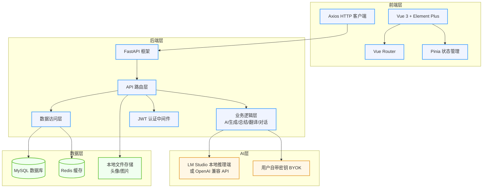

# 系统架构图

```mermaid
graph TB
    subgraph 前端层
        Vue3[Vue 3 + Element Plus]
        Router[Vue Router]
        Pinia[Pinia 状态管理]
        Axios[Axios HTTP 客户端]
    end

    subgraph 后端层
        FastAPI[FastAPI 框架]
        RouterAPI[API 路由层]
        Service[业务逻辑层<br/>AI生成/总结/翻译/对话]
        CRUD[数据访问层]
        Auth[JWT 认证中间件]
    end

    subgraph AI层
        LMStudio[LM Studio 本地推理端<br/>或 OpenAI 兼容 API]
        BYOK[用户自带密钥 BYOK]
    end

    subgraph 数据层
        MySQL[(MySQL 数据库)]
        Redis[(Redis 缓存)]
        Uploads[本地文件存储<br/>头像/图片]
    end

    Axios --> FastAPI
    Vue3 --> Router
    Vue3 --> Pinia

    FastAPI --> RouterAPI
    RouterAPI --> Auth
    RouterAPI --> Service
    RouterAPI --> CRUD
    Service --> LMStudio
    Service --> BYOK
    CRUD --> MySQL
    CRUD --> Redis
    RouterAPI --> Uploads

    classDef layer fill:#f0f4ff,stroke:#409eff,stroke-width:2px
    classDef data fill:#f0fff0,stroke:#67c23a,stroke-width:2px
    classDef ai fill:#fff7e6,stroke:#e6a23c,stroke-width:2px

    class Vue3,Router,Pinia,Axios layer
    class FastAPI,RouterAPI,Service,CRUD,Auth layer
    class MySQL,Redis,Uploads data
    class LMStudio,BYOK ai
```

本地开发时，Vite 将 `/api` 代理到 FastAPI；生产环境可按需增加反向代理与静态资源托管，本仓库以本地联调为主。
