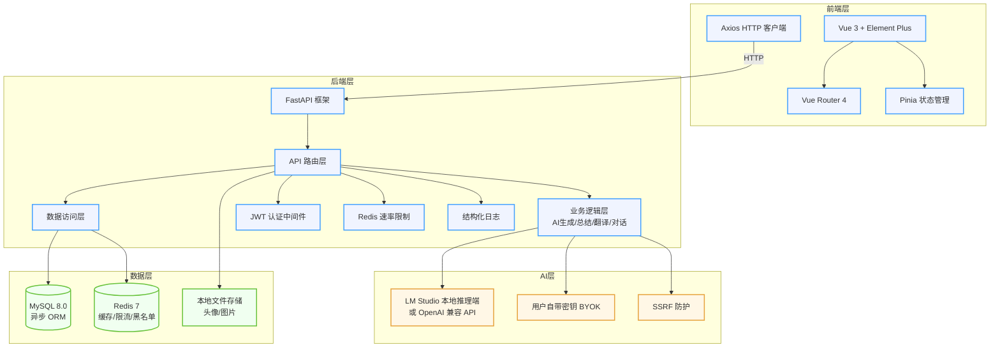
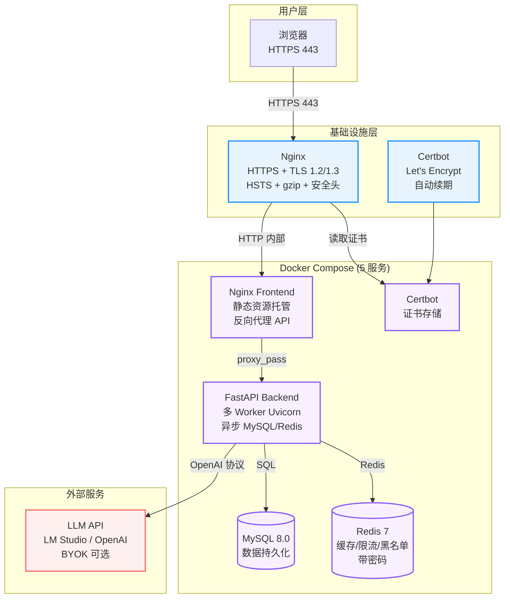

# 系统架构图

## 开发架构（本地联调）

本地开发时，Vite 将 `/api` 代理到 FastAPI（默认端口 5174 → 8000）。

---

## 生产架构（Docker Compose + Nginx + HTTPS）

### 端口映射

| 容器 | 内部端口 | 外部暴露 | 说明 |
|------|----------|----------|------|
| `frontend` (Nginx) | 80, 443 | 80, 443 | 静态资源 + API 反向代理 |
| `backend` (FastAPI) | 8000 | 不对外 | 仅供 Nginx 容器内访问 |
| `mysql` | 3306 | ❌ 不暴露 | 容器内部网络 |
| `redis` | 6379 | ❌ 不暴露 | 容器内部网络，带密码 |
| `certbot` | - | ❌ 不暴露 | 按需运行申请证书 |

### 数据安全要点

| 层 | 措施 |
|----|------|
| **网络隔离** | MySQL/Redis 仅通过 Docker 内部网络通信，不暴露到宿主机 |
| **传输加密** | Nginx 终止 TLS，内外通信走 Docker 网络 |
| **密钥隔离** | DB_PASSWORD / REDIS_PASSWORD / SECRET_KEY 通过 `.env` 注入，不硬编码 |
| **令牌安全** | JWT 2h 有效期 + Token Gen 代数 + Redis 黑名单 |
| **BYOK 加密** | 用户 API Key 使用 Fernet 加密存储 |
