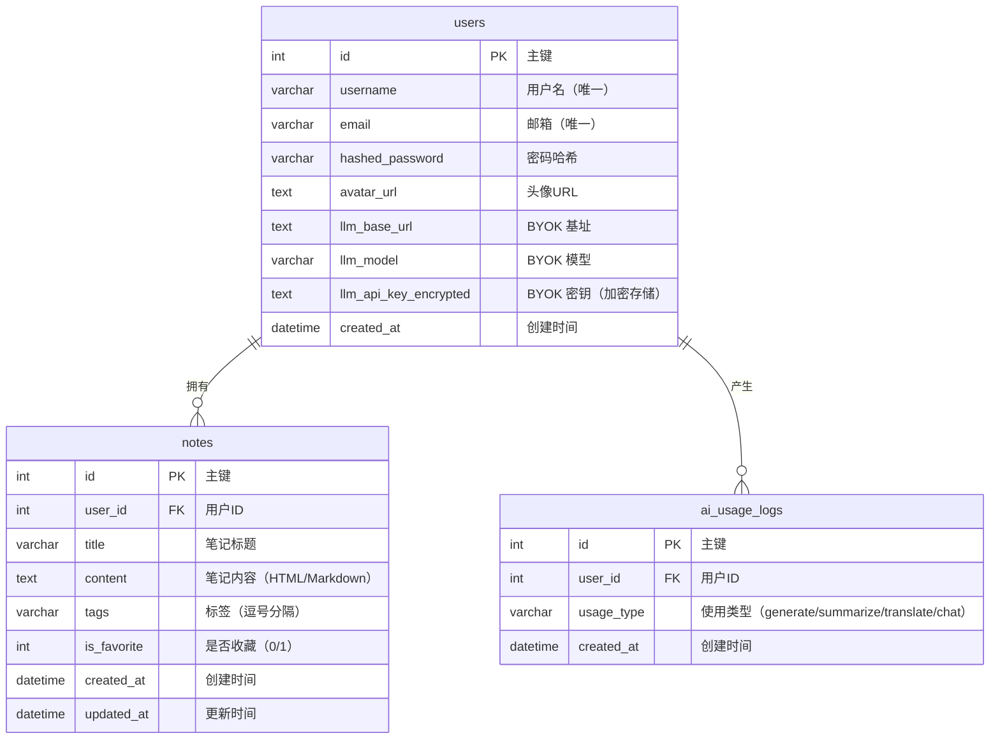

# 数据库 ER 图

```mermaid
erDiagram
    users {
        int id PK "主键"
        varchar username "用户名（唯一）"
        varchar email "邮箱（唯一）"
        varchar hashed_password "密码哈希"
        text avatar_url "头像URL"
        text llm_base_url "BYOK 基址"
        varchar llm_model "BYOK 模型"
        text llm_api_key_encrypted "BYOK 密钥（加密存储）"
        datetime created_at "创建时间"
    }

    notes {
        int id PK "主键"
        int user_id FK "用户ID"
        varchar title "笔记标题"
        text content "笔记内容（HTML/Markdown）"
        varchar tags "标签（逗号分隔）"
        int is_favorite "是否收藏（0/1）"
        datetime created_at "创建时间"
        datetime updated_at "更新时间"
    }

    ai_usage_logs {
        int id PK "主键"
        int user_id FK "用户ID"
        varchar usage_type "使用类型（generate/summarize/translate/chat）"
        datetime created_at "创建时间"
    }

    users ||--o{ notes : "拥有"
    users ||--o{ ai_usage_logs : "产生"
```
