# 数据库 ER 图（v1.2.0）

> 依据 `backend/app/models/`（`user.py`、`note.py`、`kg.py`、`ai_usage.py`、`ai_conversation.py`），由 `backend/main.py` 的 `init_db()`（`Base.metadata.create_all`）与 `backend/app/core/startup_migrations.py` 保证建表一致。若修改模型，请同步本图。

```mermaid
erDiagram
    users {
        int id PK "主键，自增"
        varchar username "用户名（String(50)，唯一索引，可为空）"
        varchar nickname "昵称（String(50)，可为空）"
        varchar email "邮箱（String(255)，唯一索引，可为空）"
        bool email_verified "邮箱已验证（默认 0）"
        varchar hashed_password "bcrypt 密码哈希"
        text avatar_url "头像 URL（相对路径，可为空）"
        text llm_base_url "BYOK API 基址（可为空）"
        varchar llm_model "BYOK 模型名（String(512)，可为空）"
        text llm_api_key_encrypted "BYOK 密钥（Fernet 加密）"
        int token_gen "令牌代数，改密后 +1"
        datetime created_at "注册时间"
    }

    oauth_accounts {
        int id PK "主键，自增"
        int user_id FK "用户 ID（关联 users.id，级联删除）"
        varchar provider "平台：github 等（String(20)）"
        varchar openid "平台用户 ID（String(128)）"
        varchar provider_username "平台用户名（String(128)，可为空）"
        text access_token "平台访问令牌（可为空）"
        varchar avatar_url "平台头像 URL（String(512)，可为空）"
        datetime created_at "绑定时间"
    }

    notes {
        int id PK "主键，自增"
        int user_id FK "用户 ID（关联 users.id）"
        varchar title "笔记标题（String(200)）"
        text content "正文（HTML 富文本或 Markdown）"
        varchar tags "标签，逗号分隔（String(500)，可为空）"
        int is_favorite "是否收藏：0=否，1=是"
        datetime created_at "创建时间"
        datetime updated_at "更新时间"
    }

    ai_usage_logs {
        int id PK "主键，自增"
        int user_id FK "用户 ID（关联 users.id）"
        varchar usage_type "使用类型：generate / summarize / translate / chat（String(50)）"
        datetime created_at "调用时间"
    }

    kg_concepts {
        int id PK "主键，自增"
        int user_id FK "用户 ID（关联 users.id）"
        varchar name "概念名（String(200)）"
        float weight "权重（默认 1.0）"
        text source_note_ids "来源笔记 ID 列表（默认空串）"
        text description "描述（可为空）"
        datetime created_at "创建时间"
        datetime updated_at "更新时间"
    }

    kg_relations {
        int id PK "主键，自增"
        int user_id FK "用户 ID（关联 users.id）"
        varchar rel_type "关系类型（String(30)）"
        int source_id "来源节点 ID"
        int target_id "目标节点 ID"
        float weight "权重（默认 1.0）"
        varchar label "关系标签（String(100)，可为空）"
        datetime created_at "创建时间"
    }

    kg_status {
        int id PK "主键，自增"
        int user_id FK "用户 ID（关联 users.id，唯一）"
        varchar status "状态：idle / generating / ready / failed（String(20)）"
        int progress "进度 0-100（默认 0）"
        int total_notes "待处理笔记总数"
        int processed_notes "已处理笔记数"
        text error_msg "错误信息（可为空）"
        datetime started_at "开始时间（可为空）"
        datetime finished_at "结束时间（可为空）"
        datetime updated_at "更新时间"
    }

    ai_conversations {
        int id PK "主键，自增"
        int user_id FK "用户 ID（关联 users.id，级联删除）"
        text title "对话标题"
        datetime created_at "创建时间"
        datetime updated_at "更新时间"
    }

    ai_messages {
        int id PK "主键，自增"
        int conversation_id FK "对话 ID（关联 ai_conversations.id，级联删除）"
        text role "消息角色：user / assistant / tool"
        text content "消息内容（默认空串）"
        datetime created_at "创建时间"
    }

    users ||--o{ oauth_accounts : "拥有"
    users ||--o{ notes : "拥有"
    users ||--o{ ai_usage_logs : "产生"
    users ||--o{ kg_concepts : "拥有"
    users ||--o{ kg_relations : "拥有"
    users ||--o{ kg_status : "拥有"
    users ||--o{ ai_conversations : "拥有"
    ai_conversations ||--o{ ai_messages : "包含"
```

## 表说明

| 表名 | 说明 |
|------|------|
| `users` | 用户账户信息，含 BYOK 配置 |
| `oauth_accounts` | OAuth 平台账号关联（GitHub 等），支持多平台 |
| `notes` | 笔记正文，按用户隔离 |
| `ai_usage_logs` | AI 功能调用记录（用于统计分析） |
| `kg_concepts` | 知识图谱概念节点（TF-IDF 提取，v1.1.0 起） |
| `kg_relations` | 知识图谱关系边（概念-概念 / 笔记-概念） |
| `kg_status` | 知识图谱生成任务状态（每用户一条） |
| `ai_conversations` | AI 对话会话（主 Agent 架构持久化，v1.2.0 起） |
| `ai_messages` | 对话内消息（user / assistant / tool 角色） |

## 索引

| 表 | 索引字段 | 类型 |
|----|----------|------|
| `users` | `id` | PRIMARY |
| `users` | `username` | UNIQUE |
| `users` | `email` | UNIQUE |
| `oauth_accounts` | `id` | PRIMARY |
| `oauth_accounts` | `user_id` / `provider` / `openid` | 普通索引 |
| `notes` | `id` | PRIMARY |
| `notes` | `user_id` | 普通索引（外键） |
| `ai_usage_logs` | `id` | PRIMARY |
| `ai_usage_logs` | `user_id` | 普通索引（外键） |
| `kg_concepts` | `id` | PRIMARY |
| `kg_concepts` | `(user_id)` | 普通索引 |
| `kg_concepts` | `(user_id, name)` | UNIQUE 联合索引 |
| `kg_relations` | `id` | PRIMARY |
| `kg_relations` | `(user_id)` | 普通索引 |
| `kg_relations` | `(user_id, rel_type)` | 联合索引 |
| `kg_status` | `id` | PRIMARY |
| `kg_status` | `user_id` | UNIQUE |
| `ai_conversations` | `id` | PRIMARY |
| `ai_conversations` | `(user_id)` | 普通索引 |
| `ai_conversations` | `(user_id, updated_at)` | 联合索引 |
| `ai_messages` | `id` | PRIMARY |
| `ai_messages` | `(conversation_id)` | 普通索引 |
| `ai_messages` | `(conversation_id, created_at)` | 联合索引 |

> 注：旧版文档记载 `notes.title` 有普通索引（全文搜索可扩展），核对 `backend/app/models/note.py` 与迁移脚本后确认**不存在**该索引，已移除该条目。
