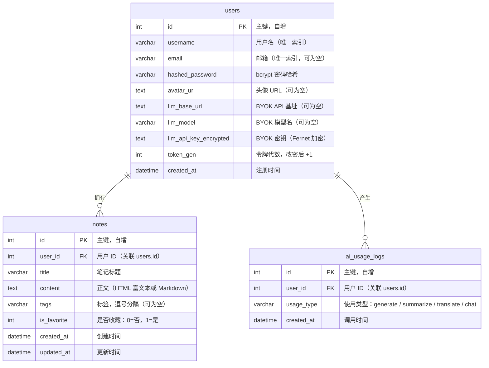

# 数据库 ER 图（v1.1.0）

## 表说明

| 表名 | 说明 |
|------|------|
| `users` | 用户账户信息，含 BYOK 配置 |
| `notes` | 笔记正文，按用户隔离 |
| `ai_usage_logs` | AI 功能调用记录（用于统计分析） |

## 索引

| 表 | 索引字段 | 类型 |
|----|----------|------|
| `users` | `username` | UNIQUE |
| `users` | `email` | UNIQUE |
| `users` | `id` | PRIMARY |
| `notes` | `user_id` | 普通索引 |
| `notes` | `title` | 普通索引（全文搜索可扩展） |
| `ai_usage_logs` | `user_id` | 普通索引 |
